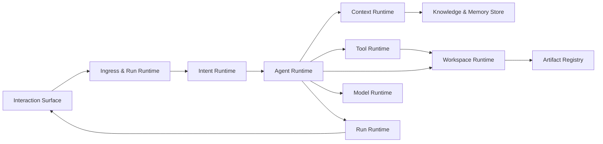

# UAW 通用 Agent 系统架构

状态：v0.10 开发设计稿。2026-10-07 补齐 [全局指引](README.md)、[项目目录](docs/PROJECT_STRUCTURE.md)、[每节点开发策略索引](docs/design/README.md) 和 [子Agent创建/调用完整链路](docs/design/SUBAGENT_LIFECYCLE.md)。[分层图谱](ARCHITECTURE_ATLAS.md) 与 [交互图](demo/uaw-architecture-map.html) 可定位对应策略文档和计划代码位置。Notion阅读落点见 [NOTION_ARCHITECTURE_REVIEW.md](NOTION_ARCHITECTURE_REVIEW.md)，工程边界见 [ENGINEERING_COMPLETENESS.md](ENGINEERING_COMPLETENESS.md)。本地/审批/语义完成见 [LOCAL_APPROVAL_SEMANTIC.md](LOCAL_APPROVAL_SEMANTIC.md)；页面见 [FRONTEND_BLUEPRINT.md](FRONTEND_BLUEPRINT.md)；交付与引用见 [DELIVERY_VERIFICATION.md](DELIVERY_VERIFICATION.md)；管理配置见 [ADMIN_CONFIGURATION.md](ADMIN_CONFIGURATION.md)；缓存见 [CACHE_DESIGN.md](CACHE_DESIGN.md)；工具见 [CONTROL_TOOLS.md](CONTROL_TOOLS.md)；模型/撤销/历史见 [RUNTIME_DECISIONS.md](RUNTIME_DECISIONS.md)。Python用于新Runtime；各模块技术主选见 [TECHNOLOGY_STACK.md](TECHNOLOGY_STACK.md)，精确版本与部署配置待实际验证。目标群体及真实任务见 [PRODUCT_VALIDATION.md](PRODUCT_VALIDATION.md)。图谱与接口仍是完整目标设计；当前工程实现和真实验证见 [实施记录](docs/implementation/README.md)，业务能力不能由文档或包安装推断已完成。

## 0. 已确认的产品决策

1. UAW 第一阶段是**单用户工作区**。对象中仍保留 `principal` 和 `scope`，以后扩展组织权限无需改 Runtime 协议。
2. UAW 核心同时实现信息获取/文件只读和沙箱内文件写入/代码执行。未来推特接入时，用产品 flag 关闭暂不开放的能力。
3. 聊天框上方有浅色、自适应高度的「AI 理解的任务」预览。它随草稿变化，用来提醒用户；**用户发送的原始问题始终是执行基准**。预览不是替代输入，也不自动加入用户指令。
4. 首先建立可扩展的交付物与外部应用接口，具体格式和连接器逐步增加。
5. 工具重试、替代、熔断、失败分类和降级归 `Tool Runtime`，Agent Runtime 只接收标准结果并决定下一步。
6. UAW 是通用 Agent 应用。角色、工具和计划按任务动态组合，不以推特业务流程定义固定链路。
7. 通用架构与首发场景分别管理。首发场景用真实材料和可接受成果验证；尚未验证的复杂能力保留扩展点，不要求全部先实现。此前确认的代码能力、工具向量索引和理解预览仍在目标范围中。
8. 简单任务默认单 Agent 循环，仅创建基本 Run 状态与交互项；TaskGraph、协作 Task Board、多分支与多模型路由按任务需要启用。成功任务可保存为用户确认过的执行模板，稳定步骤与动态探索共存。
9. 服务日常办公、开发和学术探讨三个目标群体。共用 Runtime，按群体/任务配置 Skill、RoleProfile 和 DeliveryContract，质量与成本分别验证。学术 Agent 的详细设计见 [ACADEMIC_AGENT.md](ACADEMIC_AGENT.md)。
10. 支持用户用自然语言创建职能不同的子 Agent，定义绑定当前会话供以后发现和调用；每次调用创建隔离的运行实例。配置修改可查看并撤销，不自动扩大工具权限。
11. 用户明确选择模型后，默认所有 Agent 及任务理解/规划使用该模型；仅用户明确指定的子 Agent 模型可以覆盖继承。自动模型路由仅适用于用户选择 Auto 的范围。
12. 文件、产物和 Agent 配置支持查看变更与撤销。外部动作是否可撤销由具体工具契约决定；撤销文件改动和回退聊天记录不能自动逆转外部动作。
13. 主 Agent 创建/修改子 Agent、规划、委派和变更操作通过注册控制工具调用，Tool Runtime 统一治理、所属 Runtime 实现状态与业务逻辑。主 Agent 保留精炼常驻核心与基础发现入口，其余工具和方法按需加载。
14. 首版支持已连接、获用户授权的本地项目读取、修改和测试，LocalWorkspaceAdapter/ProjectRootBinding 纳入首版；云端沙箱可选。用户选择项目目录和读/写/执行等范围，本地 Runner 执行并再次核验。上传或输入路径不自动授予全盘访问。项目路径、工作副本路径与云端沙箱路径分别建模。
15. 成品应用的模型提供方、联网搜索及第三方 API 由管理员配置，首期预留管理接口，管理 UI 后置。终端用户保留可用模型选择和子 Agent 显式模型覆盖，不要求提供服务 API key；私人外部账号授权另行管理。
16. 提供帮我审批、自己审批、不需要审批三种模式；暂按 AI 代审、用户手动、授权范围内自动执行映射，具体含义待用户确认。审批方式与实际能力/沙箱边界分别管理，选择自动不扩大权限。
17. 完成判断按任务语义、成果与真实证据进行，不沿用固定推特业务字段。必需目标来自用户/政策，LLM 可动态发现缺口、选择验证与补救；Runtime 检查引用、版本、真实执行和合法状态。

新增建议（待讨论）：采用 LLM 语义判断、单 Agent 起步与按需规划/委派；首阶段网页历史以账号关联的云端记录为权威、本地为缓存，未来以存储适配器支持本地项目历史。细则见 RUNTIME_DECISIONS.md，不将存储建议写成用户已选方案。

## 1. 三种关系、七个统一入口

多 Agent 系统需要分别建模：

- **任务依赖**：节点 A 的产出是节点 B 的输入，由 `TaskGraph` 表达。
- **Agent 委派**：父 Agent 把有明确交付契约的工作交给子 Agent，由 `AgentHierarchy` 表达。
- **工作区分支**：多个执行者如何隔离文件改动并合并，由 `Workspace Runtime` 表达。

这三种关系不自动对应：两个并行节点可以由两个 Agent 执行，也可以只做两个工具任务；任务图的依赖边不表示父子 Agent。



| 统一入口 | 对外接口（概念） | 负责所有相关操作 | 不负责 |
| --- | --- | --- | --- |
| `Intent Runtime` | `understand(intent_request)`、`preview(draft)` | 草稿理解预览、用户问题加工、指代解析、歧义、任务框架 | 执行完整任务 |
| `Agent Runtime` | `start(agent_request)`、`define_agent(definition_request)`、`spawn(agent_spec)`、`assess_execution(task_frame)`、`step(agent_id)`、`resolve_skill(skill_query)` | 子 Agent 定义与发现、语义执行策略、角色、技能、模板、规划、调度、协同、模型/工具动作循环 | 直接运行工具或拼接存储查询 |
| `Context Runtime` | `build(context_request)`、`resolve_rules(scope)`、`set_memory_policy(policy)` | 规则装配、检索、压缩、裁剪、预算、来源、记忆控制、节点上下文快照 | 自行决定用户任务目标 |
| `Tool Runtime` | `discover(tool_query)`、`invoke(tool_call)` | 注册、向量检索、权限、调用、降级、审计 | 决定整项任务是否完成 |
| `Workspace Runtime` | `allocate(workspace_spec)`、`merge(merge_request)`、`list_changes/revert(change_request)` | 沙箱、分支、文件操作、冲突检测、合并、产物登记、变更审阅与撤销 | 决定模型何时写代码 |
| `Model Runtime` | `resolve_policy(model_policy)`、`select(model_request)`、`generate(model_call)` | 用户模型选择、继承与显式覆盖、Auto 范围内的模型候选/能力匹配、调用恢复、计量 | 自行覆盖用户明确模型或决定工具授权 |
| `Run Runtime` | `create/emit_item/checkpoint/resume/control/decide_approval` | 状态、Item、事件、预算、幂等、用户干预、审批记录、取消恢复、触发入口、History Repository | 解释用户问题或扩大硬权限 |

`Ingress` 是产品 API 边界：身份、会话/附件归属、输入校验、限额、幂等、Run 创建和事件传输。七个 Runtime 是逻辑模块，第一阶段可以放在一个 Python 进程中；统一入口通过有版本的对象交互，不要求现在拆成七个服务。

跨模块缓存采用共享基础设施 CacheManager，业务可缓存性、key 依赖和失效语义仍归各 Runtime。Context Runtime 管理版本化内容块与检索/摘要复用；Model Runtime 适配供应商前缀缓存；Tool Runtime 管理明确登记的只读结果缓存。权威历史、审批、幂等账本和产物本体不按缓存淘汰；缓存以正确性与总成本为目标，详见 CACHE_DESIGN.md。

Ingress 内部按 `Transport Adapter → Admission → Resource Resolver → Request Assembler → Run Controller → Event Adapter` 组织。Transport 只处理 HTTP/流协议；Admission 校验身份、大小、配额、幂等；Resource Resolver 核实 conversation、task、workspace、asset 引用的归属和状态；Assembler 输出版本化 `AgentExecutionRequest`；Run Controller 调用 Run Runtime 并连接事件。Ingress 不生成任务计划，也不把附件二进制直接塞入 Runtime 请求。

`AgentExecutionRequest` 的最小字段是 `request_id/turn_id/run_id/trace_id`、`principal`、`scope`、`original_input_ref`、`attachment_refs`、`selected_context_refs`、`user_preferences`、`effective_capability_policy`、`budget`、`client_locale/timezone`。没有 `selected_tool`、`selected_model`、`plan` 或被改写的“最终用户问题”，这些由后续模块产生。

## 2. 从草稿到交付的完整链路

下图表示逻辑职责与状态流，不规定每个模块都独立发起一次模型调用，也不要求每个请求经过任务评估或 Planner。主 Agent 可在同一次调用理解目标、直接答复或选择工具；复杂理解与规划方法按需装配。

```text
草稿变化
  → Intent Runtime.preview（短时、只读、可取消）
  → UI 展示「AI 理解的任务」；草稿和预览版本绑定

用户发送原文
  → Ingress 校验并保存不可变原文/附件引用
  → Run Runtime 创建 run_id 与事件流
  → Model Runtime 解析并固定本 Run 的会话模型政策
  → Intent Runtime.understand
       ↳ Context Runtime 按需找最近会话、相关文件/记忆
       ↳ 必要时通过 Tool Runtime 做有预算的只读探查
  → Agent Runtime 选择起始执行方式和 Agent 角色
  → Agent 循环：获取上下文 → 模型提出动作 → Runtime 执行动作 → 观察结果
       ↳ 动作可以是答复、请求上下文、检索工具、调用工具、制定计划、委派、澄清
       ↳ 复杂任务按需生成并修订 TaskGraph；Scheduler 并行执行可并行节点
  → Workspace Runtime 验证并登记文件/代码/其他产物
  → 按 DeliveryContract 校验目标、真实成果版本与引用，形成 VerificationReport
  → 完成核验与版本提交、事件流与最终交付（完整/部分/受阻分别展示）
  → 异步形成记忆候选，经写入策略后保存
```

起始执行方式只是资源分配：简单任务先单 Agent，复杂任务可先规划，需要文件修改时分配沙箱。运行中发现信息缺口，可以扩大检索、调用新能力、委派或重规划。不存在“聊天请求永远不能用工具”之类的固定链路。

### 2.1 核心身份与版本

`conversation_id` 是产品会话；`task_id` 是跨会话可继续的用户任务；`turn_id` 是一次不可变用户输入；`run_id` 是一次执行尝试；`agent_id` 是一个 Agent 实例；`node_id` 是计划节点；`workspace_branch_id` 是文件隔离分支。一个 Task 可连接多个 Conversation，一个 Run 可有多个 Agent，一个 Agent 可执行多个节点或只执行一个节点。`trace_id` 串联跨模块调用。

共享状态必须带版本：`task_revision`、`plan_revision`、`workspace_base_revision`、`artifact_version`。任何重试或合并都基于明确版本，不能依赖“最后一个写入覆盖”。

简单对话可使用轻量 Task 关联或暂不绑定跨会话 Task；不因分配 task_id 就生成任务图、协作共享板和工作区分支。提升为协作任务时，才物化相关对象并记录迁移事件。

## 3. Intent Runtime：所有问题加工的统一入口

### 3.1 内部模块

| 子模块 | 输入 → 输出 | 规则 |
| --- | --- | --- |
| Draft Preview | 当前草稿、最近会话摘要、所选资源 → 一两句任务理解 | 低延迟、无写操作、草稿变动使旧结果失效 |
| Original Input Reader | Run 的原文/附件引用 → 不可变用户输入 | 原文写入权威归 Run，Intent 不维护另一份可覆盖账本 |
| Semantic Parser | 原文 + 最小上下文 → 目标、动作、约束、交付物 | 把显式事实、推断、未知分开 |
| Reference Resolver | “这个文件/上次方案”等 → 候选引用与依据 | 候选不唯一则保留歧义 |
| Context Probe | 信息缺口 → 有预算的上下文读取或只读工具探查 | 深度调研交给 Agent Runtime |
| Ambiguity Policy | 歧义、动作风险、可逆性 → 执行/澄清决策 | 高影响目标不唯一时先澄清 |
| Task Frame Builder | 以上结果 → `TaskFrame` | 带来源、版本、置信信息和待确认项 |

`TaskFrame` 至少含 `original_input_ref`、`goal`、`constraints`、`expected_outputs`、`entities`、`resolved_refs`、`assumptions`、`unknowns`、`evidence_refs`。用户后续纠正形成新版本，旧版本可回放。它是执行辅助信息，不覆盖原文。

### 3.2 前端预览契约

预览显示在输入框上方，浅色背景，内容决定高度。它明确标记「AI 理解的任务」，允许收起；用户仍在下方原始输入框发消息。预览请求带草稿版本或 hash，前端只显示与当前草稿匹配的结果，避免慢响应覆盖新内容。发送时保存原文；服务端再做正式理解，不能直接把未发送阶段的预览当执行命令。若正式理解与预览有实质差异，运行事件要说明已重新识别的目标。

预览按产品 flag 和用户设置启用，计算不阻塞发送。保留已确认的浅色提示设计，并通过真实任务测量误解、返工和等待成本。复杂任务可展示目标、范围和关键假设；用户纠正时形成明确的用户输入或 `InstructionPatch`，标注 `source=user`、对应原文版本和所改字段。系统生成的预览不会因显示在 UI 中取得指令权限；预览失败也不阻止正常发送。

## 4. Agent Runtime：角色、协同与动态决策

### 4.1 统一 Agent 创建入口

`AgentFactory.create(AgentSpec)` 是唯一入口。`AgentSpec` 包含 `role_profile`、`task_id`、`node_id`、`parent_agent_id`、`goal`、`input_refs`、`output_contract`、`permission_scope`、`budget`、`workspace_branch`、`model_requirements`。

长期定义通过 `AgentRuntime.define_agent` 写入 `AgentDefinition Registry`，包含 owner/conversation、职责、调用条件、工具/技能边界、模型继承或用户显式覆盖、版本。AgentFactory 创建运行实例时固定定义版本；两个同时运行的实例不会共用临时 prompt、可写文件或任务状态。该 Registry 及创建/更新/撤销链路见 RUNTIME_DECISIONS.md §3。

设计定义时主 Agent 按需加载 [agent_definition.md](prompts/agent_definition.md) 的精炼指令，调用 agents.create/update 工具，经 Tool Runtime 进入 Agent Runtime，并在当前循环消费工具反馈。实际启动任务使用 agents.invoke。模型名称由 Model Runtime 对当前可见目录校验；缺失、歧义或不可用返回 LLM，只有用户明确允许时才替代。合法定义直接持久化，阻碍项不启用，不强制为配置创建增加 Planner 或固定串行多模型处理流程。

角色配置（`RoleProfile`）定义候选模型能力、可见工具类别、默认预算、上下文模板、可委派范围、结果校验规则。首批角色可以有 `generalist`、`research`、`analysis`、`code`、`artifact`、`review`、`coordinator`、`academic`。学术角色强调证据、假设、推导与复现，可按需委派现有 research/code/review 角色；不另造一套执行 Runtime。角色是职能边界，不是“研究必走 A→B→C”的业务流程；一个用户任务可混用角色，角色集合也可扩展。角色配置缩小工具候选，**最终工具选择仍发生在执行时**。

角色决策发生在三个时点：首次接收任务、Planner 分配节点、Agent 发现自己需要专业能力而申请委派或角色切换。分配依据是目标、交付物、所需能力、权限和预算；有不确定性时从 generalist 起步并在运行中调整。角色切换新建 Agent 实例或版本化其配置，保留轨迹。

### 4.2 Agent 循环与终止

`Context Runtime.build` → `Model Runtime.generate` → 主 Agent 答复或提出工具调用 → `Agent Runtime` 检查总预算/生命周期 → `Tool Runtime` 校验并派发至对应 Runtime → 更新状态并继续。创建/更新定义、规划、委派、读取和用户询问使用已注册控制工具，respond/finish 是模型与运行生命周期动作。创建/更新定义需来自用户授权，模型生成的配置经校验后才持久化。主 Agent 常驻核心见 [main_agent.md](prompts/main_agent.md)，不要求所有回合先输出 ExecutionAssessment JSON。

每个 Agent 有最大步数、时间、Token、工具成本、子 Agent 数和递归深度。完成时检查 `output_contract`；超限可压缩上下文、请求更多预算、降级到部分结果或向用户说明，不能无限循环。Agent 的模型失败归 Model Runtime，工具失败归 Tool Runtime，任务级补救由 Agent Runtime 决定。

Completion Controller 统一负责完成条件、验证协调、语义核对与 CompletionProposal。真实检查由对应工具执行，Run Runtime 校验终态和预期版本；模型结束文本不能直接证明成功。简单回答轻量核对，复杂交付按需运行 validator/Reviewer；不强制另起 Agent 或固定测试流水线。细则见 DELIVERY_VERIFICATION.md。

### 4.3 Planner、Scheduler 与父子 Agent

执行决策基于原文、TaskFrame、最小上下文、可用资源与 Agent 定义，由 LLM 提出 `ExecutionAssessment`；可合并进首次理解调用，避免每个任务另起分类 Agent。字段分开记录 `planning_level=none/steps/dag`、`delegation=single/parent_child`、`parallelism=serial/parallel`，附证据、信息缺口、预算与复评条件。权限、依赖正确性和并发上限由代码校验，任务复杂度不靠关键词词典决定。

Context Runtime 装配稳定的身份、职责、决策原则和输出协议，以及实际可用的资源/工具/会话 Agent、用户偏好、模型政策、预算与当前进度；模型不能凭想象选择系统能力。模板与 schema 分别见 [execution_assessment.md](prompts/execution_assessment.md) 和 [execution_assessment.schema.json](contracts/execution_assessment.schema.json)。Prompt 约束模型建议，Runtime 校验结构、引用、权限和状态版本；判断与生成完整计划使用各自模板。

需要跟踪多步工作但不存在独立并行子成果时，Planner 可只输出步骤与完成条件，由单 Agent 执行。需要显式依赖和并发调度时才生成 `TaskGraph`：节点目标、依赖、输入引用、交付契约、所需角色/能力、估算预算、完成条件。Graph Validator 检查环、缺失依赖、权限、资源冲突和预算。Scheduler 按可运行节点执行，只有依赖满足且资源不冲突的节点可并行。DAG 是依赖图；RAG 是 Context Runtime 中的检索增强能力，两者独立。

父 Agent 只能通过 `delegate` 创建子 Agent，并提交清晰的目标、输入引用、输出契约、权限和预算。子 Agent 不自动继承父 Agent 全部工具；权限取父权限、角色权限和产品配置的交集。父 Agent 可取消、等待、接收子结果并决定重试或重新分配。子 Agent 可以再次委派，但受深度与总量限制。

**使用子 Agent 的判据**：子问题有可验收结果；可与父任务或其他子任务并行；需要不同专业能力/工具边界；或独立上下文能明显减少干扰。仅一个短步骤或一次工具调用不应启动子 Agent。计划图节点也不必一一对应 Agent。

默认使用单 Agent；委派还需检查预估新增成本、当前预算、可减少的等待、合并负担和已验证的任务类别。没有收益证据时保持单 Agent，不将“可并行”自动视为“值得并行”。实验按相同总预算比较单/多 Agent 的成果接受率、用户修正时间和完整成本，不能只比较成功调用。

### 4.4 多 Agent 协作协议

同一 Task 内有一个版本化 `Task Board`，存放目标、任务图、节点状态、结果引用、证据引用、产物引用和决策日志。Agent 可按权限读取相关条目，提交自己的结构化结果。共享的是**引用与经过筛选的结果**，不是复制彼此完整 prompt 或隐含推理过程。

跨 Agent 消息使用 `AgentMessage`：发送者/接收者、task_id、目标、引用、要求的响应、截止/预算、关联 node_id。消息写入事件日志。默认由父 Agent 或 Scheduler 分配与汇总；允许有界的 Agent 间请求，例如研究 Agent 向代码 Agent 询问数据格式，但不能形成无界互聊。结果由 `Join/Reducer` 在依赖满足后汇总，`Reviewer` 可对高风险交付物做独立校验。

并行 Agent 读取固定的 `Task Board` 修订版，提交结果时使用预期版本进行比较并交换。若中途出现新的用户约束或上游结果，Scheduler 将相关节点标记为 `stale`，按节点策略选择重建上下文继续、重跑或取消。子 Agent 失败先返回类型化失败给父 Agent；父 Agent 可缩小目标、换角色、重试或接受部分结果，不能让失败结果静默通过 Join。Join 检查每个必需输入的状态、版本和输出契约，缺少输入时不会合成最终答案。

例：用户要研究某技术并做原型。Coordinator 建两个并行子任务：Research Agent 查证约束，Code Agent 搭原型（若依赖研究结论，则 Code Agent 等待相关节点完成）。两者写入各自 `NodeResult` 和工作区分支；Join 节点读取证据与产物版本，Reviewer 检查原型是否满足研究所得要求，父 Agent 给用户交付。

### 4.5 动态重规划

执行发现新事实或失败后，Agent 可提出 `PlanPatch`：新增/取消/替换节点、调整依赖和交付条件。Validator 对每一修订版检查 DAG、权限、预算和已完成节点的不变量。**单一计划版本内保持无环，版本之间允许迭代**，因此 Runtime 可以循环而计划图仍易调度。

## 5. Context Runtime：所有上下文操作的统一入口

`ContextRuntime.build(ContextRequest)`，请求包括 `purpose`、`task_id`、`run_id`、`agent_id`、`node_id`、`goal`、`access_scope`、`snapshot_revision`、`token_budget`。`purpose` 至少支持：`draft_preview`、`understanding`、`agent_step`、`subagent_handoff`、`tool_result`、`plan_revision`、`semantic_compression`、`context_pruning`、`final_synthesis`。

| 子模块 | 职责 |
| --- | --- |
| Source Resolver | 根据作用域读取原文、最近会话、Task Board、文件、产物、外部证据和长期偏好 |
| Retrieval Planner | 判断需要哪些来源及检索查询，避免无关资料进入上下文 |
| Hybrid Retriever | 精确匹配、关键词和语义召回，先做权限过滤，再排序 |
| Semantic Compressor | 对历史、工具长输出和依赖结果做有来源的压缩；保留关键约束与反例 |
| Context Pruner | 去重、移除过期/低相关内容、按来源优先级和 token 预算裁剪 |
| Context Composer | 系统政策、角色目标、用户原文、节点输入、证据、允许工具 schema 分区装配 |
| Snapshot & Provenance | 固定本次模型调用所见内容的版本与引用，支持回放和纠错 |

会话记忆分原始事件、最近窗口、滚动摘要、语义 episode；用户记忆记录来源、作用域、置信度、更新时间和可撤销性；附件知识保留文件版本与页码/段落。`Memory Writer` 是 Context Runtime 内部的写入子模块：从已完成 Turn/Run 提取候选 → 与已有记忆去重、检查冲突和稳定性 → 按显式指令、重复信号与有效期决定写入/更新/丢弃 → 留下来源和撤销记录。Context Runtime 通过同一入口负责读与写，底层存储只是实现细节。长期用户记忆不能从单次任务随意推断。

附件摄取也从 Context Runtime 的统一入口触发：资产状态校验 → 类型识别与解析 → 清洗且保留标题/页码/表格结构 → 语义切片 → 索引 → 版本化可检索状态。解析失败不会伪装成“没有相关内容”，而会返回可见错误；检索时先按资产归属和任务作用域过滤，再做相关性排序。

Reference Registry 统一管理网页、上传资产、会话内容、产物、本地/云端工作区与执行证据的版本化引用；Citation 绑定回答位置/论断和来源。引用可访问、定位有效与支持论断分别检查。前端通过带身份的 resolver 打开预览/下载，不持久化临时签名链接；local kind 由已连接项目的 Local Resolver 按设备/项目/版本解析，断开时明确不可访问。网页正文与搜索摘要的证据范围分别记录，详见 DELIVERY_VERIFICATION.md §5。

`MemoryPolicy` 独立控制 `read_user_memory`、`read_cross_conversation_memory`、`write_user_memory` 和保留期限。当前会话原文与任务状态不等于长期用户记忆。会话可关闭记忆读取或贡献；已写记忆可按 ID 查看、纠正、删除，删除同时使相关缓存和派生索引失效。恢复 Run 时采用当前撤销策略，不能从旧 checkpoint 重新恢复已删除的记忆内容；受影响的上下文重新构建并记录原因。

父子 Agent 共享 `Task Board` 的结果引用和用户原始任务，子 Agent 的上下文由 Context Runtime 重新构建，只装入委派目标、所需上游节点、允许访问的文件及工具。并行兄弟 Agent 默认看不到对方临时 prompt；当结果提交后，依赖它的节点才能读取对应 `NodeResult`。这样既能共享事实，也能保留隔离。

临时 Context Snapshot 引用不可变、有依赖版本的 ContextBlock；重建节点上下文不必每次重写稳定内容。来源修改/删除、权限撤销、规则和技能变化使相关块/派生摘要失效。压缩按阶段或 episode 增量形成新 context_epoch，比较总输入/生成/缓存成本而非仅追求前缀命中。

## 6. Tool Runtime：注册、检索、执行与降级的统一入口

### 6.1 Tool Registry 与向量索引

`ToolSpec` 是权威记录：工具 ID/版本、名称、自然语言描述、适用场景和反例、输入/输出 schema、能力标签、风险、所需权限、沙箱/网络条件、成本、超时、幂等性、提供方、健康状态和 feature flag。注册或更新时，规范化描述、示例、标签并写入**工具向量索引**；索引项带 `tool_id + version`，可重建，不能作为权限和 schema 的唯一来源。

工具发现链路：

```text
Agent 角色与当前目标
  → 产品 flag / 用户权限 / 当前沙箱能力过滤
  → 角色允许类别过滤
  → 关键词 + 向量召回 ToolSpec
  → schema/能力/成本/健康状态重排
  → 小规模候选及描述交给 LLM
  → LLM 选择工具或提出 discover_tool 扩大范围
  → Tool Runtime 在调用前再次完整验证
```

向量相似只解决“可能相关”，不能授权或保证工具适用；精确工具名、参数类型和能力标签也要参与检索。工具关闭/撤销后，权威注册表立即阻止执行，异步删除索引项。工具提供方可以是本地实现、MCP 或其他适配器，对 Agent 均呈现同一种 `Capability`。

### 6.2 Tool Runtime 内部模块

内部职责包含 `Registry`（版本与生命周期）、`Discovery`（混合检索）、`Argument Validator`（schema 与资源引用）、`Policy Gate`（权限/flag/风险）、`Invocation Gate`（必要审批与执行前复核）、`Dispatcher`（提供方调用）、`Result Normalizer`（统一结果/来源）、`Failure Controller`（重试/替代/熔断）和 `Audit Recorder`（完整轨迹）。Registry/Discovery 是发现支路，不要求每次调用重新执行全部发现。

调用链路为参数与可信上下文校验 → 当前权限/预算预检 → 必要时向 Run 申请持久审批 → 执行前复核当前授权/参数/资源 → Tool 账本登记意图 → 适配器执行 → 规范结果与结算。`ToolRuntimeContext` 是服务端注入的主体、作用域、剩余时间、审批与幂等信息，不是给 LLM 的 ContextSnapshot；模型不能伪造可信字段。MCP Session Manager 管连接/协商、能力变更与有限重连，账号授权/凭据仍由控制层管理。详见 ENGINEERING_COMPLETENESS.md §4。

每次执行返回 `ToolResult`：`status`、`data_ref/summary`、`evidence_refs`、`retryable`、`failure_class`、`side_effect_state`、`latency/cost`。工具输出是外部数据，不能提升为系统指令。结果过长时由 Context Runtime 压缩，原始结果仍可追溯。

ToolSpec 显式声明 cache_policy，缺省不缓存结果。获准的纯读取按来源/账号/参数/版本/新鲜度复用，命中仍生成当前调用 Item 并保留原获取时间。agents.create、agents.invoke、撤销和外部写操作使用幂等账本，不使用结果缓存代替真实状态处理；并行相同读取可在同权限域合并计算。

### 6.3 失败与降级规则

Tool Runtime 对同一能力维护可替代提供方和健康状态。超时、限流、瞬时网络错误：只读或确认幂等的调用可按预算退避重试；参数错误不重试，返回可修复反馈；权限错误不降级绕过；写操作结果不明时先查幂等键或外部执行状态，不能盲目重试。连续故障触发熔断。

自动替换仅限显式登记且验证的 `EquivalenceContract`：相同输入含义、信息覆盖/新鲜度要求、输出语义、权限和副作用边界，并有参数映射与契约版本。向量相似、同类别或相同工具名称不能证明等价。原始论文读取失败后，网页摘要只能作为具有覆盖差异的替代建议，交给 Agent 决定、记录限制或请求用户选择；不能自动冒充原能力。所有重试和降级留在 Tool Runtime 内记录，能力范围改变才交给 Agent Runtime 做任务级决策。

## 7. Model Runtime：每阶段的模型候选与调用

先解析模型继承政策，再考虑候选。会话选定具体模型时，根 Agent、任务理解、执行判断、Planner、Reviewer 和所有未明确覆盖的子 Agent 默认使用该模型；草稿预览的 LLM 也继承，采用可取消/节流方式控制成本。子 Agent 仅在用户明确指定模型时覆盖；模型不能自行把 inherit 改成便宜模型或 Auto。角色的候选列表在固定模型模式下仅做能力校验，不能静默换模型。embedding、OCR 等专门模型是独立的工具实现，不属于 Agent 文本模型继承。

`ModelRequest` 声明角色、任务特征、上下文长度、工具调用/视觉/结构化输出等能力、延迟和成本预算。在 Auto 政策范围内，Model Runtime 可按角色/阶段选择满足要求的候选，并在许可候选间切换。明确指定模型模式下可重试同一模型；能力不满足或不可用时返回问题与选项，不自行切换。运行实例固定 `ResolvedModelPolicy` 与来源，会话模型变更默认影响下一 Run；用户要求改变当前 Run 时在安全边界更新。

内部链路：`Policy Resolver` 解析会话选择与用户显式子模型覆盖 → `Model Catalog/Capability Validator` 验证可用性与能力 → Auto 范围内 `Candidate Filter/Selector` → `Call Adapter` → `Output Validator` → `Usage Recorder` → 遵守固定/Auto 政策的 `Failure Controller`。完整继承规则见 RUNTIME_DECISIONS.md §4。

模型生成的结构化动作仍属于建议。Agent Runtime 校验目标和预算，Tool Runtime 校验具体工具调用；模型不能通过输出 JSON 直接修改任务状态、工作区或权限。

## 8. Workspace Runtime：单用户工作区与多会话隔离

### 8.1 Task、Conversation 与分支

首版 WorkspaceBackend 支持已连接本地项目与可选云端沙箱：BaseStateSpec 可来自授权本地项目、上传材料、云端快照或已授权远程适配器。以下快照机制只适用于已授权且已实现的后端，不启用任意服务器目录读取。本地 Runner 支持隔离工作副本与明确说明实际权限的原生执行；cwd/路径过滤本身不构成任意代码的 OS 沙箱。

一个单用户可以从多个会话连接同一 `task_id`；会话承担交互视图，Task 承担目标和共享结果。需要隔离写入的 Run 根据 `BaseStateSpec` 从指定提交、当前工作目录快照或已有产物版本启动。当前工作目录快照显式纳入用户未提交修改和获准的未跟踪文件，记录来源、文件清单与校验值；缓存、凭据和被排除的文件不默认复制。快照摄取需检测文件在复制中变化并重试或提示，不能生成混合版本。非 Git 项目也支持文件快照和版本化变更集。子 Agent 若要并行写文件，得到子分支或独立目录；只读 Agent 可共享同一快照。任务证据和结果是追加版本化条目，文件变更通过明确合并进入任务主分支。

同一文件的并发写入不直接写共享主目录。`Workspace Runtime` 维护文件版本、基础 revision、变更集和写入归属。读取可引用稳定快照；若任务进行中另一个会话修改文件，运行中的 Agent 不会悄悄看到变化，而会在下一次同步/合并时收到版本差异。

### 8.2 冲突与合并

1. 每个分支提交 `ChangeSet`：基础版本、改动文件、产物引用、验证结果。
2. Merge Coordinator 比较当前主分支与提交分支的基础版本。不同文件可直接合并；同文件尝试三方合并；语义冲突、二进制冲突或校验失败进入待解决状态。
3. Agent 可提出修复方案并在隔离分支验证；确定性冲突检测仍由 Workspace Runtime 执行。无法可靠解决时请用户选择，绝不静默覆盖。
4. 合并成功生成新 workspace revision 和 artifact 版本，再通知依赖节点。需要新版本的 Agent 重建上下文。
5. 外部副作用（例如发消息、发布）不参与文件分支合并，由 Tool Runtime 串行化/幂等控制和审批。

同一任务多会话同时发起新要求时，Run Controller 先把新 Turn 挂到 Task：独立补充任务可并行；修改正在处理的同一目标时生成任务修订并通知父 Agent，必要时取消旧节点并重规划。用户可以看到哪次会话/Run 产生了哪个改动。

### 8.3 沙箱和产物

沙箱能力按读文件、写文件、执行代码、网络、凭据分别授予。工具调用通过 Tool Runtime 进入 Workspace Runtime 的受控环境，模型生成的命令不直接在宿主机运行。文件完成后进行存在性、类型、大小、可访问性与可选格式校验，登记 `Artifact`（版本、来源 Run、路径/引用、校验值），事件流通知前端展示。交付物类型由适配器注册，架构不预设只会生成几种文件。

技术有效性之外，`DeliveryContract` 定义用户需要的质量：目的、受众、数据口径、证据覆盖、内容/功能验收、可编辑格式和导出要求。对应的 Quality Adapter 可以运行结构/公式/测试等可确定检查，再由 Reviewer 或用户评审内容。文件存在只能标记技术生成成功，不能直接标记用户接受；用户审阅与局部接受见 §17。

## 9. Run Runtime：状态、事件、取消与恢复

Run 状态包含 `queued/preparing/running/verifying/waiting_for_user/waiting_for_merge/completed/failed/cancelled`，不是所有任务必经全部状态；终态另带 `outcome=succeeded/partial/blocked/failed/cancelled`。completed 表示本次执行结束，完整完成、部分交付、受阻分别展示，必需检查未通过/未运行或必需副作用未决不能 succeeded。节点、Agent、工具调用各有独立状态与事件。事件带单调序号，前端断线按序号续接。Checkpoint 记录已提交事件序号、计划版本、Agent 状态、Task Board 引用、预算账本和不可变工作区/产物版本。第一阶段在可恢复边界提交 checkpoint，工具账本保留 `pending/confirmed/unknown` 的调用状态；不承诺多个外部系统的全局原子快照或 exactly-once 执行。恢复必须核对幂等键与外部动作结果。

内部模块：`Run Store` 保管执行状态及版本；`Event Log` 记录追加事件；`Budget Ledger` 预留和扣减模型/工具/时间预算；`Checkpoint Manager` 创建一致性快照；`Lease Manager` 防止同一节点被两个执行者同时领走；`Cancellation Controller` 向 Agent、Tool、Sandbox 传播取消；`Resume Controller` 从 checkpoint 回放遗漏事件、查询悬而未决的副作用调用，再让可运行节点继续。父 Run 取消时默认取消其子 Agent 和未完成工具；已完成产物按版本保留并标记来源状态。

Run 与 Task 的关系：Task 可长期存在并跨多个会话修订；每个 Run 针对某个 Task 修订版执行。Run 失败不会抹去 Task Board 上已确认的成果；下一 Run 可引用这些成果，但必须核对版本与目标是否仍适用。审批等待会暂停相关节点，并保留完整的待执行动作与参数，用户批准后再次校验权限和资源版本。

三种能力分别命名：`replay` 根据已有事件重建历史，不执行工具；`resume` 核对未决动作后继续未完成工作；`rerun` 从选定输入版本创建新 Run。重新运行受模型生成、外部信息和环境变化影响，不默认保证相同结果。外部动作撤销是独立的补偿操作，需要工具明确支持且重新校验权限，不能把线程回退解释成撤销发信或发布。

事件至少覆盖 `understanding.updated`、`agent.created`、`agent.delegated`、`plan.revised`、`node.started/completed`、`tool.started/retried/degraded/completed`、`merge.conflict/resolved`、`artifact.created`、`approval.required`、`message.delta` 和 Run 终态。UI 状态文案由真实事件映射；例如执行中可显示「努力奔跑中」，进入最终校验/交付阶段才显示「马上到终点」，不使用无法证明的进度百分比。

## 10. 前端交互预留

先确定信息架构：会话/任务导航、中央对话与运行轨迹、产物/工作区侧栏；输入框上方的任务理解预览；Agent 协作与分支/冲突可展开查看。主视图优先展示“正在做什么、为什么需要我、交付了什么”，细节轨迹可展开。视觉语言、动效和 WorkBuddy 风格参考后续单独设计，产品文案与状态都来自事件契约，不写死在模型回复里。

## 11. Feature flag、能力边界与推特适配

有效能力 = 实现已就绪 ∩ 产品已开放 ∩ 用户有权限 ∩ 本次动作风险允许。Flag 同时约束 UI、AgentFactory 角色候选、Tool Discovery、Tool Invoke、Workspace Runtime，避免只在前端隐藏。UAW 产品配置可开放代码/沙箱能力；推特适配器默认不暴露这些能力。产品适配层负责身份、资源引用、配置和事件展示，不改 Agent Runtime 的任务编排。

## 12. 实施顺序：用完整任务验证模块边界

目标用户为办公、开发和学术探讨人员，各群体的任务样本在 [PRODUCT_VALIDATION.md](PRODUCT_VALIDATION.md) 中确认。七个模块保留逻辑入口，内部协议先标记实验版本；不要求全部未来对象和适配器稳定后才能验证用户价值。一个群体表现良好不自动说明另外两类已通过验证。

1. 选一个真实任务，贯通原文/附件入口、单 Agent、必要工具、沙箱、真实成果、预览/修改/导出与基本取消；同时保存必要的 Item、来源、权限决策和成本。实际材料摄取和成果质量进入首个阶段。
2. 将第二个真实任务接入相同边界，抽取 Skill 和 DeliveryContract；再将一次成功任务保存成经用户确认的模板。验证重复使用时是否减少返工和成本。
3. 实现已确认的工具向量索引，和小工具集的直接候选策略比较召回质量、遗漏、延迟与成本；工具数量小的时候可以走精确/类别筛选，不要求每次都做向量检索。
4. 保持单 Agent 基线，对确有并行收益的任务实现父子委派、TaskGraph 和局部工作区隔离；用同等预算和同一验收口径验证收益，再扩展跨会话协调、长期记忆和自动模型路由。
5. 按首发任务需要补充环境模板、具体交付物质量适配器和关键连接器。插件安装市场、定时跟进和完整生态管理在相关需求成立后增加。
6. Python Runtime 的替换以真实任务样本、失败恢复、权限和成本检查为门槛。影子运行只运行只读/隔离动作，外部写入使用模拟器或禁用，避免新旧系统重复副作用。

用户接受率、包括检查修正的净节省时间、完整成本和重复使用是产品验收；权限、原文、幂等、取消、工具恢复与事件可追溯是必要工程验收。具体产品阈值先测基线再确定，不在架构中虚构数值。

## 13. Skills 与可复用任务模板

三类对象分别定义：`RoleProfile` 是执行者的职责和能力边界；`ToolSpec` 是可执行的具体操作；`SkillSpec` 是完成某类工作的可复用方法、材料、模板和验收要求。技能不能扩大角色、工具或沙箱权限。

技能子系统属于 Agent Runtime，统一入口 `resolve_skill/activate_skill`。内部包含 Skill Registry、Metadata Discovery、Dependency Resolver、Bundle Loader、Activation Ledger、Skill Validator。`SkillSpec` 至少包含 ID/名称、描述和触发/排除条件、版本、来源与信任范围、适用角色、指令入口、脚本/参考/模板清单、工具/环境依赖、输出/验收要求、内容校验值。

链路：列出有权限的名称与短描述 → 用户明确选择或模型按任务发现 → 校验版本和依赖 → 固定版本并加载主指令 → Context Runtime 按需加载参考材料 → 脚本通过 Tool Runtime 与沙箱执行 → 记录使用版本、结果和验收。嵌套技能加载检测循环与深度；依赖不满足时明确返回，不能静默略过验收。升级只影响新激活，运行中的技能版本固定；安全撤销则在下一安全边界阻止继续执行。

`TaskTemplate` 是用户保存的可重复执行配置，包含输入参数、数据来源/版本策略、固定步骤、动态步骤及其边界、输出模板、DeliveryContract、允许工具和预算。Skill 可以被模板引用，但加载技能本身不保证固定步骤一定执行。保存模板先去除凭据和一次性个人数据，再给用户确认；执行前重新校验权限、依赖和数据新鲜度。异常时停下或在预授权边界内转为 Agent 探索，不能擅自改变被锁定的口径或验收标准。

## 14. 规则来源与指令装配

`RuleResolver` 属于 Context Runtime，输出带来源、版本、作用域和优先级的 `InstructionSet`。可信规则来源包括产品执行政策、用户明确输入/纠正、已认可的项目及目录规则、激活技能、RoleProfile 和用户偏好。检索网页、工具输出和任意附件文本是数据，不能自行变成规则源；项目规则需要通过已授权工作区的明确发现路径注册。

执行代码强制的权限和风险政策始终有效。行为指令默认按：当前任务的用户明确指令/纠正 → 适用的项目/目录规则 → 激活技能指令 → 角色默认指令 → 推断偏好。项目规则根目录到目标目录装配，更具体的规则覆盖宽范围规则；同一层内记录时间和显式覆盖关系。用户显式指定技能时，将该选择记录为用户指令，但技能文件不会自动获得全部用户权限。重要要求无法同时满足时，记录冲突并澄清；普通风格冲突按确定顺序处理。

Agent 修改多个目录时，读取每个目标路径的适用规则，Context Snapshot 记录使用版本，Tool Runtime 在写入前检查作用域未改变。可机器验证的规则交给检查器/测试；自然语言规则仍需模型遵循和用户审阅，不能假装字符串排序能完全执行所有规则。

## 15. 运行中用户干预与审批协议

`RunRuntime.control(ControlRequest)` 是统一入口。字段包含 request_id、run_id、expected_run/task_revision、mode、用户输入、目标节点/产物、保留成果列表和作用范围。模式：`steer` 补充当前目标；`enqueue` 排队下一轮；`replace` 取消旧执行并以新输入启动；`cancel` 停止；`deliver_partial` 交付已确认成果并停止/挂起剩余工作。版本不匹配时返回实际状态，不将输入投到另一个 Run。

请求写入不可变用户输入与 Item → 控制器确认接收 → 校验任务版本 → 在模型/工具安全边界注入 → 使受影响节点失效或重规划 → 返回 `effective_after_event_seq` 和未能取消的动作。未启动的工具可取消；进行中的可取消工具请求终止；不可取消或结果不明的外部动作继续跟踪其最终状态。新输入不会撤销已经发生的动作，不能向用户显示已停止却遗漏仍在执行的副作用。

审批记录由 Run Runtime 维护，Tool Runtime/Workspace Runtime 提交请求并执行校验。`ApprovalRequest` 绑定 action_id、工具/版本、规范化参数 hash、资源版本、权限范围、风险原因、过期时间。决定可为一次批准、拒绝、取消或显式的受限持续授权；持续授权使用资源/动作/参数谓词和期限，不默认为任意工具或任意参数授权。参数、目标或资源版本实质变化后重新校验或重新审批。

ApprovalPolicy 提供 assisted/manual/automatic 三种暂定映射；独立 Reviewer 只在用户预授权代审范围内决定，不确定升级用户，执行 Agent 不能审批自身。manual 对需确认动作显示一次/受限任务授权；automatic 在已授权范围执行、范围外拒绝或返回能力缺口。模式和权限分别版本化，本地 Runner 也强制检查；原有拒绝不能通过切换模式或工具绕过。详见 LOCAL_APPROVAL_SEMANTIC.md。

执行前再次检查硬权限、授权有效期和撤销状态。拒绝后返回 `declined`，Agent 可选其他已允许方案或交付部分结果，不能换工具绕过拒绝。自动审批审查是可选策略实现，其结论与依据同样记录；超时和无响应不等于批准。撤销阻止尚未执行的动作，不能保证逆转已执行动作。

## 16. 前端交互 Item 与事件协议

`InteractionItem` 是 Run Runtime 的持久对象，事件描述它的变化。最小字段：id、conversation/turn/run_id、agent_id、parent_item_id、type、status、revision、created/updated_at、内容或引用、error。类型包括用户消息、任务理解、Agent 消息、计划、工具/命令、文件变更、审批、用户控制、产物、审阅和上下文压缩。状态按类型定义，例如 `pending/in_progress/waiting/completed/failed/declined/cancelled`。

生命周期：`item.started` 创建 → `item.delta` 携带 item_id、base_revision、新 revision 和增量 → `item.completed` 给出最终快照。每条事件含 event_id、stream_seq、schema_version、关联 IDs；客户端按 event_id 去重，缺序号或版本冲突时请求快照，不从模型文本推断命令/审批是否成功。Run 终态不能覆盖仍未核对的工具副作用，未决动作应独立展示。

快照与增量分别传输：重连从指定序号继续，历史压缩后返回快照及新的 cursor；未知 Item 类型有通用展示；原始工具日志按授权读取。交互内容与内部模型上下文分别管理，压缩内部 prompt 不删除用户可审阅历史。默认 UI 使用项目/会话、成果、版本和状态；Run/Agent/节点/分支在详细视图展开。

## 17. 环境准备与用户交付审阅

本地模式优先检测项目现有工具链/环境，按授权在项目环境补依赖；系统级安装另有明确范围，不自动修改用户机器全局环境。云端模式使用管理员模板。任务代码与 Runtime 服务环境分离，实际隔离能力、平台及版本进入报告；不把 Python venv 或设置 cwd 当成安全沙箱。

首版建议采用管理员维护的版本化基础模板预装常用工具链，每个任务隔离安装项目依赖；系统包扩展由受控 Provisioner 执行。任务代码/安装/测试不在 Python Agent Runtime 服务环境运行。process.exec/poll/stop 提供通用受控执行，语言 ValidatorSpec 形成标准检查报告，不要求每条 shell 命令都注册成独立工具。实际版本和环境记录在 EnvironmentManifest，详细代码链路见 DELIVERY_VERIFICATION.md §6–8。

环境生命周期属于 Workspace Runtime，统一 `prepare/start_process/stop_process/release`。`EnvironmentSpec` 包含环境模板/版本、BaseStateSpec、系统与依赖要求、初始化步骤、网络/凭据范围、健康检查、常用动作、CPU/内存/磁盘限制、TTL 和保留策略。链路：分配隔离环境 → 固定基础快照 → 授权初始化动作 → 安装/校验依赖 → 健康检查 → ready → 执行 → 停止进程、保存产物 → 回收。初始化失败单独标记 `preparation_failed`，保留日志并选择有限重试或返回用户；不能以空目录伪装成 ready。

初始化脚本和依赖安装同样经过权限/网络校验。后台进程有 process_id、owner Run、租约、端口、日志引用、停止策略；用户明确保留的预览/服务可获得独立租约。回收不删除已登记产物或未处理改动；不可复用的凭据不进入模板或快照。

审阅由 Workspace Runtime 的 `Delivery Review` 子模块提供，统一 `review/accept/reject/revise`。`ReviewSet` 固定 ChangeSet 和基础/目标 revision；`ChangeUnit` 可表示文件、文本块、表格单元区间或结构化对象，带稳定 ID、内容 hash 和依赖。用户可查看 diff/预览、按单位接受或拒绝、对定位位置评论。格式适配器不支持局部接受时明确只支持整份接受，不能假装已实现通用粒度。

局部接受前检查用户修改和依赖关系，必要时在隔离副本重跑验证；UI 指出互相依赖的改动。用户意见形成带 artifact_version 和位置锚点的用户输入；过期评论先重新定位或要求确认。撤销通过逆向 ChangeSet 或旧产物版本执行，若当前版本已变化则进入合并流程，保留用户后续修改。外部发布/邮件等不能通过文件撤销自动回退。

执行完成和用户接受分别记录：Run 可以在交付完成后 `completed`，Delivery 状态为 `delivered/under_review/accepted/partially_accepted/revision_requested/rejected`。是否需要用户接受才能完成 Task 由任务契约决定。用户看到检查结果、未验证部分和可继续编辑的真实成果。

VerificationReport 固定契约、实际受测文件/依赖与环境版本；修改、合并、局部接受、撤销后按依赖核验报告并在需要时重验。最终交付采用不可变版本及 CAS 完成提案，旧报告不能覆盖新成果。用户看到真实通过/失败/未运行/受阻状态，无测试不能写“测试通过”。

变更视图统一覆盖文件/产物 ChangeSet 和 AgentDefinition 配置修订；前者由 Workspace Runtime 撤销，后者由 Agent Runtime 生成逆向配置修订，Run Runtime 记录用户动作。未合并改动可丢弃隔离变更集；已合并改动先比较当前版本，再生成反向修改，保留用户后续编辑。工具执行任意代码前后需采集受控工作区的变更快照，避免绕过文件写工具后漏记改动。文档/表格等不支持块级 diff 时提供版本预览与整版恢复。细则见 RUNTIME_DECISIONS.md §5。

## 18. 插件、连接器与触发机制的扩展点

平台提供方配置由逻辑控制层 Configuration Service 统一维护，包含模型、工具提供方、凭据引用、环境模板、政策和版本审计。首期管理 API/CLI，后续管理员 UI；Runtime 消费已启用快照，调用时检查当前撤销/限额。Agent 无权修改平台配置，服务 API key 不注入任意代码沙箱；指定模型下线仍遵循用户模型政策。详见 ADMIN_CONFIGURATION.md。

保留七个 Runtime；扩展包管理属于控制层 `Extension Manager`，统一管理安装/校验/启用/升级/禁用/卸载，Manifest 引用 Skills、Tool providers、环境依赖及版本。安装不自动授予外部账号权限。Tool Runtime 只消费已启用的能力和连接状态；Context Runtime 只消费已认可规则/资料。运行使用固定包版本，卸载阻止新激活；撤销则立即阻止尚未执行的敏感调用。

账号连接状态独立为 `disconnected/connecting/active/expired/revoked/error`；凭据通过受控引用注入，不进入 prompt、向量索引或模板。断开/撤销使工具不可执行并清理相关缓存，先前的授权不能永久替代当前账号检查。完整市场、升级回滚和多账号管理后置，但此边界先定义。

Run Runtime 的 `Trigger Controller` 决定何时新建/唤醒 Run，与 Agent Runtime 的节点 Scheduler 分离。未来 `TriggerSpec` 包含来源、目标 Task/模板、时区、时间/事件条件、授权范围、幂等键、重叠策略、预算和通知条件。定时触发不能增加权限；重叠任务按明确策略排队/跳过/并行，后台跟进只在有意义的变化或需要用户动作时通知。完整定时产品后置。

## 19. 下一轮协议与公开资料边界

先细化首个真实任务需要的 `InteractionItem/ControlRequest/ApprovalRequest`、`SkillSpec/InstructionSet`、`EnvironmentSpec/ReviewSet/DeliveryContract`。原有 Agent、Context、Tool 协议随完整任务验证，内部实验协议不提前承诺永久兼容。

公开资料只用于确认公开产品机制，不证明 UAW 已等价实现 Codex，也不从“未公开”推断其内部缺少模块。已核对的参考：

- [OpenAI Skills](https://learn.chatgpt.com/docs/build-skills)：元数据发现与按需读取方法/材料。
- [OpenAI AGENTS.md](https://learn.chatgpt.com/docs/agent-configuration/agents-md)：全局与目录作用域指导。本文的优先级是 UAW 自己的拟定政策。
- [OpenAI App Server](https://learn.chatgpt.com/docs/app-server)：运行中追加输入、交互项生命周期和审批请求。本文对象不承诺与其 wire schema 兼容。
- [OpenAI Local environments](https://learn.chatgpt.com/docs/environments/local-environment)：环境初始化与常用动作。

关于市场、愿意付费的原因和多 Agent 收益，仍需 UAW 自己的任务和用户证据；未验证的推断不写成已确认产品事实。

## 20. v0.9：分层图谱与工程补齐

本轮依据用户的 [Notion Agent 专题](https://app.notion.com/p/3d46ccd32c87802c957ee8fadda38c22) 梳理 11 个主专题并重点阅读相关答案，来源范围及未验证事项见 NOTION_ARCHITECTURE_REVIEW.md。题集分类用于检查遗漏，系统仍按七个 Runtime 的职责组织；共享设施不是每次请求必经的新增 Runtime。

1. **图谱三层。** 总体模块联系 → 每个 Runtime 的内部模块联系 → Tool 调用、Agent 协作/完成、记忆、MCP、恢复等关键链路。箭头区分调用、数据、状态、政策和生命周期；总体图可以有反馈环，任务依赖 DAG 单独校验。统一入口、输入/输出与关键约束在 ARCHITECTURE_ATLAS.md 和交互图中逐节点展示。
2. **状态所有权。** 原文/历史、Run 状态/审批/预算归 Run；计划、共享板与对话控制权归 Agent；资料/记忆/上下文版本归 Context；工具调用/未决效果归 Tool；工作区/产物归 Workspace；模型政策解析和实际调用归 Model。Checkpoint 和 Trace 保存关联引用，不能变成第二套可独立写入的权威业务状态。
3. **观测与版本评测。** 增加共享 `Observability.observe` 和离线 `EvaluationLab.evaluate` 逻辑入口，分别诊断当次运行与比较系统版本。记录实际模型/技能/提示词/工具/索引/环境版本、所有尝试成本和真实结果；不记录隐藏思维全文，不把一次完成核验当成产品整体评测。
4. **Context 生命周期。** 摄取先构建/核验再发布版本；删除/撤销影响检索、摘要和缓存。显式记住需确认提交，后台推断先作为候选；记忆按条件处理冲突与遗忘。压缩保护用户目标、硬约束、关键数字、未完成工作与引用，权限和执行状态仍读取所属 Runtime。
5. **协作责任。** 默认 delegate 的子 Agent 返回结果，父 Agent 保留最终对话责任；可选 handoff 转交唯一控制权，使用 Agent 所有的 ControlLease 和 CAS，并重新核对权限、模型继承、剩余预算和未决动作。handoff 与 A2A 先预留，不默认首版开启。
6. **资源与恢复。** Run 总账本预留/结算模型、工具、子 Agent 和评审资源；各层传递剩余 deadline、限制队列与并发。恢复先取得租约、核验兼容与当前撤销，再通过 Tool 对账未决效果、Workspace 核对实际版本后继续。
7. **缓存和发布。** 在途合并绑定权限与真实依赖，等待者独立取消/截止，不用于写幂等。不可变 ReleaseManifest 绑定方法与适配版本，新发布经真实任务回归；安全撤销当前生效，固定模型不能因升级静默替换。

细分链路与错误处理见 ENGINEERING_COMPLETENESS.md。实现仍先贯通真实任务并验证成果、成本与恢复，图中完整目标不意味着全部首版同时开发。

## 21. v0.10：独立开发策略与目录映射

每个架构节点分别有开发文档，包含领域参数、逐步处理/决策策略、模型参与方式、状态所有权、幂等/CAS、失败反馈、缓存/资源/取消、验收案例、上下游联系与Notion参考。大模块文档定义统一入口与内部组织，细分模块文档定义可实现策略，公共契约集中维护。总索引见 docs/design/README.md；文档作用与位置见 docs/DOCUMENT_MAP.md。

子Agent链路明确为：用户要求持久角色 → 主Agent按需加载角色设计方法 → agents.create/update → Tool校验 → Agent定义/Model意图校验 → 定义版本提交 → 会话候选发现 → 当前LLM依据目标/依赖/能力/成本决定调用 → agents.invoke → 唯一AgentFactory → 隔离实例/预算/上下文 → 子结果核验/Join → 父整合交付。定义与实例不合并；用户只创建角色不启动任务。主Agent是默认设计者，可选agent_designer只在需求成立时帮助提出草案，不强制固定多模型链。

图谱将Agent定义进一步展开为设计方法、定义校验、模型意图、版本提交、会话发现、配置变更；统一实例工厂单独展示。详细策略、提示词与计划路径见 docs/design/SUBAGENT_LIFECYCLE.md。节点详情新增开发设计入口和待实现代码位置。

目录分为 src/uaw 七Runtime/公共设施、apps/web、apps/local_runner、tests/fixtures/evaluation 与 docs/prompts/生成源。技术主选为FastAPI、LangGraph、PostgreSQL＋pgvector、React＋TypeScript和独立Python Runner，详见 [技术栈文档](TECHNOLOGY_STACK.md)；历史权威部署、提供方配置和精确兼容版本仍按开发轮收敛。代码目标不是当前存在的实现，目录结构本身不算开发完成。
