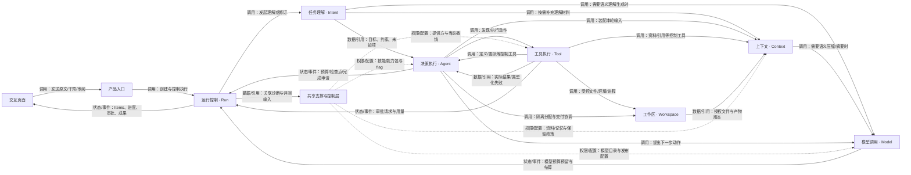
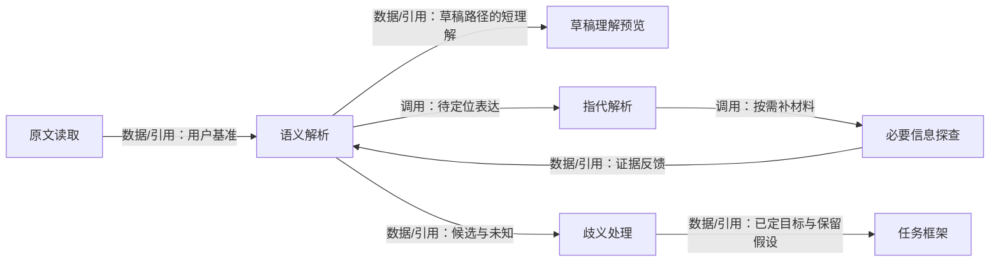
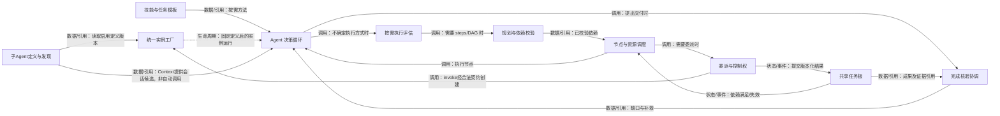
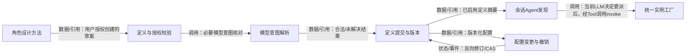
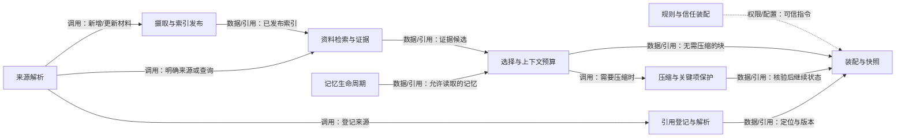
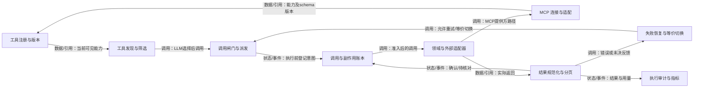
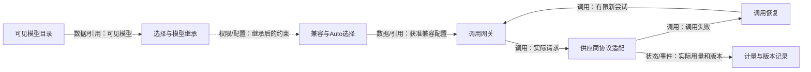
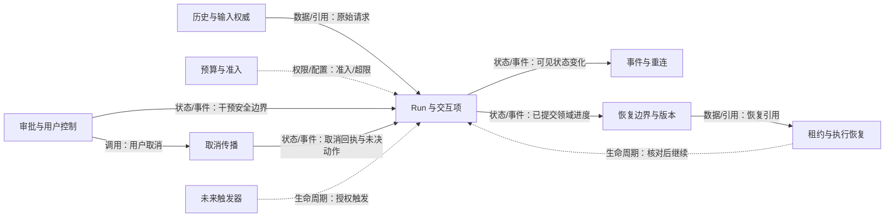
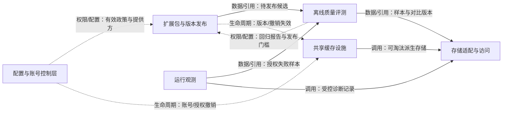
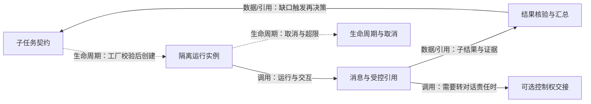

# UAW 分层架构图谱

状态：v0.10 目标设计。七个 Runtime 是逻辑边界，不是七个独立服务；图中所有执行能力均未因画图而成为已实现功能。

[打开交互图](demo/uaw-architecture-map.html) · [主架构](ARCHITECTURE.md) · [本轮题集参考](NOTION_ARCHITECTURE_REVIEW.md) · [细节契约](ENGINEERING_COMPLETENESS.md)

## 如何阅读

- 第一层：大模块调用与反馈。第二层：每个 Runtime 内部职责。第三层：易出错部分的细化链路。
- 箭头标清调用、数据/引用、状态/事件、权限/配置或生命周期。职责图允许反馈环，只有某一版任务依赖 DAG 必须无环。
- 统一入口代表状态所有权与契约；面向模型的控制工具通过 Tool 入口分发，不把全部业务逻辑挤进 Tool。
- 交互图点击节点看入口/输入/输出/约束，双击或点击“展开内部”进入下一层；关系筛选只隐藏显示，不改变设计。
- 节点 ID、归属与联系来自 [graph.json](architecture/graph.json)，由 [build_atlas.py](architecture/build_atlas.py) 生成本文与交互页面，更新图应修改生成源后重建。

## 1. UAW 总体关系

这是职责关系图，可以有反馈与循环；不规定每个请求必经全部模块。任务依赖 DAG、Agent 委派树和工作区分支另行建模。

| 子模块 | 统一入口 | 输入 → 输出 | 关键约束 | 详细开发策略 |
| --- | --- | --- | --- | --- |
| 交互页面 | `send/control/review` | 用户输入与选择 → 请求与可见反馈 | 任务理解是提示，原文是执行基准。 | [开发设计](docs/design/components/ui.md) · [接口契约](docs/api/nodes/ui.md) |
| 产品入口 | `submit/stream` | 原文、附件引用、会话配置 → AgentExecutionRequest | 输入路径不自动赋予本地权限。 | [开发设计](docs/design/components/ingress.md) · [接口契约](docs/api/nodes/ingress.md) |
| 任务理解 · Intent | `understand/preview` | 原文、草稿、必要资料 → TaskFrame / DraftPreview | 预览不替代用户指令；理解可以随证据修订。 | [开发设计](docs/design/modules/intent.md) · [接口契约](docs/api/nodes/intent.md) |
| 决策执行 · Agent | `start/step/define_agent` | TaskFrame、能力、预算、模型政策 → 动作提案、NodeResult、CompletionProposal | LLM 提议动作，Runtime 检查权限、预算、状态。 | [开发设计](docs/design/modules/agent.md) · [接口契约](docs/api/nodes/agent.md) |
| 上下文 · Context | `build/ingest/remember/forget` | purpose、目标、作用域、版本、token预算 → ContextSnapshot / ContextManifest / Reference | 压缩不赋权；资料和规则按信任来源区分。 | [开发设计](docs/design/modules/context.md) · [接口契约](docs/api/nodes/context.md) |
| 工具执行 · Tool | `discover/invoke/reconcile` | 工具参数与可信 ToolRuntimeContext → ToolResult、效果状态、原始结果引用 | 未知写结果先核对；只有登记等价契约才自动切换。 | [开发设计](docs/design/modules/tool.md) · [接口契约](docs/api/nodes/tool.md) |
| 工作区 · Workspace | `allocate/prepare/merge/review/revert` | 项目授权、BaseState、操作与预期版本 → Environment、ChangeSet、Artifact、ReviewSet | 本地 Runner 再检查；cwd/venv 不等于安全隔离。 | [开发设计](docs/design/modules/workspace.md) · [接口契约](docs/api/nodes/workspace.md) |
| 模型调用 · Model | `resolve_policy/generate` | 固定/Auto政策、prompt、能力需求 → 模型动作输出、实际版本、用量 | 用户指定模型优先；不可用不能静默换模型。 | [开发设计](docs/design/modules/model.md) · [接口契约](docs/api/nodes/model.md) |
| 运行控制 · Run | `create/control/checkpoint/resume` | 执行请求、版本、用户控制 → RunState、Items、事件、checkpoint | 完成文本不证明成功，completed 与 succeeded 分开。 | [开发设计](docs/design/modules/run.md) · [接口契约](docs/api/nodes/run.md) |
| 共享支撑与控制层 | `领域入口 + 共享设施` | 版本配置、派生数据、诊断/评测请求 → 有效配置、缓存、运行诊断、对比报告 | 不成为第八个强制执行 Runtime；业务状态仍归领域。 | [开发设计](docs/design/modules/support.md) · [接口契约](docs/api/nodes/support.md) |

## 2. 任务理解 · Intent

草稿与正式理解是两个入口；必要探查可循环，简单请求可以直接构建 TaskFrame。

| 子模块 | 统一入口 | 输入 → 输出 | 关键约束 | 详细开发策略 |
| --- | --- | --- | --- | --- |
| 草稿理解预览 | `preview` | 草稿 hash、最小历史 → DraftPreview | 只显示匹配当前草稿的预览。 | [开发设计](docs/design/components/intent-preview.md) · [接口契约](docs/api/nodes/intent.preview.md) |
| 原文读取 | `read_original` | original_input_ref → 原文与用户修订 | 不另存可覆盖的原文账本。 | [开发设计](docs/design/components/intent-original.md) · [接口契约](docs/api/nodes/intent.original.md) |
| 语义解析 | `parse` | 原文与必要上下文 → 目标/约束/候选解释 | 不用词典判复杂度，推断不伪装用户事实。 | [开发设计](docs/design/components/intent-semantic.md) · [接口契约](docs/api/nodes/intent.semantic.md) |
| 指代解析 | `resolve` | 表达与候选引用 → 可验证资源引用 | 不唯一保留歧义，不凭名称猜本地文件。 | [开发设计](docs/design/components/intent-references.md) · [接口契约](docs/api/nodes/intent.references.md) |
| 必要信息探查 | `probe` | 缺口、权限、剩余预算 → 证据与信息缺口 | 不在理解阶段无限调研。 | [开发设计](docs/design/components/intent-probe.md) · [接口契约](docs/api/nodes/intent.probe.md) |
| 歧义处理 | `resolve_ambiguity` | 候选目标与影响 → 可开始/需澄清 | 高影响关键条件未知时不能猜。 | [开发设计](docs/design/components/intent-ambiguity.md) · [接口契约](docs/api/nodes/intent.ambiguity.md) |
| 任务框架 | `build_frame` | 以上解析与证据 → TaskFrame revision | 正式理解变化说明原因，不覆盖原文。 | [开发设计](docs/design/components/intent-frame.md) · [接口契约](docs/api/nodes/intent.frame.md) |

## 3. 决策执行 · Agent

默认单 Agent 循环；规划、委派和并发分别按需启用。完成核验是任务语义与真实证据核对。

| 子模块 | 统一入口 | 输入 → 输出 | 关键约束 | 详细开发策略 |
| --- | --- | --- | --- | --- |
| 子Agent定义与发现 | `define_agent/discover_agents` | 用户授权配置、角色/定义版本 → AgentDefinitionVersion / CandidateSummary | 创建角色不自动启动任务；定义修改可撤销。 | [开发设计](docs/design/components/agent-definitions.md) · [接口契约](docs/api/nodes/agent.definitions.md) |
| 统一实例工厂 | `AgentFactory.create` | 定义版本、目标、引用、有效权限/模型与预算 → AgentInstance / allocation result | 定义创建不启动实例；重复请求不创建第二实例。 | [开发设计](docs/design/components/agent-factory.md) · [接口契约](docs/api/nodes/agent.factory.md) |
| Agent 决策循环 | `step` | TaskFrame、ContextSnapshot、预算 → 动作提案或答复 | 失败回到决策，不强制固定业务流水线。 | [开发设计](docs/design/components/agent-loop.md) · [接口契约](docs/api/nodes/agent.loop.md) |
| 按需执行评估 | `assess_execution` | 目标、能力、已知信息、成本 → ExecutionAssessment | 可合并理解，不要求独立判断 Agent。 | [开发设计](docs/design/components/agent-assessment.md) · [接口契约](docs/api/nodes/agent.assessment.md) |
| 规划与依赖校验 | `plan/validate` | 目标、依赖、预算、资源 → TaskGraph revision | 只有执行依赖图必须无环；计划版本之间可以迭代。 | [开发设计](docs/design/components/agent-planning.md) · [接口契约](docs/api/nodes/agent.planning.md) |
| 节点与资源调度 | `schedule` | 可运行节点、资源预留 → 受控执行与 Join 条件 | 节点不必须对应 Agent，能并行不等于值得并行。 | [开发设计](docs/design/components/agent-scheduler.md) · [接口契约](docs/api/nodes/agent.scheduler.md) |
| 委派与控制权 | `delegate/join/handoff` | 子目标、契约、引用、权限/预算 → NodeResult / ControlLease | 子上下文独立；默认父 Agent 负责最终回复。 | [开发设计](docs/design/components/agent-collaboration.md) · [接口契约](docs/api/nodes/agent.collaboration.md) |
| 技能与任务模板 | `resolve_skill/activate_skill` | 目标与可见技能元数据 → 固定 SkillBundle / TaskTemplate | 技能不能扩大权限，不把所有方法塞进常驻 prompt。 | [开发设计](docs/design/components/agent-skills.md) · [接口契约](docs/api/nodes/agent.skills.md) |
| 完成核验协调 | `verify/propose_completion` | 契约、成果版本、检查证据 → VerificationReport / Proposal | 真实测试、语义满足、用户接受分别记录。 | [开发设计](docs/design/components/agent-completion.md) · [接口契约](docs/api/nodes/agent.completion.md) |
| 共享任务板 | `read/commit(expected_revision)` | 各节点结构化结果 → TaskBoard revision | CAS 提交；依赖变更只使相关节点 stale。 | [开发设计](docs/design/components/agent-board.md) · [接口契约](docs/api/nodes/agent.board.md) |

## 4. 子Agent定义与发现

用户要求创建时主Agent加载方法并调用create；后续语义发现合适角色，invoke另经统一工厂启动。

| 子模块 | 统一入口 | 输入 → 输出 | 关键约束 | 详细开发策略 |
| --- | --- | --- | --- | --- |
| 角色设计方法 | `design_definition` | 用户创建要求、现有角色、能力摘要 → AgentDefinitionDraft | 不强制另起设计Agent，不擅存临时角色。 | [开发设计](docs/design/components/agent-definitions-designer.md) · [接口契约](docs/api/nodes/agent.definitions.designer.md) |
| 定义与授权校验 | `validate_definition` | 定义草案与可信上下文 → 可提交草案或阻碍项 | 用户指定来源由服务核对，模型引用不自行证明授权。 | [开发设计](docs/design/components/agent-definitions-validator.md) · [接口契约](docs/api/nodes/agent.definitions.validator.md) |
| 模型意图解析 | `resolve_model_intent` | 原指定名称及来源、父模型政策 → 规范ModelRequest或缺口 | 型号缺失回当前LLM，不暗换型号。 | [开发设计](docs/design/components/agent-definitions-model_intent.md) · [接口契约](docs/api/nodes/agent.definitions.model_intent.md) |
| 定义提交与版本 | `commit_definition` | 已验证定义、稳定请求键、预期版本 → DefinitionVersion / per-item result | 定义是配置，提交不创建执行实例。 | [开发设计](docs/design/components/agent-definitions-repository.md) · [接口契约](docs/api/nodes/agent.definitions.repository.md) |
| 会话Agent发现 | `discover_agents` | 当前任务与可见定义 → 有版本候选摘要 | 候选发现不等于调用；use_when不是词典路由。 | [开发设计](docs/design/components/agent-definitions-discovery.md) · [接口契约](docs/api/nodes/agent.definitions.discovery.md) |
| 配置变更与撤销 | `diff/disable/revert` | 定义版本、用户选定变更 → 新定义版本/冲突 | 撤销配置不逆转已发生的外部动作。 | [开发设计](docs/design/components/agent-definitions-change_service.md) · [接口契约](docs/api/nodes/agent.definitions.change_service.md) |
| 统一实例工厂 | `AgentFactory.create` | 定义版本、目标、引用、有效权限/模型与预算 → AgentInstance / allocation result | 定义创建不启动实例；重复请求不创建第二实例。 | [开发设计](docs/design/components/agent-factory.md) · [接口契约](docs/api/nodes/agent.factory.md) |

## 5. 上下文 · Context

资料、记忆与规则是不同支路，最终按当前任务目的装配；不是先跑完整 RAG 再回答。

| 子模块 | 统一入口 | 输入 → 输出 | 关键约束 | 详细开发策略 |
| --- | --- | --- | --- | --- |
| 来源解析 | `resolve_sources` | 目标、scope、引用版本 → SourceManifest | 本地材料走 Workspace 授权适配器。 | [开发设计](docs/design/components/context-sources.md) · [接口契约](docs/api/nodes/context.sources.md) |
| 规则与信任装配 | `resolve_rules` | 可信规则来源与作用域 → InstructionSet | 网页/工具文本不会自动变为高优先级指令。 | [开发设计](docs/design/components/context-rules.md) · [接口契约](docs/api/nodes/context.rules.md) |
| 摄取与索引发布 | `ingest/publish/delete` | 来源版本、内容、授权 → 内容块与 active revision | 未准备好的新索引不能混入当前有效版本。 | [开发设计](docs/design/components/context-ingestion.md) · [接口契约](docs/api/nodes/context.ingestion.md) |
| 资料检索与证据 | `retrieve` | 查询、过滤、scope、预算 → 版本化证据引用 | 召回相关不证明来源真实；少量资料可直接读取。 | [开发设计](docs/design/components/context-retrieval.md) · [接口契约](docs/api/nodes/context.retrieval.md) |
| 记忆生命周期 | `remember/recall/forget` | 用户显式要求/候选、记忆政策 → Memory revision | 用户偏好不能授予权限；未核验结论不升为共享事实。 | [开发设计](docs/design/components/context-memory.md) · [接口契约](docs/api/nodes/context.memory.md) |
| 选择与上下文预算 | `select/allocate` | 候选块、模型限制、任务目标 → 选中块与分配计划 | 不按固定回合裁剪所有任务。 | [开发设计](docs/design/components/context-selection.md) · [接口契约](docs/api/nodes/context.selection.md) |
| 压缩与关键项保护 | `compress/validate` | 固定输入与保留项 → ContinuationState | 真实审批与执行状态回 Runtime 读取。 | [开发设计](docs/design/components/context-compression.md) · [接口契约](docs/api/nodes/context.compression.md) |
| 装配与快照 | `compose` | 选中块、指令、压缩状态 → ContextSnapshot / Manifest | 缓存不能改变用户目标、时间或有效工具权限。 | [开发设计](docs/design/components/context-composer.md) · [接口契约](docs/api/nodes/context.composer.md) |
| 引用登记与解析 | `register/resolve/read` | 来源与位置、hash、可见范围 → Reference / Citation | 不编造来源；不可用时给出明确状态。 | [开发设计](docs/design/components/context-references.md) · [接口契约](docs/api/nodes/context.references.md) |

## 6. 工具执行 · Tool

工具动作有统一入口，具体状态仍由所属 Runtime 实现；失败恢复集中在 Tool。

| 子模块 | 统一入口 | 输入 → 输出 | 关键约束 | 详细开发策略 |
| --- | --- | --- | --- | --- |
| 工具注册与版本 | `register/update` | 已启用 ToolSpec、能力/效果元数据 → Registry revision | 向量命中不能代替 schema 或当前授权。 | [开发设计](docs/design/components/tool-registry.md) · [接口契约](docs/api/nodes/tool.registry.md) |
| 工具发现与筛选 | `discover` | 目标、范围、候选预算 → 可见 schema 与候选依据 | 小工具集可直接暴露，索引只是发现方法。 | [开发设计](docs/design/components/tool-discovery.md) · [接口契约](docs/api/nodes/tool.discovery.md) |
| 调用闸门与派发 | `invoke` | ToolCall + trusted context → 标准 ToolResult | 模型不能写入 approved/principal 等可信字段。 | [开发设计](docs/design/components/tool-invocation.md) · [接口契约](docs/api/nodes/tool.invocation.md) |
| 调用与副作用账本 | `record_intent/reconcile` | action_id、参数hash、幂等键 → confirmed/pending/unknown | 超时不证明失败，不盲重试未知外部写入。 | [开发设计](docs/design/components/tool-effects.md) · [接口契约](docs/api/nodes/tool.effects.md) |
| 失败恢复与等价切换 | `recover` | 类型化错误、剩余deadline → 恢复结果或能力缺口 | 非等价替换必须交给 Agent 重新决定。 | [开发设计](docs/design/components/tool-failure.md) · [接口契约](docs/api/nodes/tool.failure.md) |
| MCP 连接与适配 | `connect/discover/call/close` | 已授权 provider 配置引用 → 命名空间能力与协议结果 | 连接不授信，重连不重放未知写调用。 | [开发设计](docs/design/components/tool-mcp.md) · [接口契约](docs/api/nodes/tool.mcp.md) |
| 领域与外部适配器 | `dispatch` | 已准入的调用 → 原始结果及效果状态 | 平台凭据不进入任意任务代码。 | [开发设计](docs/design/components/tool-adapters.md) · [接口契约](docs/api/nodes/tool.adapters.md) |
| 结果规范化与分页 | `normalize/page` | 原始输出、执行状态 → ToolResult / raw_ref | HTTP200 或成功文字不能证明业务成功。 | [开发设计](docs/design/components/tool-results.md) · [接口契约](docs/api/nodes/tool.results.md) |
| 执行审计与指标 | `audit/observe` | 调用版本、结果、关联IDs → 事件与受控诊断引用 | 不保存凭据；执行审计不依赖模型自述。 | [开发设计](docs/design/components/tool-audit.md) · [接口契约](docs/api/nodes/tool.audit.md) |

## 7. 工作区 · Workspace

本地项目首版可用是产品目标；图不代表 Runner 已实现。交付、用户接受和外部发布是不同操作。

| 子模块 | 统一入口 | 输入 → 输出 | 关键约束 | 详细开发策略 |
| --- | --- | --- | --- | --- |
| 项目绑定与本地授权 | `bind/check_scope` | 用户选定项目与权限 → ProjectRootBinding | 上传路径、符号链接或子目录不能绕过根边界。 | [开发设计](docs/design/components/workspace-binding.md) · [接口契约](docs/api/nodes/workspace.binding.md) |
| 输入基础状态 | `capture_base` | 用户工作目录/选定revision → BaseStateSpec | 记录来源，不遗漏用户正在编辑的内容。 | [开发设计](docs/design/components/workspace-base.md) · [接口契约](docs/api/nodes/workspace.base.md) |
| 隔离与分支 | `allocate/release` | 基础状态与所需隔离 → WorkspaceHandle | 如需原项目执行，明确冲突策略与实际隔离能力。 | [开发设计](docs/design/components/workspace-isolation.md) · [接口契约](docs/api/nodes/workspace.isolation.md) |
| 环境准备与回收 | `inspect/ensure/release` | 模板、项目要求、预算 → EnvironmentManifest | 项目依赖与 Runtime 服务环境分开，全局安装另授权。 | [开发设计](docs/design/components/workspace-environment.md) · [接口契约](docs/api/nodes/workspace.environment.md) |
| 文件与进程执行 | `read/write/exec/poll/stop` | 工作区句柄、命令、deadline → 执行证据与实际改动 | 任意代码前后采集改动，不能漏掉shell写文件。 | [开发设计](docs/design/components/workspace-process.md) · [接口契约](docs/api/nodes/workspace.process.md) |
| 变更与冲突合并 | `changes/merge/revert` | 基础/当前版本与改动单位 → 新revision或ConflictSet | 不覆盖用户后续修改；冲突需明确解决。 | [开发设计](docs/design/components/workspace-changes.md) · [接口契约](docs/api/nodes/workspace.changes.md) |
| 产物与格式适配 | `register/preview/export` | 真实成果文件与版本 → ArtifactHandle | 存在可打开不等于内容质量合格。 | [开发设计](docs/design/components/workspace-artifacts.md) · [接口契约](docs/api/nodes/workspace.artifacts.md) |
| 审阅与局部接受 | `review/accept/reject/revise` | 固定 ReviewSet 与用户意见 → Delivery 状态与新用户修订 | 不支持块级接受的格式明确只支持整份。 | [开发设计](docs/design/components/workspace-review.md) · [接口契约](docs/api/nodes/workspace.review.md) |

## 8. 模型调用 · Model

默认所有 Agent 继承用户选择；成本优化与故障恢复都遵守这一政策。

| 子模块 | 统一入口 | 输入 → 输出 | 关键约束 | 详细开发策略 |
| --- | --- | --- | --- | --- |
| 可见模型目录 | `list/resolve` | 用户scope与平台配置 → 可用模型候选 | 目录可缓存，调用仍复核当前状态。 | [开发设计](docs/design/components/model-catalog.md) · [接口契约](docs/api/nodes/model.catalog.md) |
| 选择与模型继承 | `resolve_policy` | 用户选择、父政策、子显式要求 → EffectiveModelPolicy | 技能/角色不能覆盖用户选定模型。 | [开发设计](docs/design/components/model-policy.md) · [接口契约](docs/api/nodes/model.policy.md) |
| 兼容与Auto选择 | `check/select` | 有效政策、能力需求与预算 → 兼容调用配置或缺口 | 不可用回到Agent/用户，不偷偷降低模型。 | [开发设计](docs/design/components/model-capability.md) · [接口契约](docs/api/nodes/model.capability.md) |
| 调用网关 | `generate` | ContextSnapshot与调用配置 → 带关联ID的模型尝试 | 供应商差异明确呈现，统一接口不伪装全兼容。 | [开发设计](docs/design/components/model-gateway.md) · [接口契约](docs/api/nodes/model.gateway.md) |
| 供应商协议适配 | `provider_call` | 支持的参数与版本 → 标准输出与usage | 能力/计费依官方协议核对，不假设KV可控。 | [开发设计](docs/design/components/model-adapters.md) · [接口契约](docs/api/nodes/model.adapters.md) |
| 调用恢复 | `recover` | attempt错误、剩余预算 → 新attempt或明确失败 | 流式重试不拼接两次输出；固定模型不静默切换。 | [开发设计](docs/design/components/model-recovery.md) · [接口契约](docs/api/nodes/model.recovery.md) |
| 计量与版本记录 | `record_usage/settle` | provider usage与预留 → 账本结算、模型调用记录 | 未知账单待核对，不能按成功调用数漏算失败。 | [开发设计](docs/design/components/model-usage.md) · [接口契约](docs/api/nodes/model.usage.md) |

## 9. 运行控制 · Run

Run 负责可靠控制；计划/记忆/工具结果仍由各自领域写入，不复制第二套业务权威。

| 子模块 | 统一入口 | 输入 → 输出 | 关键约束 | 详细开发策略 |
| --- | --- | --- | --- | --- |
| 历史与输入权威 | `append/read` | 原文与用户控制 → InputRef / History | 云/本地权威尚待选定，执行位置不决定存储位置。 | [开发设计](docs/design/components/run-history.md) · [接口契约](docs/api/nodes/run.history.md) |
| Run 与交互项 | `transition/emit_item` | 预期版本与领域确认 → RunState / InteractionItem | 模型finish不能跳过必需的证据核验。 | [开发设计](docs/design/components/run-state.md) · [接口契约](docs/api/nodes/run.state.md) |
| 事件与重连 | `append/subscribe/replay` | 带关联IDs的变化 → stream_seq与cursor | 事件回放不重新调用工具，不能被采样丢失关键状态。 | [开发设计](docs/design/components/run-events.md) · [接口契约](docs/api/nodes/run.events.md) |
| 预算与准入 | `reserve/settle/release` | 动作估算、已用额、deadline → 预留凭据或限额结果 | 重试/子Agent/汇总都计入总额，队列有界。 | [开发设计](docs/design/components/run-budget.md) · [接口契约](docs/api/nodes/run.budget.md) |
| 审批与用户控制 | `control/decide_approval` | 用户或受授权独立代审决定 → ApprovalRef / ControlReceipt | assisted/manual/automatic不扩大真实权限。 | [开发设计](docs/design/components/run-approval.md) · [接口契约](docs/api/nodes/run.approval.md) |
| 恢复边界与版本 | `checkpoint` | 已提交进度与未决动作 → Checkpoint | 不承诺跨外部系统原子快照。 | [开发设计](docs/design/components/run-checkpoint.md) · [接口契约](docs/api/nodes/run.checkpoint.md) |
| 租约与执行恢复 | `acquire/resume` | checkpoint和当前状态 → 恢复节点或明确受阻 | 非兼容版本不强行续跑；rerun是新Run。 | [开发设计](docs/design/components/run-resume.md) · [接口契约](docs/api/nodes/run.resume.md) |
| 取消传播 | `cancel` | 范围与取消原因 → 各执行器回执/未决项 | 停止等待不等于外部动作已撤销。 | [开发设计](docs/design/components/run-cancel.md) · [接口契约](docs/api/nodes/run.cancel.md) |
| 未来触发器 | `trigger` | 授权TriggerSpec与幂等键 → 新Run或受控续接 | 先预留，不默认允许自动创建定时任务。 | [开发设计](docs/design/components/run-trigger.md) · [接口契约](docs/api/nodes/run.trigger.md) |

## 10. 共享支撑与控制层

共享设施各有统一入口；调用图显示逻辑职责，不要求新增多个服务或数据库。

| 子模块 | 统一入口 | 输入 → 输出 | 关键约束 | 详细开发策略 |
| --- | --- | --- | --- | --- |
| 配置与账号控制层 | `publish_config/connect/revoke` | 平台管理与账号授权 → 版本配置、凭据引用 | 管理API不暴露为普通Agent工具；撤销当前生效。 | [开发设计](docs/design/components/support-configuration.md) · [接口契约](docs/api/nodes/support.configuration.md) |
| 扩展包与版本发布 | `install/validate/activate/rollback` | 不可变包与依赖 → ReleaseManifest | 安装不是授权，同版本内容不能偷偷变化。 | [开发设计](docs/design/components/support-extensions.md) · [接口契约](docs/api/nodes/support.extensions.md) |
| 共享缓存设施 | `get_or_compute/invalidate` | 领域声明的可复用输入 → 缓存引用与命中结果 | 领域决定有效性，缓存不储存唯一的审批/产物。 | [开发设计](docs/design/components/support-cache.md) · [接口契约](docs/api/nodes/support.cache.md) |
| 运行观测 | `observe/query_trace` | 脱敏span/event/metric → 诊断视图与指标 | Trace不替代恢复日志，不收隐藏思维全文。 | [开发设计](docs/design/components/support-observability.md) · [接口契约](docs/api/nodes/support.observability.md) |
| 离线质量评测 | `evaluate/compare` | candidate/baseline/dataset/environment → 切片对比与ReleaseGate | 不为每个用户请求执行；防止评测重放外部写入。 | [开发设计](docs/design/components/support-evaluation.md) · [接口契约](docs/api/nodes/support.evaluation.md) |
| 存储适配与访问 | `repository/blob/index` | 领域拥有的对象和scope → 持久引用与版本 | 物理数据库选型另议，不共用无归属的万能状态表。 | [开发设计](docs/design/components/support-stores.md) · [接口契约](docs/api/nodes/support.stores.md) |

## 11. 调用闸门与派发

这是一条动作的安全契约，不是固定业务任务流水线；拒绝和未知结果都回到Agent决策。

| 子模块 | 统一入口 | 输入 → 输出 | 关键约束 | 详细开发策略 |
| --- | --- | --- | --- | --- |
| 参数与可信上下文 | `normalize` | ToolCall与服务端上下文 → ValidatedCall | 模型参数不能覆盖执行主体。 | [开发设计](docs/design/components/tool-invocation-schema.md) · [接口契约](docs/api/nodes/tool.invocation.schema.md) |
| 执行预检 | `precheck` | 动作与资源版本 → 允许/拒绝/需审批 | schema合法不等于允许执行。 | [开发设计](docs/design/components/tool-invocation-precheck.md) · [接口契约](docs/api/nodes/tool.invocation.precheck.md) |
| 必要审批等待 | `request_approval` | 绑定动作、参数hash、资源、有效期 → ApprovalRef / declined | 超时或没回复不算批准。 | [开发设计](docs/design/components/tool-invocation-approval.md) · [接口契约](docs/api/nodes/tool.invocation.approval.md) |
| 执行前复核 | `recheck` | 当前动作与审批引用 → 可执行调用或stale | TOCTOU变化需重新判断，不复用过期批准。 | [开发设计](docs/design/components/tool-invocation-recheck.md) · [接口契约](docs/api/nodes/tool.invocation.recheck.md) |
| 意图登记与执行 | `record_then_dispatch` | 稳定业务键、预留、deadline → confirmed/pending/unknown | 并行生成不能越过执行闸门。 | [开发设计](docs/design/components/tool-invocation-dispatch.md) · [接口契约](docs/api/nodes/tool.invocation.dispatch.md) |
| 规范结果与结算 | `normalize/settle` | 实际返回与用量 → ToolResult与反馈 | unknown保留核对，不冒充failed后重发。 | [开发设计](docs/design/components/tool-invocation-result.md) · [接口契约](docs/api/nodes/tool.invocation.result.md) |

## 12. 委派与控制权

delegate返回结果，父Agent仍负责用户对话；handoff另行移交控制权，不是普通子调用。

| 子模块 | 统一入口 | 输入 → 输出 | 关键约束 | 详细开发策略 |
| --- | --- | --- | --- | --- |
| 子任务契约 | `prepare_delegation` | 父目标与独立子工作 → DelegationSpec | 检查协调成本，不凭复杂二字一律拆分。 | [开发设计](docs/design/components/agent-collaboration-contract.md) · [接口契约](docs/api/nodes/agent.collaboration.contract.md) |
| 隔离运行实例 | `spawn` | 定义版本与子预算 → AgentInstance | 不共享可写临时状态。 | [开发设计](docs/design/components/agent-collaboration-instance.md) · [接口契约](docs/api/nodes/agent.collaboration.instance.md) |
| 消息与受控引用 | `send/read` | 带任务/节点/版本的消息 → 可追踪AgentMessage | 不复制完整上下文或凭据。 | [开发设计](docs/design/components/agent-collaboration-channel.md) · [接口契约](docs/api/nodes/agent.collaboration.channel.md) |
| 结果核验与汇总 | `join` | NodeResult引用与状态 → 整合结果/缺口 | 缺失和失败不静默视为完成。 | [开发设计](docs/design/components/agent-collaboration-join.md) · [接口契约](docs/api/nodes/agent.collaboration.join.md) |
| 可选控制权交接 | `handoff` | 目标Agent、未完成状态、expected_lease → 新ControlLease或失败 | 控制权不自动转移全部权限，首版不默认开启。 | [开发设计](docs/design/components/agent-collaboration-handoff.md) · [接口契约](docs/api/nodes/agent.collaboration.handoff.md) |
| 生命周期与取消 | `cancel/reconcile` | 父子关联与未决调用 → 回执与保留成果 | 不可取消副作用仍需Tool对账。 | [开发设计](docs/design/components/agent-collaboration-cancel.md) · [接口契约](docs/api/nodes/agent.collaboration.cancel.md) |

## 13. 完成核验协调

成果存在、检查通过、语义满足和用户接受分别表达；验收策略随任务变化。

| 子模块 | 统一入口 | 输入 → 输出 | 关键约束 | 详细开发策略 |
| --- | --- | --- | --- | --- |
| 语义交付契约 | `resolve_contract` | 用户原文与已明确修订 → DeliveryContract revision | LLM不能为完成而删掉必需目标。 | [开发设计](docs/design/components/agent-completion-contract.md) · [接口契约](docs/api/nodes/agent.completion.contract.md) |
| 真实证据收集 | `select_and_request_checks` | 成果与缺口 → 检查/来源引用 | 没有跑测试就不能说测试通过。 | [开发设计](docs/design/components/agent-completion-evidence.md) · [接口契约](docs/api/nodes/agent.completion.evidence.md) |
| 语义核对 | `review` | 契约与受测版本证据 → 目标满足/部分/受阻 | 不强制新增裁判Agent；主张不是事实证明。 | [开发设计](docs/design/components/agent-completion-semantic.md) · [接口契约](docs/api/nodes/agent.completion.semantic.md) |
| 版本与硬条件校验 | `validate_proposal` | VerificationReport与当前revision → 允许提交或stale | 合并/撤销/局部接受可能需要重验。 | [开发设计](docs/design/components/agent-completion-version.md) · [接口契约](docs/api/nodes/agent.completion.version.md) |
| 提交交付 | `commit_completion` | CAS完成提案 → 完整/部分/受阻交付 | completed不一律等于succeeded。 | [开发设计](docs/design/components/agent-completion-delivery.md) · [接口契约](docs/api/nodes/agent.completion.delivery.md) |
| 用户接受与迭代 | `review_delivery` | 固定ReviewSet与用户意见 → 独立Delivery状态/新修订 | AI判断完成与用户认可分开。 | [开发设计](docs/design/components/agent-completion-acceptance.md) · [接口契约](docs/api/nodes/agent.completion.acceptance.md) |

## 14. 记忆生命周期

显式要求及时提交并报告成功/失败；推断候选可后台核验。遗忘是可追踪动作。

| 子模块 | 统一入口 | 输入 → 输出 | 关键约束 | 详细开发策略 |
| --- | --- | --- | --- | --- |
| 记忆候选 | `propose_memory` | 用户输入、任务结果、来源 → 待判断候选 | 不要每句话都写长期记忆。 | [开发设计](docs/design/components/context-memory-candidate.md) · [接口契约](docs/api/nodes/context.memory.candidate.md) |
| 范围与写入政策 | `check_memory_policy` | 候选与用户控制 → 允许写入或拒绝 | 不因协作而默认共享私人资料。 | [开发设计](docs/design/components/context-memory-policy.md) · [接口契约](docs/api/nodes/context.memory.policy.md) |
| 查重与冲突 | `resolve_conflict` | 来源/时间/条件/版本 → 版本化事实或待确认 | 相似不等于相同，不混淆不同成立条件。 | [开发设计](docs/design/components/context-memory-conflict.md) · [接口契约](docs/api/nodes/context.memory.conflict.md) |
| 提交与召回 | `commit/recall` | 验证事实与policy → MemoryRef / revision | 记忆不能成为授权凭证。 | [开发设计](docs/design/components/context-memory-store.md) · [接口契约](docs/api/nodes/context.memory.store.md) |
| 遗忘与删除传播 | `forget` | 选择器、派生依赖、保留政策 → 完成项/失败项/删除标记 | 备份恢复要重放删除，物理期限明确。 | [开发设计](docs/design/components/context-memory-forget.md) · [接口契约](docs/api/nodes/context.memory.forget.md) |

## 15. MCP 连接与适配

MCP会话由Tool管理，账号授权与凭据由控制层管理，两种生命周期关联但不混为一份状态。

| 子模块 | 统一入口 | 输入 → 输出 | 关键约束 | 详细开发策略 |
| --- | --- | --- | --- | --- |
| 提供方绑定 | `resolve_provider` | provider_ref与调用scope → 可连接配置 | 服务密钥不进入prompt。 | [开发设计](docs/design/components/tool-mcp-provider.md) · [接口契约](docs/api/nodes/tool.mcp.provider.md) |
| 协议会话 | `connect/health/close` | 连接配置与deadline → SessionHandle | 重连不重新执行未知写操作。 | [开发设计](docs/design/components/tool-mcp-session.md) · [接口契约](docs/api/nodes/tool.mcp.session.md) |
| 能力规范化 | `discover/normalize` | 远端能力清单 → ToolSpec / registry revision | 远端描述是数据，不是高优先级指令。 | [开发设计](docs/design/components/tool-mcp-capabilities.md) · [接口契约](docs/api/nodes/tool.mcp.capabilities.md) |
| 闸门后调用 | `proxy_call` | 已准入动作与稳定调用ID → 协议结果或类型化失败 | 注册可见不等于现在有执行授权。 | [开发设计](docs/design/components/tool-mcp-invoke.md) · [接口契约](docs/api/nodes/tool.mcp.invoke.md) |
| 变化与撤销 | `invalidate_binding` | 当前变化事件 → registry revision / revoked状态 | 旧会话不能继续使用已撤销账号。 | [开发设计](docs/design/components/tool-mcp-invalidate.md) · [接口契约](docs/api/nodes/tool.mcp.invalidate.md) |

## 16. 租约与执行恢复

恢复有明确核对边界；未决效果无法核实的依赖不能当成已成功继续。

| 子模块 | 统一入口 | 输入 → 输出 | 关键约束 | 详细开发策略 |
| --- | --- | --- | --- | --- |
| 取得运行租约 | `acquire_lease` | run/node及预期revision → 有限Lease | 多worker需要fencing，单进程先保恢复边界。 | [开发设计](docs/design/components/run-resume-lease.md) · [接口契约](docs/api/nodes/run.resume.lease.md) |
| 版本兼容检查 | `check_compatibility` | checkpoint与当前实现 → 兼容/迁移/受阻 | 升级不能悄悄改变既有审批与模型政策。 | [开发设计](docs/design/components/run-resume-versions.md) · [接口契约](docs/api/nodes/run.resume.versions.md) |
| 重建连接与核验 | `rehydrate` | 有效配置与资源引用 → 可恢复句柄与范围 | checkpoint不保存可长期复用的密钥授权。 | [开发设计](docs/design/components/run-resume-access.md) · [接口契约](docs/api/nodes/run.resume.access.md) |
| Tool未决动作对账 | `reconcile` | Tool账本游标与业务键 → 实际效果状态 | 先核对，再决定是否允许重试。 | [开发设计](docs/design/components/run-resume-effects.md) · [接口契约](docs/api/nodes/run.resume.effects.md) |
| 工作区实际版本 | `check_workspace` | 保存的版本与当前Runner状态 → 可继续/冲突/缺失 | 不把旧快照冒充当前磁盘。 | [开发设计](docs/design/components/run-resume-workspace.md) · [接口契约](docs/api/nodes/run.resume.workspace.md) |
| 恢复可运行工作 | `resume_nodes` | 核对后的领域状态 → Run进展或明确受阻 | replay不执行；rerun是新尝试。 | [开发设计](docs/design/components/run-resume-continue.md) · [接口契约](docs/api/nodes/run.resume.continue.md) |

## 变更、失败和等待如何回流

- 用户纠正：UI → Ingress → Run 原文/ControlRequest → Intent 新理解 → Agent 使相关计划/结果失效；未受影响成果继续保留。
- 工具失败：Tool 分类与允许恢复 → Agent 观察缺口；改变能力或目标时由 Agent 再决策。
- 审批等待：Tool 预检 → Run 持久审批 → Tool 再核验 → 真正执行，拒绝回到 Agent 选已允许方案。
- 上下文不足：Context 分页/筛选/压缩保护 → Agent 按缺口补资料；不能用摘要证明工具已执行。
- 用户改文件：Workspace 检测实际版本变化 → ChangeSet 冲突/报告失效 → Agent 重验或修订，保留用户编辑。
- 执行恢复：Run 租约/兼容检查 → 当前授权 → Tool 未决效果对账 → Workspace 实际版本 → Agent 可运行节点。

## 跨模块引用契约

每条联系的概念载荷必须携带 scope、关联 IDs、实际版本与类型化失败。返回的引用由原领域保管，消费方检查当前可访问性；Trace 只串联诊断，不作为第二份权威状态。具体字段按首条真实任务细化，不宣称永久协议已稳定。
