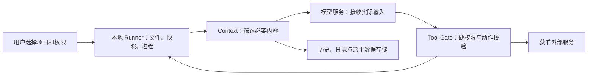

# UAW 产品独立评审

评审日期：2026-10-02（Asia/Shanghai）  
模式：Product Architect / Critical Review，追加 AI 产品专项审查  
对象：E:/UAW 中的架构 v0.8、配套文档、提示词、协议草案及模拟页面  
建议状态：有条件推进一个真实任务闭环；尚无充分证据支持按完整通用平台范围投入。此为评审建议，不更改用户已确认的产品方向。

## 1. 判断与证据边界

UAW 的工程目标已经比较清晰：提供单用户工作区，让用户以自然语言完成办公、开发和学术任务，按需调用工具或子 Agent，访问获准本地项目，交付有版本、可检查、可修改的成果。

产品价值仍处于待验证阶段。三类目标用户是团队选择的服务范围，不等于已经验证的市场；真实任务、使用频率、切换理由、付款和成本数据尚未在本目录出现。缺少证据不证明需求不存在，但不足以支持大范围投资。

本次完整读取 10 份根目录 Markdown、4 份提示词、1 份 JSON Schema；静态检查 HTML 的模拟逻辑并查看桌面、移动端两张预览图。本目录未发现可用于验证七个 Runtime、Local Runner、真实模型调用或用户行为的执行实现、运行日志和研究数据。没有启动后端、运行陌生脚本、安装依赖或联系用户。原设计文档保持原样。

与此前 v0.2 相比，v0.8 已补充：真实任务优先、单 Agent 基线、可复用模板、交付质量、运行中干预、局部接受、撤销及本地访问边界。因此不能继续把“没有模板”“仅校验文件存在”“所有任务先走复杂规划”作为当前问题。风险已从职责遗漏，转向这些设计能否以合理成本兑现，并形成用户选择理由。

重要判断：

| 判断 | 类型与依据 | 置信及适用边界 | 改变判断的证据 |
| --- | --- | --- | --- |
| 可以继续一个完整任务的验证开发 | Recommendation / E-001、E-002、E-007 | 中等；适用于设计阶段，不代表可公开发布 | 明确的团队资源、真实任务和可接受成果标准 |
| 不宜让三类用户同时驱动首发完整范围 | Recommendation / E-001、E-002、H-001 | 中等；资源未知，不能断言团队做不到 | 各类任务均有可复用能力、用户行为与可承担成本证据 |
| 当前尚未证明差异化和产品市场匹配 | Unknown / E-002、E-015～019 | 对“本目录缺证据”置信高；对实际市场成败无确定判断 | 与现有方式对照的成果、返工、重复使用和付款记录 |
| 审批与语义核验的真实效果必须独立评测 | Recommendation / E-006、E-007、E-015 | 高；程序边界与模型判断不能相互替代 | 对抗、故障和盲评样本的真实结果 |

## 2. 证据台账

本地证据均在 2026-10-02 读取。其事实范围是“文档这样定义”或“模拟代码这样展示”，不是生产能力证明。文件没有统一的编写日期；不把读取日期当成编写日期。

| ID | 来源与定位 | 可以支持的陈述 | 限制 |
| --- | --- | --- | --- |
| E-001 | [ARCHITECTURE.md:3](E:/UAW/ARCHITECTURE.md:3)、[实施顺序:296](E:/UAW/ARCHITECTURE.md:296) | v0.8 为设计；三类用户；从真实任务提取公共能力 | 没有实现和用户结果 |
| E-002 | [PRODUCT_VALIDATION.md:3](E:/UAW/PRODUCT_VALIDATION.md:3)、[指标:36](E:/UAW/PRODUCT_VALIDATION.md:36) | 用户范围已选，任务、付款、基线待验证；已有正确的指标口径 | 验证计划不是验证结果 |
| E-003 | [RUNTIME_DECISIONS.md:90](E:/UAW/RUNTIME_DECISIONS.md:90) | Agent 定义默认绑定会话；项目/个人提升留作显式扩展 | 未验证复用习惯 |
| E-004 | [ARCHITECTURE.md:240](E:/UAW/ARCHITECTURE.md:240) | 固定模型涵盖理解、预览和未覆盖的子 Agent；Auto 才可路由 | 无调用成本和任务表现数据 |
| E-005 | [LOCAL_APPROVAL_SEMANTIC.md:5](E:/UAW/LOCAL_APPROVAL_SEMANTIC.md:5) | 首版本地 Runner、配对、快照；隔离与 native 两种执行边界 | OS、包装和真实隔离选型尚未落地 |
| E-006 | [LOCAL_APPROVAL_SEMANTIC.md:29](E:/UAW/LOCAL_APPROVAL_SEMANTIC.md:29) | 三种审批；独立 Reviewer；预授权和动作绑定 | 文案解释仍待反馈；没有误放行/误拒绝数据 |
| E-007 | [DELIVERY_VERIFICATION.md:13](E:/UAW/DELIVERY_VERIFICATION.md:13)、[版本:57](E:/UAW/DELIVERY_VERIFICATION.md:57) | 技术与语义校验分开；必需条件来源、版本、真实检查、用户接受分别记录 | 没有验收集或误判率 |
| E-008 | [ADMIN_CONFIGURATION.md:3](E:/UAW/ADMIN_CONFIGURATION.md:3)、[配额:52](E:/UAW/ADMIN_CONFIGURATION.md:52) | 平台提供服务凭据；额度、故障、成本需运营 | 无定价、供应商或支持成本 |
| E-009 | [CACHE_DESIGN.md:192](E:/UAW/CACHE_DESIGN.md:192) | 缓存有渐进实施顺序，不承诺收益 | 尚无收益测量；标题仍配套 v0.6 |
| E-010 | [FRONTEND_BLUEPRINT.md:5](E:/UAW/FRONTEND_BLUEPRINT.md:5) | 三栏、项目导航、模型/审批、任务预览、成果/核验/引用 | 交互蓝图，不是可用性研究 |
| E-011 | [ACADEMIC_AGENT.md:3](E:/UAW/ACADEMIC_AGENT.md:3)、[验收:92](E:/UAW/ACADEMIC_AGENT.md:92) | 学科未知；强调真实引用、前提、复现与用户验收 | 角色协议不能证明学科能力 |
| E-012 | [CONTROL_TOOLS.md:81](E:/UAW/CONTROL_TOOLS.md:81)、[main_agent.md:3](E:/UAW/prompts/main_agent.md:3)、[schema:4](E:/UAW/contracts/execution_assessment.schema.json:4) | 基础发现常驻；工具按需加载；形状校验不等于授权/正确性 | 提示词未真实评测 |
| E-013 | [uaw-workspace.html:112](E:/UAW/demo/uaw-workspace.html:112)、[FRONTEND_BLUEPRINT.md:3](E:/UAW/FRONTEND_BLUEPRINT.md:3) | 推进/审批可直接切到模拟完成；页面明确说明示例 | 不得把模拟“通过”用于产品质量结论 |
| E-014 | [RUNTIME_DECISIONS.md:146](E:/UAW/RUNTIME_DECISIONS.md:146) | 云端权威历史仍为建议；本地历史与模型推理位置独立 | 历史部署方式尚未选定 |

外部证据在 2026-10-02 检索。官方资料可确认公开能力/厂商描述，不能证明竞品实际效果或 UAW 一定不具竞争力。本次不做市场规模、价格或完整竞品评分。

| ID | 官方来源 | 所支持的竞争/依赖信息 | 日期与边界 |
| --- | --- | --- | --- |
| E-015 | [Anthropic: How we contain Claude across products](https://www.anthropic.com/engineering/how-we-contain-claude) | 介绍 Code/Cowork 的不同隔离与审批策略；模型防御不能单独承担控制 | 发布 2026-05-25；厂商自己的工程报告 |
| E-016 | [Claude Code: Create custom subagents](https://code.claude.com/docs/en/sub-agents) | 公开提供自定义子 Agent、独立上下文、工具限制及项目/个人作用域 | 动态文档，公开能力，不是 UAW 对照实测 |
| E-017 | [Microsoft: Work IQ overview](https://learn.microsoft.com/en-us/microsoft-365/copilot/extensibility/work-iq/) | 组织数据、上下文、工具、工作区与权限治理是其公开产品方向 | 页面更新 2026-09-25；不推断真实采用率 |
| E-018 | [Elicit: Which workflow should I use?](https://support.elicit.com/en/articles/14757543-getting-started-with-elicit-which-workflow-should-i-use) | 提供研究 Agent、报告、系统综述入口，后者含筛选与抽取控制 | 动态帮助页；不推断学科通用准确度 |
| E-019 | [Anthropic: Cowork Workshop — Foundations](https://www.anthropic.com/webinars/cowork-workshop-foundations) | 公开介绍本地工作目录、连接工具、技能与交付物工作方式 | 活动日期 2026-06-09；产品教学介绍 |

检索围绕 Cowork 本地文件/隔离、Claude Code 子 Agent、Microsoft 工作上下文、Elicit 研究流程。采用以上可访问官方页面；排除社区抱怨作为总体需求证据，不采用未实测的精确成功率、营收或付费客户数。文档内 OpenAI 链接只记录为团队已有参考，本次不以未重新核实内容作新增竞争结论。

## 3. 优先风险：失败假设、后果与反证

优先顺序依据失败后果和修正代价，不给没有概率依据的精确风险分数。R-001/002/008 决定是否值得做；R-003/004/005/006 决定是否能可靠交付；R-007/009 影响持续使用与投入效率。

### R-001：三类目标用户已选，首发工作仍未选

类型：Value（用户价值）；依据 E-001、E-002、E-011；假设 H-001。

“办公、开发、学术”覆盖了很大的知识工作范围。共享 Runtime 只能证明技术可以复用，不能证明三个群体可以共用激活路径、质量标准、获客方式和付费理由。文档目前还无法说清一名具体用户在什么情况下打开 UAW。

若同时围绕三个群体建设首发，就可能各自做出一部分能力，却没有一个完整成果足以替代现有方式。用户范围可以保留，首发交付必须有一个主任务和明确验收者。

最低成本验证 X-001：每类取得真实材料和当前流程，然后选择一个有重复发生、材料可取得、质量可评审的主任务做人工辅助交付。研究负责人和实际用户共同判断。若所有样本都只是一次性好奇体验，先重新定义任务，不继续增加角色。

反证/改变判断：若三个群体的真实任务确实共享相近材料、流程与交付标准，且团队可以承担各类适配成本，覆盖三类的代价可能较小。当前资料不能排除这种情况。

### R-002：公开功能重叠很高，尚未形成选择 UAW 的理由

类型：Value / Business Viability（商业可持续性）；依据 E-012、E-015～019；假设 H-002。

自然语言、工具、文件执行、自定义 Agent、技能、成果与证据，已经与多个现有产品公开方向重叠。Claude Code 有自定义子 Agent，Cowork 有本地文件和技能，微软侧重工作上下文，Elicit 有结构化研究流程。[子 Agent 官方文档](https://code.claude.com/docs/en/sub-agents)、[Cowork 官方介绍](https://www.anthropic.com/webinars/cowork-workshop-foundations)、[Work IQ](https://learn.microsoft.com/en-us/microsoft-365/copilot/extensibility/work-iq/)、[Elicit](https://support.elicit.com/en/articles/14757543-getting-started-with-elicit-which-workflow-should-i-use)

这些来源不证明它们在 UAW 的任务上更好；但足以说明“拥有这些能力”本身难以构成独特卖点。用户还要承担安装、传资料、学习、审阅和迁移成果的成本。

建议把差异化改写成可检验的结果，例如：特定本地项目任务减少返工；指定研究任务让关键结论更容易查证；重复报告更新保留用户修订。三者是候选假设，不能写成已证实优势。

最低成本验证 X-002：使用同一输入、验收和预算边界，与用户现有软件/人工方式以及最相关的一款现有产品对照；盲评结果，并保留失败。PM 与用户判断。没有稳定优势时可把 UAW 调整为某项专门技能/交付工作流，避免继续横向复制功能。

### R-003：首版本地执行将安装、环境和支持成本带进核心流程

类型：Usability（易用性）/ Feasibility（可实现性）；依据 E-005、E-007、E-010；假设 H-003。

本地读取与测试是用户已确认能力，应保留。但桌面客户端还是网页加配对服务、哪个操作系统、哪种隔离、哪些工具链，仍未选定。首个成果前可能要经过安装、配对、选项目、授权、识别环境、解决依赖和获得网络访问。

开发者可能接受这种成本；普通办公人员未必有相同权限和操作能力。这是需要测试的行为假设。前端展示“连接本地项目”按钮不能证明激活容易。

建议首个实现先支持一个明确 OS、一个执行方式和首任务必需的工具链；不改变未来通用方向。需要 native 的任务单列能力与限制。首次故障让用户继续获得解释/部分成果，避免 Runner 未启动就让整页失效。

最低成本验证 X-003：从干净机器/普通账号开始，由目标用户独立完成安装到真实成果；记录卡点、人工支持分钟、环境失败和恢复。工程、支持与用户共同判断。若目标用户无法安装或首个任务依赖不可获得，应改包装或任务，而不是增加规划能力。

### R-004：“本地项目”标签不足以解释数据去哪儿

类型：Usability / Business Viability / Feasibility；依据 E-005、E-010、E-014；假设 H-004。

设计已经正确区分本地文件、本地执行、历史存储和模型推理位置，但这些独立设置尚未成为明确的首版数据契约。使用远端模型时必要片段可能离开设备；建议云端历史可能保留消息、日志和引用。“本地项目”不能被用户理解为“所有资料都留在本机”。

信任边界应覆盖：



图中 Context、历史和编排部署位置仍待选定；箭头描述可能的数据流，不表示都已实现或必然在云端。

需明确允许传输的文件/片段、模型提供方、日志保留、删除和断开后的快照处理。项目程序联网与模型服务通信是不同能力，不能让“网络未开启”暗示模型数据也不会出设备。秘密文件排除与输出日志脱敏应有真实测试，不能只靠模型遵循。

最低成本验证 X-004：给用户展示实际传输/保留说明，再让其复述哪些资料离开设备；用测试文件和抓取记录核对真实路径。产品、工程与隐私负责人判断。若目标资料不获准发送，选择兼容的部署/模型或缩小任务。这里未做法律适用性结论。

### R-005：独立审批实例不等于独立、准确的安全判断

类型：Feasibility / Usability；依据 E-004、E-006、E-015；假设 H-005。

三种模式、真实动作绑定、不可自审、范围校验和拒绝不能绕过，是值得保留的设计。但 fixed 模型政策让执行与审查通常使用相同模型。即使实例隔离，语义误解仍可能相关；AI 代审能检查的范围，也受真实环境能力约束。

重点区分两个问题：动作是否有权限，动作是否符合用户目标。项目内误删、错误迁移、意外覆盖可能不越过目录权限，仍然损害用户。不能把 allow 状态展示成动作已经被证明安全。厂商工程资料也强调模型防御与环境边界需要叠加。[Anthropic 工程报告](https://www.anthropic.com/engineering/how-we-contain-claude)

建议保持三种模式，把 assisted 的可代审动作、不能代审动作及升级理由做成明确策略；审查模型是附加判断层，权限由程序强制。用原生命令的实际可达范围决定是否开放，不能仅靠一段命令说明降低风险。

最低成本验证 X-005：固定动作集，包含合法动作、范围外动作、恶意材料、参数改写、权限撤销、误删风险、超时和拒绝后的换工具重试；检查误放行、误拒绝、用户升级负担、时延和成本。安全/工程与产品共同判断。测试中出现硬权限越界、旧批准错用或秘密泄露即暂停相关能力并修复。零次事故只说明该测试集通过，不证明生产风险为零。

### R-006：语义核验可能把“看起来满足”展示成“已经核实”

类型：Value / Feasibility；依据 E-007、E-011、E-013；假设 H-006。

文档已区分模型判断、真实测试、版本和用户接受，不能说它只靠一句“完成了”。仍有未验证之处：同一模型可能误读目标、遗漏条件，再用同样理解对自己产物给出 satisfied；真实引用存在，也不代表确实支持结论。

办公、开发和学术的验收需要分别落实。开发任务要检查用户可观察行为；办公任务要检查口径、事实和可编辑性；学术任务要检查证据、前提与推导限制。学术讨论还包含有价值但不能一次判为正确的开放问题，不能全部转成通过/失败。

建议让前端分别呈现“检查实际通过”“AI 判断目标已满足”“用户已接受”；不同状态有各自依据。外部验收样本必须先固定，不能完全由产出 Agent 临时定义。审核既要找错，也要评测误报受阻的比例。

最低成本验证 X-006：由用户/领域评审者先定义标准和故障成果，对隐藏关键错误、引用错配、错误前提、测试通过但功能缺失等做盲评；比较模型判断与人工结果。重大错误被显示为已核实，暂停对应强保证文案和自动完成策略，修复后回归。

### R-007：用户沉淀在会话里的角色，未必能服务其长期工作

类型：Usability / Value；依据 E-003、E-010；假设 H-007。

默认会话定义便于隔离，但导航使用项目和会话，用户还可能希望同一工作方法下周、另一个会话继续使用。重复创建角色将增加配置成本，降低沉淀价值。当前定义可显式提升到项目/个人，首版路径仍未具体化。

建议保留会话默认和权限隔离；若观察到跨会话复用需求，提供明确的“保存到项目/个人”“只保存方法、不携带旧材料”操作，并在复用前重新校验权限。优先验证模板、技能和角色分别承担什么复用价值，不让用户同时管理三套近似对象。

最低成本验证 X-007：让用户隔一段时间在新会话继续同类任务，观察找回、复制和修改行为。设计与实际用户判断。若复用主要发生在同会话，当前默认是合理的，无需提前扩展个人库。

### R-008：管理员提供服务降低使用门槛，也让 UAW 承担变量成本

类型：Business Viability；依据 E-002、E-004、E-008、E-009；假设 H-008。

不要求终端用户填 API key 是合理的成品方向，但模型、搜索、解析、审查、环境、日志和故障恢复的账单归平台。固定高成本模型用于草稿预览、审批和子任务，可能扩大长尾成本；缓存降低输入处理开销，不自动减少输出、失败或支持成本。

文档已有“每个可接受成果成本”的正确口径；当前仍缺套餐、付款、使用分布和支持数据。不能给无依据的定价、利润率或回本时间。

测算模板：

```text
单位可接受成果变量成本 =
  （所有尝试的模型 + 搜索/OCR/解析 + 运行环境 + 存储/流量
   + 可归属的支持/人工复核 + 退款等直接服务成本）/ 可接受成果数

客户期间贡献 = 同期实际净收入 - 同期全部变量服务成本
```

研发、获客和固定管理成本另外记录，不能把正贡献误称为公司盈利。接受成果数为零时单独报告损失。看任务与用户的中位数和高成本尾部，不能只看平均成功任务。

最低成本验证 X-008：真实运行记账，再用真实购买/明确价格下的行为检验付费；不得把口头喜欢当付款。产品、运营/财务与工程共同判断。若可接受价格覆盖不了变量服务成本，先修调用和任务范围，或调整计费/服务方式，再扩量。

### R-009：架构已写明渐进实现，但缺少可约束开发的首版能力清单

类型：Feasibility；依据 E-001、E-009、E-012；假设 H-009。

七个逻辑边界可以保留，不要求拆七个服务。真正的膨胀风险来自同时实现所有边界背后的角色、图、分支、记忆、缓存和适配器。多个文档说“按需”“后续”，但尚未给出首个任务对应的精确范围、支持环境、完成定义和责任人。团队/预算/期限也未知。

最低成本行动 X-009：用首任务建立一页能力清单，把每项标为首任务必需、实验、接口预留、后置。架构负责人/工程负责人估算后由产品取舍。未经首任务触发的缓存层、复杂合并或跨会话协调保持设计，不自动进入开发排期。

文档还有维护风险：缓存和执行评估分别标注旧配套版本；代码链路示例在本地已纳入首版后仍主要写上传/云端输入。它们尚不足以判定逻辑错误，但需要一个权威决策索引，避免实现误把旧示例当最新范围。

## 4. 假设台账与最低成本实验

所有实验均未执行。下列样本数是探索性资源建议，不是统计功效计算；只用于发现重大问题，不宣称代表总体市场。收益阈值应在观察基线后、正式对照运行前固定，不能看完 UAW 结果再降低标准。

| ID | 可证伪假设 | 实验/产物 | 参与者 | 继续与停止条件 |
| --- | --- | --- | --- | --- |
| H-001 / X-001 | 至少有一类用户存在可重复、可交付且当前有明显负担的主任务 | 先从每类 2 位实际用户、每位 1 个真实任务开始；保存材料、基线、验收与下次发生时机 | 研究负责人、用户 | 找到实际任务与下次使用机会才进入主任务；全部一次性体验则重定义问题 |
| H-002 / X-002 | UAW 在该任务上有足以覆盖切换成本的优势 | 同条件对照、成果盲评、检查/修改时间记录 | PM、用户 | 预设的质量底线和净收益成立；若仅外观/轨迹更丰富则调整定位 |
| H-003 / X-003 | 目标用户可以承担本地接入 | 安装到成果的观察录像/卡点和支持记录 | 工程、支持、用户 | 支持环境内能完成；关键权限不可获得则改包装/任务 |
| H-004 / X-004 | 用户理解并接受实际数据流 | 数据说明理解任务、实际出站/存储记录 | 产品、工程、隐私负责人 | 说明与行为一致、资料获准；重大误解或不获准资料则缩范围 |
| H-005 / X-005 | AI 代审减少负担且在明确策略内可靠工作 | 动作集、故障/对抗结果、代审与人工升级成本 | 工程、安全、产品 | 硬边界失败立即停相关能力；软判断按动作类别评估 |
| H-006 / X-006 | 语义核验能揭示缺口，而非增加误信 | 预先固定的故障成果、盲评及误判分析 | 用户/领域评审者、质量负责人 | 重大错误不能用强核实状态交付；误报成本也纳入收益 |
| H-007 / X-007 | 方法与角色沉淀能降低下次任务成本 | 新会话复用与找回记录 | 设计、用户 | 观察到收益再扩作用域；没有复用则不投入库管理 |
| H-008 / X-008 | 用户可接受收入覆盖变量服务成本 | 实际成本、支持分钟、购买/复购证据 | 产品、运营/财务、工程 | 单位贡献与尾部风险可承担才扩量；失败则优化或改计费 |
| H-009 / X-009 | 公共模块能从少量完整任务中提取 | 第二任务接入差异、新增适配成本 | 架构/工程负责人、PM | 复用真实成立再扩；不同任务持续重做核心则重估通用抽象 |

有机会重复发生的任务，应观察至少两次自然再次使用机会。用户在被提醒、陪跑或奖励下回来，与主动返回分别记录。学术长周期任务可观察继续同一研究项目，不强迫使用周活作为统一指标。

## 5. 建议决策与首个验证版本

### D-001：保留通用方向，为首个验证版本选择一个主任务

依据 E-001、E-002、R-001。三类群体仍在产品愿景中，首发实验用实际材料和验收者驱动。以任务发生频率、失败代价、材料可得性、可观察成果和接入成本比较，不按角色名称或想象中的市场规模排序。

“指定资料 → 可追溯的解释/笔记 → 必要时执行获准计算 → 用户修订 → 下次继续”是一个可比较的候选，因为能覆盖研究与代码的交集；它不是已选市场，也不证明比办公或开发首发更好。

### D-002：首版能力按真实交付裁剪

| 处理 | 范围 | 代价/取舍 |
| --- | --- | --- |
| 首任务必须落地 | 原文/材料、单 Agent、必要工具、已授权本地读取/测试、真实成果、引用、版本、取消、审阅与基本恢复 | 宁可减少格式/环境种类，也要做到用户能使用成果 |
| 保留已确认能力，用有限实现检验 | 三种审批、模型选择及继承、自然语言创建会话子 Agent、理解预览、工具向量索引 | 不能把“已确认要支持”当效果已验证；按首任务最小范围实现 |
| 用收益触发投入 | 子 Agent 真正并行执行、复杂 DAG、合并、跨会话任务协调、自动路由、长期记忆 | 暂不承诺全面覆盖；有证据再扩大 |
| 保留接口和文档 | 广泛插件市场、完整管理员 UI、所有工具链/格式、分布式缓存、全量调度生态 | 更晚形成平台完整度，换取更早的价值验证 |

三种审批的名字与行为仍有待确认语义，评审不能代替用户完成该决定。模型继承是明确产品选择，应按现有约束实现；成本问题通过测量、节流、预算及用户明确的 Auto 授权解决，不建议暗中换模型。

### D-003：以成果和下一步作为默认界面

依据 E-010、E-013、R-003～007。三栏布局不是当前最严重问题；它已有压缩轨迹和成果侧栏。需要测试普通用户能否快速找到真实成果、理解限制、提出修订并继续。

默认内容优先：本次交付/当前缺口、需要用户决定的事项、真实来源和环境。模型/执行偏好/子 Agent 配置在相关时出现。保留友好状态文案，但给实际动作和限制；不以动效代替可操作的进度信息。新用户第一次任务应展示材料入口、一个明确成果示例和授权范围，而不只展示正在运行的开发案例。

### D-004：风险状态与验收状态分别建立准入

依据 E-006、E-007。F-001：区分本地执行与云端传输；F-002：三种审批可理解且绑定真实动作；F-003：检查事实、AI 判断、用户接受分开；F-004：中断、断连、部分交付和撤销保留版本与缺口。

门槛来自真实任务和动作类别。任何硬越权、泄露、覆盖用户后续修改或错用审批，都阻止相关能力扩大；重大语义误判先调整报告与自动结束策略，不用“用户最终会检查”作为完整补救。

## 6. 可替代方案与选择条件

| 选项 | 适用条件 | 收益 | 放弃或延后内容 |
| --- | --- | --- | --- |
| A. UAW 做一个主任务的完整应用闭环（建议） | 有实际材料、验收者和再次使用机会 | 保留已确认架构方向，同时获得价值与成本证据 | 三类用户同时完整覆盖、全部 Runtime 深度 |
| B. 先人工辅助/现有产品交付，验证成果价值 | 还没选任务，或团队资源紧张 | 最快发现材料、质量与复用问题 | 不验证 UAW 本身可靠性；人工收益须单列 |
| C. 把独特方法先做成现有产品的技能/模板 | 真正优势来自流程与领域材料，而非工作区 | 降低执行平台和获客投入 | 平台控制力、部分权限/历史和商业自主性 |
| D. 一次建设完整通用平台 | 已有明确资源、跨任务用户证据或开发者平台需求 | 较早形成广度 | 高投入、验证慢；当前目录证据不足以支持 |

选择 A 不意味着已经证明产品值得规模化。若 X-001/002 失败，应先切 B/C 或重新定义任务；若价值有证据但本地环境不可用，调整交付包装；若质量成立但单位贡献不成立，调整服务范围/计费后复测。

## 7. 下一步与未决事项

按依赖推进，不承诺无团队依据的开发日期：

1. 研究负责人/PM：取得真实任务包和当前完整流程，形成 X-001 记录；产品输出为一个主任务候选及未选理由。材料不可得或无验收者，不进入完整平台排期。
2. 产品/工程：选 OS、Local Runner 包装、模型政策、数据传输/历史保留和首个格式；形成能力清单与成本估算。产物必须能说明哪些立即支持、哪些只有接口。
3. 工程/质量/安全：完成主任务和 X-003～006，保存真实产物、日志、版本及失败。模拟页面不计入成功样本。
4. PM/实际用户/运营：进行 X-002、X-007、X-008，比较净时间、可接受质量、主动继续及费用；结果不达预设门槛就调整任务或服务方式。
5. 架构负责人：用第二个任务验证复用后，再决定复杂协作、缓存层和扩展生态投入；保留反例，不因公共接口存在宣称复用成功。

当前最影响决策的 Unknown：首任务材料与验收者；首发地域/使用语言；个人付费或组织采购；团队角色/预算；首个 OS/执行包装；模型/服务供应商；传输与历史政策；三种审批的最终语义；首交付格式；旧 Runtime 的实际状态。取得这些信息后更新相关 H/D/R，不静默改变用户群或成功指标。

评审结论：工程边界值得保留；首发任务、选择理由、真实质量和完整成本需要先取得证据。应让真实任务决定 Runtime 深度，而不是用 Runtime 完整度代替产品成立。
