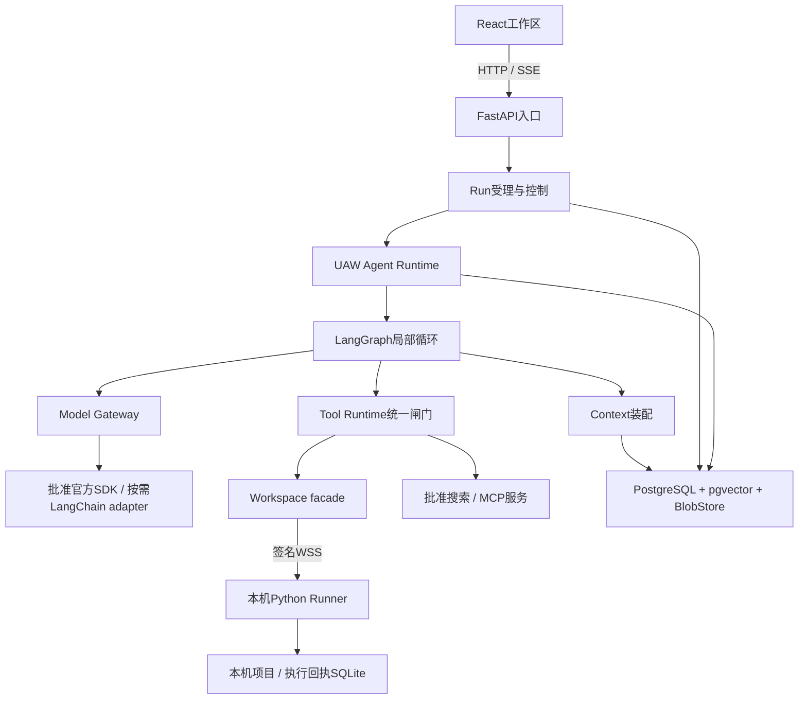

# UAW 技术栈与组件设计

技术方案v0.1 · 2026-10-07 · 对齐UAW v0.10架构及50轮开发计划。

**UAW核心用Python开发，LangGraph承担Agent内部循环；模型按批准提供方接入，LangChain组件按需使用。后端采用FastAPI，业务状态与向量检索采用PostgreSQL＋pgvector，Web采用React＋TypeScript，本地执行采用独立Python Runner。**

这是技术主选，供各轮开发使用。P0核心依赖已安装并锁定，工程启动与开发持久化已验证；其余能力按阶段接入。实际版本与范围见[实施记录](docs/implementation/README.md)，不表示Agent产品已经能完成任务。

## 1. 每个模块选什么

| 模块 | 主选技术/组件 | 框架之外我们要实现的部分 |
| --- | --- | --- |
| [Intent 用户问题加工](docs/technology/modules/intent.md) | Python、Pydantic、jsonschema、ModelGateway | 原文溯源、任务理解、歧义、草稿版本与纠正 |
| [Agent 决策执行](docs/technology/modules/agent.md) | LangGraph StateGraph、asyncio、graphlib、PostgreSQL | 角色定义/实例工厂、任务规划调度、父子协作、完成核验 |
| [Context 上下文](docs/technology/modules/context.md) | PostgreSQL、pgvector、关键词索引、pypdf及按需格式适配器 | 指令优先级、资料访问、引用、预算、压缩、记忆控制 |
| [Tool 工具](docs/technology/modules/tool.md) | jsonschema、HTTPX、MCP官方SDK、pgvector | 发现过滤、审批闸门、效果账本、失败治理和等价替换 |
| [Workspace 工作区](docs/technology/modules/workspace.md) | Runner协议、Git CLI、快照、按需Docker后端 | 本机授权、输入基线、写隔离、真实环境、审阅与撤销 |
| [Model 模型](docs/technology/modules/model.md) | 批准提供方官方SDK、HTTPX、按需LangChain集成 | 模型继承、能力预检、Auto授权、真实用量与恢复 |
| [Run 运行控制](docs/technology/modules/run.md) | PostgreSQL、SQLAlchemy、事务Outbox、持久待办 | 历史、状态、审批、预算、干预、取消与安全续跑 |
| [共享设施](docs/technology/modules/support.md) | SQLAlchemy、Psycopg、Alembic、cachetools、structlog、OpenTelemetry | 配置、秘密、能力包、缓存失效、评测与版本发布 |
| [API与账号](docs/technology/modules/api.md) | FastAPI、Uvicorn、SSE、WebSocket、Authlib OIDC | 身份/归属、请求契约、事件续接、管理员边界 |
| [Web页面](docs/technology/modules/web.md) | React、TypeScript、Vite、Tailwind、Radix、TanStack Query、Monaco | 聊天/理解提示、实际状态、成果/改动、用户控制 |
| [本地Runner](docs/technology/modules/runner.md) | Python、SQLite、websockets、cryptography、OS keyring、psutil、PySide6 | 设备配对、本机选择、签名/回执、真实进程和范围检查 |
| [工程与部署](docs/technology/modules/engineering.md) | uv、pnpm、pytest、Ruff、mypy、Playwright、Compose、Nginx | 依赖组装、兼容矩阵、场景验证、发布/恢复资料 |

数据库主选PostgreSQL 17维护线，Python主线选择3.14，前端构建选择Node 24 LTS；这些是设计基线，不宣称是各自最新版本。精确补丁、镜像digest和包组合按开发轮验证。[Python版本政策](https://devguide.python.org/versions/)、[PostgreSQL版本政策](https://www.postgresql.org/support/versioning/)、[Node版本政策](https://nodejs.org/en/about/previous-releases)

## 2. LangChain、LangGraph怎样放进来

LangGraph提供底层执行、状态和暂停/恢复组件，可以通过自定义节点接入我们的逻辑；它可以独立于LangChain使用。[官方说明](https://docs.langchain.com/oss/python/langgraph/overview)

我们的安排：

- 每个Agent实例有独立执行引擎和图命名空间，图节点调用UAW公共接口。
- 任务DAG的依赖与资源调度由UAW Scheduler负责；LangGraph执行实例内部的“判断—行动—再判断”循环。
- LangChain按组件装入模型/资料adapter，具体使用需要有接入收益，不将全部功能自动交给其现成Agent。
- 工具权限、审批、工作区、引用、记忆与最终完成判断仍由对应Runtime掌管。
- 使用框架公开接口和自有适配器扩展，框架类型留在适配器内部。

详见 [框架职责与接入边界](docs/technology/FRAMEWORK_BOUNDARIES.md)。

## 3. 组件怎样连接

图表示调用联系，不规定所有任务必须访问每个组件。简单任务可以单Agent完成；子Agent、规划和并行仍按任务语义与资源分别决定。

## 4. 数据、缓存和部署

- 主状态采用PostgreSQL；同一个数据库可分领域表，状态所有者仍唯一。
- 工具向量索引使用pgvector，先保留关键词/精确召回；向量检索在P4补齐。
- 大内容先采用私有持久卷BlobStore，后续可接S3兼容后端。
- 进程缓存采用cachetools＋自有依赖失效；页面缓存采用Query cache，P4增加IndexedDB。
- Runner SQLite只保存本机执行事实、回执与根绑定，不成为第二套聊天主库。
- 首版推荐账号关联的服务端权威历史＋本地缓存；D01仍待用户确认。技术组件支持把完整后端部署到本机，权威模式不会因缓存存在自动改变。

详见 [数据权威与部署设计](docs/technology/DATA_AND_DEPLOYMENT.md)。

## 5. 开发时怎么使用这份文档

1. 从 [技术模块索引](docs/technology/README.md) 找模块，再读相应策略、接口和轮次。
2. 按 [依赖与版本设计](docs/technology/DEPENDENCIES.md) 安装本轮实际需要的包，冻结依赖；不要把全部可选组件装成首版默认依赖。
3. 按 [兼容与接入验证](docs/technology/VALIDATION.md) 跑真实验证，尤其审批暂停、断线、未知写和恢复边界。
4. 在原 [开发计划](DEVELOPMENT_PLAN.md) 对应轮保存代码、配置、版本和实际回执。

[完整节点技术对应表](docs/technology/COVERAGE.md) 将115个架构节点关联到组件、设计、接口和开发轮。该表仍是目标覆盖；实际实现、版本及测试证据单独记在[实施入口](docs/implementation/README.md)，不能从组件安装推断业务能力已可用。
