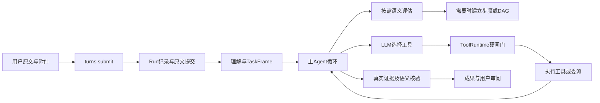

# 关键接口调用链与开发示例

版本：0.1，2026-10-07。入口：[功能接口](README.md)。本文解释多条接口怎样配合；详细字段按[对象字典](OBJECTS.md)，硬约束按[共同规则](CONVENTIONS.md)。下面ID是说明用样例，实际使用从真实响应取得。

## 1. 输入任务与动态执行



先用 `POST /v1/conversations`建立会话和用户模型政策。草稿可调用preview；正式发送turns.submit时原文入库与Run受理关联提交，不能直接复用过期草稿理解。简单任务从根Agent循环完成，不要求先创建图、子Agent或独立评估Agent。

规划、父子Agent、并发分别决定。`tasks.assess`只返回建议；`tasks.plan`提交步骤/DAG；调度器检查依赖、资源和写集；`agents.invoke`才创建子实例。只并发多个只读工具不需要多个Agent。

## 2. 用户要求“帮我创建三个子智能体”

1. Context提供用户原文、当前会话角色摘要、批准能力和模型政策。
2. 主Agent按需加载agent_definition方法，拟定职责、use_when、avoid_when、输入与输出契约；不要求先启动一个设计Agent。
3. 当前LLM调用 [agents.create](interfaces/tool--agents-create.md)，ToolRuntime注入主体/会话并校验权限及用户来源。
4. Agent Runtime校验每项草案、名称、依赖及模型意图，提交不可变定义版本；需要解决的项返回needs_resolution及原因。
5. 下次任务时 [agents.list](interfaces/tool--agents-list.md) 或 tools.discover只提供适用摘要，当前LLM按实际目标决定是否invoke。

```json
{
  "definitions": [{
    "client_definition_key": "office_research_1",
    "name": "资料研究员",
    "description": "读取材料并整理来源明确的结论",
    "instructions": "先核对来源和时效，再整理支持结论的证据；不足时说明缺口。",
    "use_when": ["有独立可验收的资料研究任务"],
    "avoid_when": ["只有简单解释问题", "需要写文件或发布内容"],
    "skill_refs": [],
    "tool_categories": ["web_search", "file_read"],
    "input_contract": {"goal":"读取用户指定资料","requirements":[],"outputs":[],"version":"1"},
    "output_contract": {"goal":"提交有来源和限制说明的调研结论","requirements":[],"outputs":[],"version":"1"},
    "model_request": {"mode":"inherit"}
  }],
  "batch_policy":"atomic",
  "source_input_ref":{"kind":"input","id":"input_user_create_roles","version":"1"}
}
```

input_contract/output_contract应在真实请求写全验收要求；这里缩短为结构示例。create不启动执行，不分配工作区。需要创建三项就传三项，最多16；independent逐项提交，atomic任一失败不提交整批。owner、conversation、权限批准不在模型参数中。

用户说“研究员使用某模型”时model_request为explicit，必须附真实用户来源。目录中找不到该模型，返回needs_resolution；不能偷偷改成主模型。用户没说则inherit。角色定义版本改变不会改变已经运行实例的定义或已发生费用。

## 3. 何时与怎样调用子Agent

调用前确认有独立目标、授权材料、输出验收和父预算内额度；不是因为角色存在就一定调用。主Agent调用 [agents.invoke](interfaces/tool--agents-invoke.md)，DelegationSpec固定定义、资料和预算。Factory原子预留，计算权限交集，建立独立Context与必要工作区，返回AgentInstance。

子Agent可通过message共享授权Ref；它不会直接读父完整聊天或修改父提示词。wait等结果，Join核对Task/输入/成果版本，再归并候选。父/子读写同文件时使用隔离副本/worktree，或明确串行原生执行。Agent数量与工作区数量是不同概念。

控制权handoff另有租约和栅栏。并发做不同子任务通常不需要handoff；移交后旧持有者不能继续提交。停止父任务传播到子树，未知效果先对账。

## 4. 开发任务：读取、编辑、运行真实测试

1. 用户在本机可信选择器选择项目，Runner配对后 `projects.bind`取得ProjectBinding。
2. capture_base收录获准未提交改动；allocate建立工作区。不是只从最新提交启动而遗漏用户修改。
3. `environment.inspect`读真实语言版本；缺依赖时ensure使用管理员批准模板。默认预装常见环境，按需安装仍须审批/权限和来源检查。
4. `file.read`读实现及适用规则；`file.write`以旧摘要CAS写入，或通过process执行受控编辑命令；采集before/after。
5. `process.exec`传argv启动真实测试，例如以下请求；`process.poll`等退出码、输出和实际ChangeSet。
6. verification.run登记命令检查，tasks.verify关联具体要求与实际证据；用户查看成果、Diff，再选择接受/合并。

```json
{
  "spec": {
    "workspace_ref":{"kind":"workspace","id":"workspace_go","version":"tree_7"},
    "executable":"go",
    "argv":["test","./..."],
    "cwd":".",
    "environment":[],
    "timeout_ms":120000
  }
}
```

返回running不代表测试通过。真实结束并exit_code=0才支持该命令passed；测试覆盖不足继续报告limitations。Runner离线返回lost/blocked，不造日志。本机native exec需要本机实际授权；隔离能力由OS/沙箱配置承担。

## 5. 审批后资源改变

LLM提出调用 → normalize → precheck → 若需审批则ApprovalRequest → 用户/审查服务决定 → recheck → 记录动作意图 → dispatch。

批准的是“对这些具体资源版本、用这组参数做这个动作”，不是工具名永久通行。用户批准后文件被手动修改，recheck返回stale；不执行旧动作；重新读取并决定是否重新申请。automatic/assisted也不能跳过版本和真实权限。

## 6. 查看变更、局部接受与撤销

workspace.changes获得固定base/target的ChangeSet。用户审阅选择unit ID，reviews.decide保存意见；workspaces.merge执行应用，两者不能混成一个隐式写操作。二进制按文件处理，不能伪造行级合并。

撤销传change_set_ref、selected_unit_ids、expected_workspace_version。对比原before/after和当前文件；用户后来改过相同部分，返回conflicted并保留用户内容。成功撤销生成新文件树版本，旧测试证据失效，需重新测试。不能用文件撤销声称已经发出的邮件或发布的网页被撤销。

## 7. 成果引用与完成校验

Artifacts登记真实内容及Hash，Reference登记实际读取来源和Location。Citation把结论定位到来源，不仅贴网址。搜索snippet只是候选，不是全文读取证明。

Completion流程：从原文/修订解析Contract → 逐要求选取或申请Checks → semantic逐条核对 → version检查成果/证据/未决效果 → DeliveryProposal → Run合法终态提交 → 用户accept/reject/revise/partial_accept。

VerificationReport中每条要求有passed/failed/not_run/blocked和依据。所有必需要求未覆盖时不得全部成功；可以如实交付partial。成果后来修改使旧报告过期。用户接受不代表AI核验自动全部passed。

## 8. 缓存如何接入

Context构建用稳定指令、角色/技能和工具版本形成前缀，动态原文/观察追加后段。模型供应商实际usage才统计前缀命中。Source解析、检索、Context派生和可复用只读结果走共享CacheKey：主体+资源版本+政策+配置+参数Hash+时效。

lookup命中后仍校验访问权；miss才计算并put。单飞计算只能合并相同主体范围和依赖。删除Memory/资料、撤销连接或变更文件，按dependency_refs传播失效。缓存命中不跳审批、不重放外部写，不替代最新进程状态。

## 9. 用户纠正、多会话与恢复

用户运行中补充走control.steer；下一轮走enqueue；改变目标走replace；cancel停止后续；deliver_partial先交已有成果。控制受理有版本和ID；工具在安全边界收到新要求，未决效果仍记录。

另一会话参与已有Task需显式tasks.attach_conversation，同主体、双边授权和目标CAS通过。关联不取得写控制权；目标同时修改返回conflict，不能“最后一条覆盖”。并行工作仍需读写集隔离及合并审阅。

Checkpoint固定已提交域版本，resume按顺序取得租约、检查格式兼容、复核当前权限、对账未决效果、检查工作区/环境，然后续跑可恢复节点。事件replay只是重建显示；resume是继续；rerun是新Run再次执行，不能保证模型和联网结果完全相同。

## 10. 从接口进入开发

[覆盖地图](COVERAGE.md)给每个节点列出五类接口、详细策略和计划代码。实现时先打通一条完整任务，再逐项接适配器。schema通过只证明字段结构；真实Runner、审批竞态、DAG调度、重试对账、成果核验及前端流式恢复需要后端建成后单独验收。
