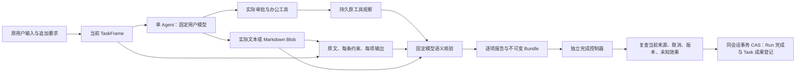

# MS-I2i：A 的评估、成果与完成控制接线

日期：2026-10-09。固定开工来源 `ms-i2i-start / d8023eb07e1460961782f297697da7428f6ad247`。
本页是实际 Python 内部接线，不代表公开 HTTP/模型工具已绑定。普通 Agent 只能提出完成候选。

## 1. 链路和目录



| 文件 | 实际职责 |
| --- | --- |
| `src/uaw/model/evaluation_inputs.py` | 有界直接评估输入、实际来源复查、固定模型调用；规则 assessor |
| `src/uaw/infrastructure/db/context_batch.py` | 一次 PostgreSQL 查询的有界顺序批读；不授予权限 |
| `src/uaw/workspace/artifact_repository.py` | Artifact 与来源关联原子登记、实际 Blob/hash/大小/归属核验 |
| `src/uaw/workspace/artifacts.py` | 原 Agent 的真实 ModelOutput 转换为不可变文本成果 |
| `src/uaw/agent/completion/contracts.py` | 从当前 TaskFrame 构建合同，计算逐项报告结果 |
| `src/uaw/agent/completion/evidence.py` | 有界 Reading 与实际引用约束；检测尚未验证的网页链接 |
| `src/uaw/agent/completion/activity.py` | 最多16个该 Run 实际工具动作的完整账本与 ToolSpec；不声称全局 OS 行为 |
| `src/uaw/agent/completion/semantic.py` | 逐要求固定模型核验；精确 ID 集合与真实证据引用检查 |
| `src/uaw/agent/completion/delivery.py` | 成果、合同、报告、提案和 Bundle 持久化及来源复查 |
| `src/uaw/agent/completion/assembly.py` | 显式组装 AgentCompletionPort 与独立控制器 |
| `src/uaw/run/completion.py` | 独立用户接受记录、终态事务、版本及未知效果检查 |
| `src/uaw/shared/builtin_tools.py` | 管理员登记封闭的本地办公提供方及实际连通验证 |
| `src/uaw/composition.py` | 显式办公工具和 Context 批读适配器组装 |
| `src/uaw/infrastructure/runner_pipe.py` | A 控制端通道消费与原命令、设备签名、实际读取结果核验 |
| `ops/agent_probe.py` | 保护目录中的真实 DeepSeek 有界验收，不把 CLI 当产品入口 |
| `ops/summarize_agent_probes.py` | 导出脱敏的全部尝试、失败、Token 与待确认费用统计 |

## 2. 内部接口

| 入口 | 输入 | 输出 | 约束与失败 |
| --- | --- | --- | --- |
| `EvaluationInputs.resolve(ref, ctx)` | 已登记评估绑定的完整 context Ref、可信 ctx | `ModelPrompt` | 96KiB 上限；当前 Frame/角色、所有实际行版本和摘要；不递归调用 Context |
| `FixedModelEvaluator.evaluate(purpose, instruction, data, schema, ctx, sources=...)` | 职责、不可变候选数据、严格 JSON schema、实际来源 pins | `EvaluationResult(data, output_ref, output, context)` | 模型来自原 Run 固定政策；不改变用户模型；原操作恢复不换 attempt 重发 |
| `FixedModelRuleAssessor.assess(candidates, ctx)` | 1..64 个实际已登记规则 | `RulePlan` | 全部 ID 精确覆盖；级别/顺序/来源不变；平台/权限规则不能降级；矛盾进入原澄清机制 |
| `contract_from_frame(frame, acceptance_required=False)` | 合法实际 TaskFrame | `Contract` | 最多128个唯一要求；包含原目标、所有约束和每个输出；OutputSpec.kind 是描述文本 |
| `TextArtifacts.from_model(output_ref, observation_refs, ctx)` | 原 Agent 的已完成真实输出、原工具观察 | artifact Ref | 只接受完整 respond/propose_completion；实际调用与固定政策匹配；UTF-8 最多64KiB |
| `ArtifactRepository.read(ref, ctx)` | 完整 artifact Ref、可信 ctx | `(ArtifactRecord, text, ArtifactSourceBinding)` | owner/session/Run 精确绑定；实际 Blob/hash/大小核验；无本机路径读取授权 |
| `CompletionCoordinator.propose(instance_ref, model_result, ctx)` | 原 Agent 已决定/已结束操作中的真实模型结果 | proposal Ref | 不能拿外来结果；所有来源真实读取；已登记 Bundle 只恢复原版本 |
| `SemanticVerifier.verify(contract, artifact, evidence, ctx)` | 合同、实际成果与只读证据集合 | 逐项 verdicts、实际 EvaluationResult | schema限定数量和实际 ID；代码再校验精确覆盖；passed 必须引用实际 artifact；未知证据拒绝 |
| `RunCompletionController.accept(actor, bundle_ref, artifact_ref, decision, ctx, meta)` | 独立认证用户、确切成果版本、用户决定 | 不可变 acceptance Ref | actor 必须等于可信用户；原成果版本固定；当前入口一次登记；部分接受/拒绝/修订不能满足 accept |
| `RunCompletionController.complete(proposal_ref, ctx, meta)` | 原提案、原可信上下文、当前 Run 修订号 | 实际 completed RunRecord | 见下面终态门槛；CAS 与取消/修订使用同一 conversation aggregate |
| `publish_builtin_office(config, admin, request_id)` | 实际配置服务、独立管理员、请求身份 | 本地 provider Ref | 固定 profile 和 USD 设置，无 endpoint/脚本/秘密；新配置保留原模型与 flags，旧 Run 配置不移动 |
| `assemble_office_tools(control, registry, tool_refs, provider)` | 精确登记的1..3个工具、实际本地提供方、服务主体 | `OfficeToolBindings` | 原权限/审批/预算/持久账本；确切 executor/verifier；当前缺来源明确不可用 |
| `RunnerPipeClient.read(command_ref, recover=False)` | 实际活连接、独立 registry/command Reader/signatures、固定命令 | `CheckedPipeReceipt` | 一项在途；限时；设备/签名/command/attempt/hash/实际文件结果核验；错误关闭，无自动重发 |

新增持久结构由 `contracts/interface_catalog.py` 维护并生成：
[EvaluationSourcePin](../../../api/objects/EvaluationSourcePin.md)、
[EvaluationInputBinding](../../../api/objects/EvaluationInputBinding.md)、
[ArtifactSourceBinding](../../../api/objects/ArtifactSourceBinding.md)、
[CompletionBundle](../../../api/objects/CompletionBundle.md)、
[CompletionAcceptance](../../../api/objects/CompletionAcceptance.md)。
没有新增公共接口或 RefKind；runtime schema 与机器 schema 必须保持相同字节。

## 3. 完成判定的处理策略

1. 当前 TaskFrame 的原输入和追加要求逐版本读取，原目标及每项约束/输出形成合同。模型核验收到原输入正文，不能把系统生成的理解当用户的新指令。
2. 成果来自实际已完成 ModelOutput，绑定原 Agent 操作、固定模型和真实工具观察。登记实际 Blob，检查 UTF-8、内容摘要及大小。
3. 实际引用由代码/Reader 核验；语义模型只能使用给出的证据身份。不存在的证据拒绝，缺测试/manual 证据为 not_run，无法实查的网页链接不能通过。
4. 语义模型逐项返回 passed/failed/not_run/blocked。必需项全部 passed 且全部技术检查 passed 才能产生 succeeded；文本格式不能冒充其他实际文件格式。
5. 合同、报告、提案、Bundle 一起保存。保存报告不代表完成，更不代表用户已经接受。
6. 读取该 Run 实际工具 context/call/spec/effect/dispatch 完整清单并固定行版本；模型可据实际规格和执行数评估“只执行一次”“不做业务联网”。清单只证明本 Run 记录的工具行为，模型 API HTTP 另计，不证明整个 OS/供应商内部行为。终态前清单完整集合必须相同。
7. 独立控制器复查当前 Frame/input-set、政策、角色、实际来源与 Blob、当前取消和原操作结束状态；未知 Model/Tool 效果和仍可执行的预算预约阻止终态。
8. **已知完成调用的供应商费用可继续 pending。** 只保留 money hold，不释放或声称费用为0；reserved/dispatched 或未知调用仍不能完成。
9. 合同需要用户接受时，只读取独立认证入口登记的确切 Bundle/成果版本 accept。其他决定保持未完成。
10. 同会话事务复查版本，以 CAS 提交 Run、Task 成果及事件；并发相同请求恢复原结果。先取消/修订的旧成果不能越过终态门槛。

## 4. 显式组装

```python
contexts = assemble_registered_context(
    control, registry=registry,
    record_batch=PostgresContextRecordBatch(control.records), batch_required=True,
)
tools = assemble_office_tools(
    control, registry=registry, tool_refs=actual_pins, provider=actual_service,
)
agent = assemble_agent_runtime(
    control, contexts, tools, registry=registry, instruction_refs=actual_extra_rule_pins,
)
completion = assemble_completion_runtime(control, agent, contexts=contexts)
# contexts= 明确安装实际固定 Model 规则评估器；不会自动创建子 Agent。
# 原 Agent 完成自己的步骤后，可信控制层提供原 ctx 与实际 Run revision：
await completion.controller.complete(proposal_ref, original_ctx, current_run_meta)
```

调用者必须先提供实际 Run、当前权限、配置、角色、工具目录及源 Reader。
`ctx`、原文/Frame Ref、服务主体及管理员不是由模型输出创建。
默认公开组装和 feature flags 保持原状态；没有因为提供上述内部函数自动开放能力。

## 5. IPC 与环境边界

A 控制端无 `uaw_runner` 包的生产硬依赖，通过 Protocol 显式注入 D 的实际会话/registry。
实际 Windows 双进程验收覆盖 A 客户端→D endpoint→真实临时文件→设备签名结果。
UAW 账号/设备映射、native 根选择和当前 Run authority 在该 OS 验收中仍是独立受控 fixture，
不是由通信正文生成，也不是生产用户配对。缺生产确认/认证/项目授权时不向用户项目开放。

本轮不新增用户文件写入、安装、exec，不做自动工具替换，不默认子 Agent/DAG。
文本交付和纯参数办公工具不依赖本机通道。专业文件编辑、网页验证及真实用户接受 UI 需后续独立建设。

实际接受范围、失败记录和测试路径见 [A 阶段记录](../../../implementation/MS-I2i-A1.md)。
