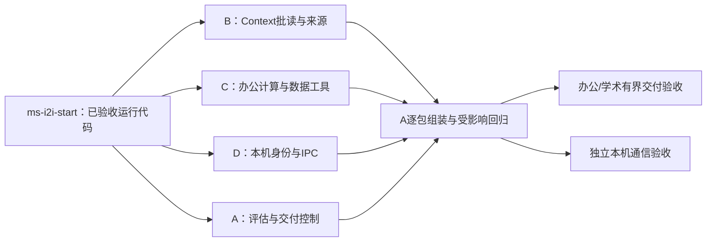

# MS-I2i：完成校验、上下文提速、办公工具与可信本机通道

日期：2026-10-09。沿用A/B/C/D四个session。运行代码来源为 `ms-i2h-a3 / 3e5917d9b8dffa767f403c3d71a1884327db8f70`；本轮开工标签为 **ms-i2i-start**，标签提交包含本安排，实际SHA以[DISPATCH](../../DISPATCH.md)为准。

## 1. 本轮要解决什么

上轮已经用实际DeepSeek跑通三个小样例。接下来要使答案能核验、结果能登记，同时解决每一步上下文展开过慢、可用工具少、本机通道仍为受控替身的问题。

| Session / 包 | 完整功能范围 | 第一阶段可独立使用的输入 | 最终交付 |
| --- | --- | --- | --- |
| A / MS-I2i | 固定模型评估、成果登记、完成提交与逐包集成 | 已接受的Run/TaskFrame/Model/Context/纯文本Tool | 实际VerificationReport、DeliveryProposal及受约束终态；真实样例报告 |
| B / MS-C7 | 上下文读取提速与来源复查 | 原Context、实际Run来源、固定输入/规则/工具 | 兼容的有界批读/展开、等价性与性能回执 |
| C / MS-T2f | 两个办公数据工具与多适配器调用/恢复 | 原Tool Registry/执行/账本/审批/结果ports | arithmetic.calculate、data.inspect_json及严格路由/验证组件 |
| D / MS-R2f | Windows本机可信IPC与只读Runner接入 | 原签名、Root、channel/owner/authority ports、ReadOnlyRunner | 实际双进程通信、独立身份核验、断连/重连/回执恢复 |

四个包都从同一固定基线开始，不以另一个worker开发分支为输入。A会消费阶段版接口并提供组装适配，worker用原基线和明确测试依赖继续做完整组件。纯文本/计算交付的A验收不等待D。本轮不默认多Agent或DAG；它们继续留在后续阶段。



## 2. 通用执行办法

### 2.1 开工与四个里程碑

1. 在原worktree核对分支和干净状态，fetch tags，`git merge --ff-only ms-i2i-start`；核对HEAD等于标签commit，再按uv.lock同步独立环境。失败保留现场，不reset/rebase或改其他worktree。
2. **M1：接口和核心实现。** 第一项形成可执行组件、目标签名、输入/输出/错误、调用样例、目录清单；尽早在本session requests发布阶段说明，A此时即可审阅，不等最终包。
3. **M2：核心链路。** 提交阶段源码与独立说明，继续M3/M4。接口变动用新阶段提交说明，不悄悄改已经交给A的签名。
4. **M3：持久化/恢复/边界。** 完成来源、取消、版本、并发与原尝试恢复；遇到公共缺口提出最小提案，并继续不依赖该变更的部分。
5. **M4：本模块验收与交接。** worker实跑自己的单元和SQL/OS模块。保留失败及修复回执，按不同节点去重；最终源码和handoff分开提交，干净后报告，不自动扩包。

阶段交付必须带真实SHA、实际回执路径和“可以接什么/还不能接什么”。每包是完整能力交付，不能在M1提交几个类后就把整个包标完成。实际耗时由任务和验证决定，不承诺四包同时结束。

### 2.2 公共与私有边界

公共schema、shared、Run/Model/Intent/Agent、API、组装根、依赖锁、迁移、全局文档与共享evidence归A。B/C/D仅改各自session页允许路径及本session requests/handoff。本轮A新增成果文件为 `src/uaw/workspace/artifacts.py`、`src/uaw/workspace/artifact_repository.py`；D原workspace四个文件归属不变。

目标内部接口由所属worker实现并在M1固定；本页不声称尚未实现的类已可调用。新增内部Protocol/dataclass可放本模块，持久对象必须消费合法schema；公共对象缺字段时提案A，不能用私有DTO掩盖不兼容。原构造默认兼容，新能力显式注入；缺生产来源明确不可用。

### 2.3 环境、测试与数据

| Session | 原工作区 / 分支 | 数据库端口 | 本轮写回执 |
| --- | --- | --- | --- |
| A | E:/UAW / integration | 55432 | docs/implementation/evidence，由A汇总 |
| B | E:/UAW/.worktrees/context / dev/context | 55433 | tests/.artifacts/B/MS-C7，ignored |
| C | E:/UAW/.worktrees/tool / dev/tool | 55434 | tests/.artifacts/C/MS-T2f，ignored |
| D | E:/UAW/.worktrees/runner / dev/runner | 55435，确需SQL才用 | tests/.artifacts/D/MS-R2f，ignored |

各自PowerShell `. ./ops/start-dev-db.ps1 -Session B/C/D`，随后本worktree锁定环境迁移、`--require-postgres`实跑。不得复制A私有配置/DeepSeek凭据，或操作别的库/volume。真实LLM及管理员配置集中由A负责；worker的受控HTTP/语义/授权依赖分别注明，不能当实连。

A审阅回执和修改归属，优先做受影响及跨模块检查。全量只在本轮集成里程碑执行一次，发现具体风险再扩大；不把历史1077或上轮31当本轮回归。测试守护超时与业务deadline分开，不能删并发/一次发送断言来让测试通过。

## 3. B / MS-C7：Context读取提速与来源复查

### 输入、目录、输出

- 输入：当前RegisteredContextInputs/Authority/Reader、GenericModelInputs、已接受的可选纯计算缓存，实际Run/政策/规则/工具与原文版本。
- 允许：B已有 `src/uaw/context/` 文件（排除seed.py/intent.py）、B unit/integration、requests/handoff；建议增加 `read_batch.py`、`read_metrics.py`。不直接在Context写ORM查询或修改Run授权实现。
- 输出：兼容的组合/模型输入入口、有界读取策略、固定Ref/正文相同的证据、实际查询和耗时对比。

### 目标内部批读接口

```python
@dataclass(frozen=True)
class RecordReadKey:
    namespace: str
    resource_id: str
    revision: int | None = None

class ContextRecordBatchPort(Protocol):
    async def read(self, principal: Principal,
                   keys: tuple[RecordReadKey, ...]) -> tuple[Record, ...]: ...
```

M1固定放置、类型与调用方；最多128个键，返回保持顺序与重复键语义，任一缺失/删除/不属于owner则整体失败，不返回部分内容。数据读取端口不授予权限。A负责其PostgreSQL批量适配与共享存储扩展；B先完成原get方式的兼容策略、阶段结构及测量，批读适配缺失时显式用已声明的兼容模式，batch-required模式明确不可用。新来源只在包边界同步，不强迫全体worker跟随A中途HEAD。

### 四个里程碑

1. 实跑原基线单规则/多规则、有/无工具、冷/暖纯计算缓存场景；记录get按namespace、SQL往返、blob/Reader/assessor次数及build/ModelInput/整步耗时。用相同版本资料与相同输出预算，区分fixture准备、Context耗时和模型HTTP耗时；不把小模型的1秒调用当整个任务的延迟。
2. 精简重复资料展开、序列化和内层重复读取；新增一次操作内的有界读取批，只复用已固定版本的数据。独立公开入口仍有完整检查，不能跨请求缓存授权/取消/撤销，不保存“已经允许”的永久标记。模型/审批/外部I/O等待之后、提交和Model派发之前必须有当前复查。
3. 接可选批读port，当前来源先后实读，检查完整owner/session/scope/model/policy/配方/工具/Ref/hash。顺序读取和批读对同一输入应给出相同消息、引用及拒绝结果；批读是一次数据库读取视图，不宣称外部ACL/文件也原子。
4. B独立55433实跑回归及修订、删除、撤销、取消、并发/新进程、批读部分缺失/重复键/损坏/跨主体反例。阶段版与最终版都保存测量条件。目标是实质降低读取成本；若某项优化不能保持正确性，保留原路径并说明限制，不用固定比例承诺代替数据。

M1后向A交 `MS-C7-stage-interface.md`；最终交 `MS-C7-final-wiring.md` 和B handoff。A以此适配批读，不让B等A完成所有交付逻辑才工作。

## 4. C / MS-T2f：办公工具与多适配器恢复

### 输入、目录、输出

- 输入：原ToolExecutorPort/ToolOutputVerifierPort、ToolReceiptStore/Results/Recovery、Registry、真实SQL审批/预算账本。
- 允许： `src/uaw/tool/`、C unit/integration、requests/handoff。建议 `providers/arithmetic.py`、`providers/json_data.py`、`providers/multiplex.py`。
- 输出：两个精确版本ToolSpec、实际本地计算/检查、有限适配器路由与独立结果校验。A登记目录、角色和合法提供方；C不把DeepSeek聊天提供方宣称为本地计算执行者。

### 两个工具的数据边界

| 工具 | 输入契约 | 输出与限制 |
| --- | --- | --- |
| arithmetic.calculate@1 | operation为add/subtract/multiply/divide/percent；operands为有界Decimal字符串数组 | value为Decimal字符串，带实际精度/舍入标记；拒绝零除、NaN/Inf、过大数字/指数。具体位数、数组/字节上限M1固定；不eval、不执行表达式/脚本 |
| data.inspect_json@1 | text为有界UTF-8 JSON；可选有界required_keys，仅检查顶层对象 | 实际根类型、数量、键/缺失键及明确限制；拒绝重复键、非有限数、超深/超大数据；不自动修正用户内容、不把元数据声称为专业数据准确性 |

两者只处理已传入参数，无本机文件/网络/安装/exec权限；不需要开启code_execution。固定本地tariff可为0，模型费用继续独立记录。ToolResult成功表示该操作得到正确结果，不代表任务完成。

### 目标接口与四个里程碑

1. 完成纯函数、完整input/output schemas、Decimal与JSON边界及精确ToolRef/hash。提供 `arithmetic_spec(provider_ref)` / `json_data_spec(provider_ref)`、实际executor/verifier构造和样例，保留text.inspect原接口。
2. 实现显式可信构造的有限路由：`ToolExecutorRouter(bindings)`与`ToolOutputVerifierRouter(bindings)`沿用现有execute/verify签名。bindings必须绑定完整ToolRef和确切实现；未知、改版、重复、提供方不符拒绝。不按模型给出的Python路径或类别字符串动态import，也不自动选“差不多”的工具替代。
3. 经过原normalize/权限/审批/预算/一次发送/receipt/结果读取链，持久化实际输出与usage；恢复按原tool_ref绑定同一验证器。缺资源Reader/恢复来源明确不可用；可在C增加纯参数工具的合法resource/recovery adapter，A提供Run/提供方权威。未知发送仍对账，不换attempt重做；撤销数据访问与停止新执行分开。
4. C独立55434实跑两个工具、原text链及混合路由的审批/取消/参数变更/并发一次执行/重启恢复/结果篡改/费用中断。原检索/索引默认兼容。A用真实DeepSeek让模型在可见工具中选择，C受控模型不计真实选择质量。

M1后提交 `C-009-ms-t2f-stage-tools.md`，固定构造、estimates、prepare检查和允许文件；最终提交 `C-010-ms-t2f-final-wiring.md`及C handoff。不以新增工具Spec数量代替可执行/可恢复交付。

## 5. D / MS-R2f：真实Windows本机IPC

### 输入、目录、输出

- 输入：现有RunnerChannelSnapshot/SourcePort、PrincipalMapping、已签名command/receipt、ReadOnlyRunner和journal。native用户确认仍是独立来源，不能从通信成功生成。
- 允许：D原workspace四个文件、 `apps/local_runner/uaw_runner/`、D unit/integration、requests/handoff。建议 `ipc/windows_pipe.py`、`ipc/frames.py`、`ipc/sessions.py`、`ipc/channel_source.py`；A控制端与组装代码归A。
- 输出：Windows开发环境的同机命名管道、双向身份核验、有界帧、活连接来源及原命令/回执传输。此选择是开发适配器，不代替D03正式部署/执行环境决定。

### 信任与协议边界

1. 管道显式DACL只允许登记的本机登录主体，拒绝远程连接；核验实际OS身份及对端进程生命周期，PID或自报user_id单独不能证明UAW账号。通过受保护登记映射绑定owner/runner/device/当前key，握手nonce及角色签名绑定本连接。
2. 使用当前签名原语和OS凭据，不把私钥/API Key写在帧、日志或普通SQL。内部IPC帧版本独立，不冒称公开配对V2。JSON解析拒绝重复键/非JSON数、未知字段；长度前缀后才分配，帧上限256KiB、握手/读写默认10秒且不越可信deadline，队列/并发有界。
3. 帧仅传command或receipt以及必要相关ID；body不授予Principal、approved、root、capabilities。authenticated_principal来自本连接的独立登记。传输收到不是执行成功，仍需原签名、当前authority、Root、一次消费与journal验证。
4. 断连/到期/进程退出/撤销使旧channel不可用。重连取得新连接Ref/nonce；不能复用旧连接授权，不自动重新发送未知command。恢复读取原journal并核验实际设备签名，未完成继续unknown/in_progress。

Windows默认管道安全描述符并不等于仅本用户可用；显式ACL和身份检查按[微软安全说明](https://learn.microsoft.com/en-us/windows/win32/ipc/named-pipe-security-and-access-rights)实现。若使用客户端身份模拟，检查返回值并始终恢复线程身份，失败不执行业务。[官方API说明](https://learn.microsoft.com/en-us/windows/win32/api/namedpipeapi/nf-namedpipeapi-impersonatenamedpipeclient)

### 四个里程碑

1. 先交真实双进程建立/关闭通道、OS来源核验和有界frame parser；说明目标构造、线程/进程所有权、错误及关闭语义。优先标准库/ctypes消费现有依赖，新增依赖先提案A。
2. 独立connection registry适配现有 `RunnerChannelSourcePort.read(channel_ref, *,device_id)`；current源检查活进程/登记owner/key/期限与连接，避免从帧回显生成snapshot。提供接受可信owner映射的构造，不更改公共channel字段。
3. 把已登记command送进ReadOnlyRunner，保留签名、临时根句柄、当前authority/lease/fence和一次使用，再通过IPC收取真实签名receipt。临时根与授权测试依赖分别标明；组件通道证明不等于真实用户配对/确认，缺生产映射/确认不向用户项目开放。
4. 实跑Windows双进程：冒名/错误签名/旧nonce/错误设备/断帧/过长/超时/取消/进程退出/并发/重连、终态已落盘但回复丢失后恢复一次使用。仅D临时测试根，清理随机OS凭据/管道/子进程并给回执；无Windows能力明确记录缺口，不用socket替身冒充Windows实连。

后台helper窗口按隐藏方式启动。D不自行登记真实用户账号/授权项目，不实现写入/安装/exec，不开启flags；真实用户确认UI和正式配对生命周期后续单独验收。M1交 `MS-R2f-stage-ipc.md`，最终交 `MS-R2f-final-wiring.md`及D handoff。

## 6. A / MS-I2i：当前模型评估与真正的交付控制

允许A保留路径及新成果文件。内部目录建议 `src/uaw/agent/completion/{contracts,evidence,semantic,delivery}.py`、 `src/uaw/model/evaluation_inputs.py`、 `src/uaw/workspace/{artifacts,artifact_repository}.py`、 `src/uaw/run/completion.py`，相应A测试与验收工具。

1. **当前来源与评估入口。** 设计共用的有界评估上下文，消费实际TaskFrame、固定用户Model、候选规则/成果/证据Ref；为RegisteredRuleAssessor和语义验收提供不同职责指令。评估输入不递归调用同一多规则Context，不把模型建议当权限。阶段B批读接口到达后，优先补A的实际SQL批读适配；公共新增集中发布、兼容旧构造。
2. **成果、校验与完成状态。** 第一版登记真实UTF-8文本/Markdown成果及immutable版本，绑定原ModelOutput/Tool观察、可读Blob和来源。对TaskFrame原文/明确约束逐项给结构/引用/语义检查；实际文件/引用检查由代码和Reader做，语义由当前固定模型评估。缺测试是not_run/blocked，报告不是“LLM说通过”这一字段。实现合法VerificationReport、DeliveryProposal，接AgentCompletionPort；由独立Run完成控制器复核当前版本/取消/全部必需项/未知外部效果后CAS终态和事件，普通worker仍不能提交completed。用户接受仅在合同要求时等待，不伪造点击。
3. **逐包审阅与装配。** 收到每个阶段SHA即审阅归属/公共提案、接口消费方和受影响路径；C的新纯工具配置合法本地提供方、角色和实际executor/verifier，而非用聊天API冒充执行者。D的实际通道和登记映射独立组装，缺native确认/业务file工具仍显式不可用。一个组件验收后即时记录接受，不等待另外两个才开始；最终合并采用保留历史的普通merge。
4. **真实样例与本轮里程碑。** 固定DeepSeek验办公计算/JSON数据问题、学术材料结论/引用、多规则矛盾、用户修订/取消、错误引用/缺证据、评估输出错误和超时。用同一输入/预算比较，记录所有模型尝试/失败/费用；不得为了成功删除失败样例。先让纯数据成果完成链通过，IPC单独验；全部相关最终组件合入后执行一次完整集成回归，完整P1仍按真实项目/测试/用户授权/前端原门槛判断。

本轮公开哪些API/Item必须在实际来源、引用和错误链验证后决定。feature flags默认保持关闭，新增数据计算并不需要本机exec。网页端、真实专业文件编辑、子Agent、DAG和Skills没有因此宣称完成。

## 7. 合并、冲突与下一包

worker自己的模块实现错误自己修复；A负责公共契约、消费者兼容、实际配置与跨模块问题。不能为赶进度让四个session一起改shared/composition。补丁/提案必须指出来源基线与修改文件；目录冲突先由A划归属，再实现。

本轮M1和M2交付后worker继续同包，A持续接线；最终包交付后等待接受。若某session先完成，A根据当时实际已接受输入发布追加独立包，不让它自行改另外一个领域，也不要求为等待而重复全模块测试。阶段标签不移动，下一基线在包边界通知；本页是已发布安排，实际开工/接受分别记录。
