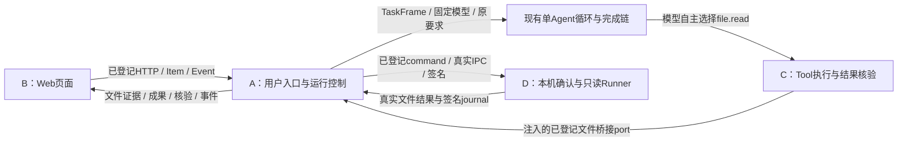

# MS-I2j：真实页面、文件工具与本机授权

日期：2026-10-10。状态：开发安排；各包尚未实现或接受。

## 1. 固定输入与验收状态

- 四方沿用原聊天、worktree及分支。共同固定开工标签为 `ms-i2j-start`；准确 commit 在发布后用 `git rev-parse ms-i2j-start^{commit}` 核对，不跟随浮动 integration。
- 运行代码来源为 `30566c62f7440b363d188910cdc14a8d69b940be`，已合入 B/MS-C7、C/MS-T2f、D/MS-R2f 最终源码及 handoff，包含 A/MS-I2i 的实际完成链和控制端。安排前 integration 为 `00e59becd78118911b49e607809f14e0e2721b71`。
- [三个组件接受](MS-I2i-worker-acceptance.md)、[A阶段验证](../../../implementation/MS-I2i-A1.md)已经登记。MS-I2i 完整回归仍在收尾；本标签是固定开发输入，不能称为完整产品验收或正式发布。
- A 先完成原固定来源的回归与实际失败复核。该回归结束前只准备本轮文档/接口提案，不改变 A checkout 的运行代码、契约和测试；不拿新代码的结果替换旧来源回执。
- B/C/D 可在各自 worktree 开始本轮独立实现。原标签不移动；发生必须的共享变更时，A先发布明确的兼容接口版本，受影响方在约定里程碑同步，不要求全员追随每个提交。

## 2. 本轮结果与模块关系

目标：用户从真实网页发送任务，看到理解提示和实际状态；在本人本机确认目录授权后，Agent 可以通过 file.read 取得真实内容，形成可预览的文本/Markdown成果及逐项核验。

默认单Agent，用户选定的模型保持不变。本轮不扩大为子Agent、DAG、代码写入、安装或进程执行。网页本身不能用路径字符串授予本机权限。

## 3. 文件归属与阶段协作

| Session / 包 | 独占范围 | 对外交付 |
| --- | --- | --- |
| A / MS-I2j | 原A保留目录：api、run、agent、model、infrastructure、composition、公共契约/迁移/锁/配置、A测试及全局文档 | 实际HTTP能力清单、浏览器认证入口、任务执行与事件、文件桥接、成果读取与完成控制 |
| B / MS-U1 | 新增 `apps/web/`（含其package.json、pnpm-lock.yaml、构建、测试、客户端生成物），B requests/handoff；仅为原回执目录缺失问题可修 B Context测试的准备逻辑 | 完整页面、类型客户端、事件投影、错误状态和真实联调回执 |
| C / MS-T2g | `src/uaw/tool/`、C unit/integration、C requests/handoff | file.read provider、executor/verifier/recovery、严格资源与回执绑定 |
| D / MS-R2g | 原D四个 workspace 文件、`apps/local_runner/uaw_runner/`、D unit/integration、D requests/handoff | 真实Windows确认/目录选择、配对/根选择状态、当前根来源、IPC装配入口 |

B 保留原 Context 归属，但本轮暂停新的 Context 优化。新前端依赖与锁仅在 apps/web 内；根 Python 依赖仍归 A。B 不改后端 DTO、认证、配置、模型或共享 schema。C 不直接调用 D 私有类。D 不改 A 的 HTTP/认证/Run实现。A 不代替 worker 修业务组件。

四个包连续做 M1→M4：

1. M1 固定接口、输入输出、错误与真实依赖，提交阶段说明及源码 SHA。
2. M2 交付首条可用组件链，提交阶段 SHA 后继续本包。
3. M3 完成版本、取消、撤销、断线与重启恢复。
4. M4 实跑模块及实际场景，保留失败、修复、成本和原始回执，最终源码与 handoff 分开提交。

A逐阶段消费、逐包接受，不等四包齐才审阅。缺其他组件时用明确标注的注入测试依赖验证自身；测试依赖不能登记为产品提供方，缺实际依赖时真实入口返回不可用。

## 4. A / MS-I2j：用户入口、浏览器身份与运行装配

### M1：原回归收尾与最小接入清单

先收尾 MS-I2i 固定来源回归，复核失败原因，保留中断和原失败。按当前实际代码登记最小端点、请求/返回/错误/权限及示例，交 `MS-I2j-stage-api.md`。

已有 routes.py 中 conversations.create/get/items、turns.submit、runs.get/control、tasks.frame、approvals.get/decide、events.read/payload、models.list 是开发入口；不能仅因目录已有接口文档，就把成果、核验、SSE、配对或 projects.bind 声称为已实现。A明确本轮新增哪些，并更新契约和实际实现清单。

当前 authenticate 对带 Origin 的浏览器请求明确拒绝。先实现仅本机可达的浏览器入口及服务端会话：用户级开发身份与管理员身份分开；HttpOnly会话、精确Origin、CSRF/状态修改保护、退出失效，不把管理员 token 或模型 key 放进 Vite变量、源码、localStorage或IndexedDB。原 CLI Bearer 路径兼容。真实 OIDC 配置未落实时不把开发身份称为公网账号登录。

冻结 B 所需的 HTTP/Item/Event 子集及读取恢复方式。优先使用已有契约；缺字段时集中修源与生成物。现有事件分页可先支持实际页面；SSE 只有真实实现且通过续接测试后才启用，未启用时显式分页轮询，不能伪造流。

### M2：网页发送到实际执行及成果

网页提交原文后，由持久运行入口调起已有理解→单Agent→工具→完成链，保留实际固定模型、TaskFrame与版本。后台任务有并发/队列上限，重启读取原 Run/attempt 恢复；不能只创建 Run 却让页面永远等待，也不能用一段离线模型回答冒充完整链。

接 B 的聊天、理解提示、人工审批、取消、成果预览及逐项核验。新增成果/核验/用户接受入口必须复用实际 Artifact、VerificationReport、CompletionBundle/Acceptance，并检查当前主体与准确版本。只有合同要求用户接受时等待点击；页面不能直接设置 completed。只实现整份文本/Markdown成果查看和合同接受，代码 diff、局部合并与文件写入撤销仍属后续能力。

### M3：文件桥接与本机当前来源

M1确定 C→A 的可信文件端口；A负责把原 ToolCall/Spec/Context/当前项目授权解析为已有 RegisteredReceiptCommand，并走 RunnerPipeClient。分别核对模型可见参数、工具动作、审批、设备、项目、根权限、签名、期限和原 attempt。D提供 NativeConfirmationPort/RootSelectionPort 及实际本机来源，不从HTTP body/模型自报owner造登记。

可在 localhost 开发配置下让用户显式启用已通过的只读链，绑定当前用户/设备/根与精确 file.read ToolSpec；默认全局 flags 保持原值，管理员启用有独立范围及撤销。file.read 不依赖 process_exec/code_execution。

模型等待、工具等待、用户决定后继续复核修订/取消/权限。未知发送先对账，不能重建 command 或换 attempt 读取新内容当作旧结果。文件正文作为资料进入 Context，不升级为系统规则；成果引用绑定实际文件内容摘要/范围和观察。

### M4：真实用户链与里程碑

用真实页面/后端与已批准固定 DeepSeek 验办公及学术材料任务、file.read引用、审批/取消、刷新重连、旧版本接受拒绝。文件场景使用显式选择的测试根，实际用户确认单独记录；没有用户点击的测试不能声称真人确认通过。记录全部模型失败/用量，未知费用继续pending。逐包接线后最终受影响与完整回归，不重复重跑刚接受且未变化的组件来填数量。

## 5. B / MS-U1：真实最小Web工作区

### M1：工程与协议客户端

参考[Web技术主选](../../../technology/modules/web.md)、[UI设计](../../../design/components/ui.md)、[P1-10](../../../plan/rounds/P1-10.md)。在 apps/web 内建立 React/TypeScript/Vite/pnpm，核验本机Node/pnpm与依赖兼容并锁版本，不要求一次装齐所有未来库。禁止影响根 Python lock；需要根脚本/跨模块依赖时提案 A。

按基线 contracts/openapi.json、schema及实际 routes.py建立客户端接口，M1交 `MS-U1-stage-client.md`：方法、请求、结果联合类型、Item/Event输入、事件游标和错误处理。客户端 mock 只验证组件；接口未开放显示不可用，等待 A 最小清单后联调。不要猜新增路由或悄改服务器字段。

### M2：完整页面流程

会话侧栏、聊天、输入框上方随内容变化的浅色“AI理解的任务”框、成果侧栏。原文是执行基准，理解提示不能替换它。模型从后端获准目录选择；不展示供应商密钥配置。

接真实发送、运行状态、人工审批/拒绝、取消、文本/Markdown预览和合同要求的整份成果接受。状态由 Item/Event/Run 读取，不解析模型文字猜成功；“努力奔跑中”等展示槽位同时保留真实阶段。安全 Markdown 禁用原始HTML/危险URL，未知Item有可读降级。

### M3：事件、重连与用户状态

按 Item ID/revision 和事件 seq/cursor 去重。刷新/断线先查原 turn_request_id/Run，不能重发生成第二任务；游标过旧取权威快照。SSE/分页轮询分别明确状态和关闭/取消机制。

只缓存非敏感草稿/读取投影并标记版本，换身份清理；令牌、审批和执行权威不落浏览器持久存储。取消在真实确认前显示“正在停止”。未实现的本机写入/exec、diff/局部接受、子Agent/DAG不可展示为可用。

### M4：构建与真实联调

类型、构建、必要组件测试及 Playwright 原始回执。与 A 实际 localhost 入口验证发送→理解→实际成果，刷新/断线不重发、审批/拒绝/取消、错误及版本冲突。开发浏览器/后端不可用时继续独立页面与客户端，真实联调写pending，不拿 mock 截图代替。

保持 E:/UAW/.worktrees/context / dev/context，不因接前端另开worktree或改分支名。修原 Context测试回执目录问题只限幂等准备，保留原断言/时限与失败，不重做优化。最终交 `MS-U1-final-wiring.md`及 B handoff。

## 6. C / MS-T2g：实际file.read工具及证据恢复

### M1：现有契约与桥接接口

实现已有 file.read（workspace_ref、RelativePath、location、cursor→FileContent），不增加任意绝对路径、owner、approved、shell参数。ToolSpec固定完整版本、读取副作用、file_access及当前环境/角色门槛；M1交 `MS-T2g-stage-file-port.md`，明确调用/恢复桥接签名和真实依赖。

现有 ToolExecutorPort.execute、ToolOutputVerifierPort.verify及 ToolRecoveryAccessPort.check 保持兼容。新内部 Protocol 只放 C 模块、由 composition 注入：输入完整原 call/spec/ctx；输出已登记 command_ref、receipt_ref与实际RunnerReceipt；恢复查原不可变登记和journal。端口不负责用户配对或自行签新命令。A负责实际控制端适配，缺端口真实入口明确不可用。

### M2：执行与语义核对

沿原 normalize/权限/审批/预算/一次发送链走精确路由，保留text/计算/JSON工具。校验签名证据、command/attempt/参数、workspace/path/location、UTF-8/返回64KiB、完整/片段摘要语义及游标。不能把签名有效、HTTP成功或Runner ok直接当工具数据正确；部分内容不能用片段hash冒充完整文件hash。

### M3：持久结果与恢复

实际 FileContent、原观察、来源范围和使用量持久化，供Agent后续输入、Artifact与Verification引用。恢复核对原command/journal；unknown不重发，当前读取数据权限与是否能新执行分开。撤销目录/设备/密钥后按职责拒绝；原费用欠账独立恢复，不伪造零费用。

### M4：独立真实验证

在 C 的 55434 实跑 SQL及临时测试根的 file.read provider/executor/verifier/recovery，验证行/游标、改文件、旧摘要、坏签名、跨项目/主体、撤销/取消、回复丢失/重启。使用基线已接受 Runner 组件或独立注入端口，不导入 D 未合入的开发分支；受控授权源标明。真实 A↔D 本机确认后的整链由 A验收。交 `MS-T2g-final-wiring.md`与 C handoff。

## 7. D / MS-R2g：Windows本机确认、目录选择与只读授权

### M1：真实本机交互与依赖

消费已有 NativeConfirmationPort、RootSelectionPort、PairingVerifier、LocalRoots及一次使用 Ticket；优先使用已锁依赖/Windows原生API，新 Python依赖先提案 A。M1交 `MS-R2g-stage-native.md`，固定构造、异步确认、取消、超时、短期selection与撤销接口。

真实窗口显示账号标识、设备、只读能力、有效期与本机目录，用户亲自确认/选择；模型、HTTP路径或测试布尔值不能替代确认。只有此明确交互窗口可见，其余helper隐藏。无可交互桌面返回不可用，不默认批准。

### M2：原配对/根选择状态接UI

从独立控制端挑战/认证映射绑定账户与设备；保留签名、当前key/角色、document_hash、期限、原Ticket版本和持久一次消费。仅知道Windows SID/PID不能证明UAW账号。绝对目录仅留本机LocalRoots，控制面得到不透明根句柄/工作区Ref及签名选择凭据。

网页请求只能触发本机选择/显示已授权项目，不能通过string path或requested_capabilities升级权限。本轮只读，原生确认不等于同意exec或安装。

### M3：当前根与IPC生命周期

授权后复用基线Windows可信命名管道、ReadOnlyRunner和签名journal，接实际 RootSource/owner映射。复核当前根身份、撤销/期限、设备/key、channel、Run/lease/fence；断连与重启不沿用失效channel，不重发未知command。用户撤销立即阻止新读取；读结果数据恢复遵循当前数据权限。

### M4：原组件与人工验收边界

实际 Windows/native部件测试及双进程只读链；临时测试根覆盖选择取消、超时、签名/账号/设备错配、过期、重复消费、撤销、重启恢复。清理随机测试凭据、管道和进程，保留原始回执。人为确认步骤准备可复现指南/界面，实际用户未点击时单独标pending，不能用自动化替身宣称真人授权。生产账号/OIDC由A提供；缺来源不可用，不自行决定云/本地历史权威或D03执行模式。交 `MS-R2g-final-wiring.md`及 D handoff。

## 8. 开工、交接与接受

worker在自己的干净worktree执行 fetch tags→merge --ff-only ms-i2j-start→核对HEAD/tag commit→uv sync --frozen；失败保留现场，不reset/rebase/stash他人改动。B新增前端依赖仅 apps/web；C/D按需使用自己的开发数据库，不能复制 A 私有配置或改其他session的库。

阶段交接包含固定签名、样例、依赖、修改清单和 SHA；最终交接包含原始验证命令、完整失败历史、未完成门槛与 A 的接线事项。源码/handoff分开提交、工作区干净，本包结束停止，不自行扩范围或下一包。

MS-I2i历史完整验收收尾后只更新其验收记录与last_full来源，不覆盖本轮dispatch_ref、B前端归属或开工标签。用户通过转发消息派发，A没有代替用户给其他聊天发消息或同步worker工作区。
