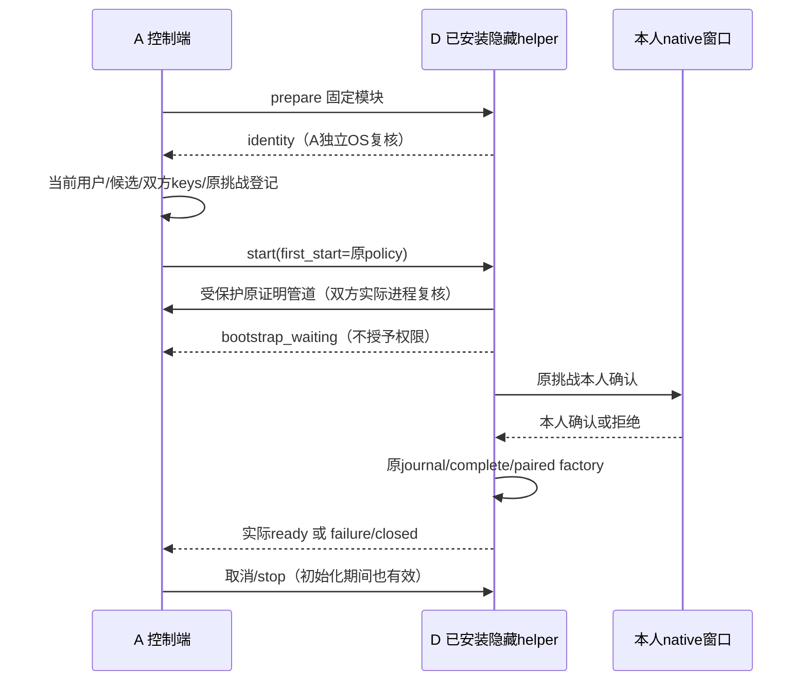

# MS-I2l：A/D 首次启动与取消契约 v1

2026-10-10。这是正式分包的固定输入；实现状态逐项说明。它是内部 Python/本机生命周期协议，不是新的授权、HTTP DTO 或公开配对 V2。

## 1. 已存在的实际入口

| 入口 | 当前状态 / 归属 |
| --- | --- |
| `uaw.shared.runner_bootstrap.FirstStartPolicy` | A 已实现并验证：原挑战期限、SHA256、首次等待上限 |
| `FirstStartProgressPort.waiting(policy) -> None` | A 已定义；A 首次 factory 已提供可选回调，D 本轮实现发送端与观察端 |
| `FirstEnrollmentDeviceFactory(..., progress=None).create(identity)` | A 已实现：当前来源/原证明复核，pending 时回调；回调后重新检查原挑战，再 native/原 journal/complete/paired factory |
| `HelperProcess.prepare(python, assembly_module, environment=None)` | D 原实现：隐藏启动固定已安装模块，独立复核实际 PID/创建时间/SID/logon；不接受模型导入路径或命令 |
| `HelperProcess.start()` | D 原实现只等待15秒；不适合首次60秒 native 确认。本轮扩展下方兼容签名，当前未实现 |
| `HelperAssemblyPort.create(identity) -> HelperApplication` | 保留原签名；A 注入实际首次 factory，D 不改成 body 自证身份 |
| `EnrollmentProofServer.prepare/serve_once/close` 与 `EnrollmentProofClient.current` | A 已实现受保护原控制签名管道；实际双进程/SQL已验证，installed 首次链尚未实连 |

源码：`src/uaw/shared/runner_bootstrap.py`、`src/uaw/infrastructure/enrollment_bootstrap.py`、`src/uaw/infrastructure/enrollment_pipe.py`；D：`apps/local_runner/uaw_runner/helper_process.py`、`helper_host.py`。

## 2. 固定对象与签名

```python
@dataclass(frozen=True)
class FirstStartPolicy:
    expires_at: datetime       # 原挑战 timezone-aware 期限，不新生成
    challenge_hash: str        # 原 document 的 parameter_hash，64位小写hex
    wait_seconds: float = 90.0 # 有限且 0 < 值 <= 90，bool 不接受
    def remaining(self, now: datetime) -> float: ...

class FirstStartProgressPort(Protocol):
    async def waiting(self, policy: FirstStartPolicy) -> None: ...

# 以下由 D 本轮实现；不是现有 start 已接受这些参数。
async def HelperProcess.start(
    self, *, first_start: FirstStartPolicy | None = None,
    on_progress: FirstStartProgressPort | None = None,
) -> dict[str, Any]: ...

# D 新增具体发送适配器；A 的 installed factory 注入它。
class HelperBootstrapProgress(FirstStartProgressPort):
    async def waiting(self, policy: FirstStartPolicy) -> None: ...
```

`HelperBootstrapProgress` 位于 `uaw_runner.helper_host`。发送端不接私钥、用户路径、账号或批准状态；只输出下方一次进度。`on_progress` 是父端观察者，不是权限来源；没有 first_start 时不得通过 on_progress 启用首次模式。A 当前 factory 回调最多5秒，超时/异常不继续确认。active 原实例不重复回调/打开首次窗口。

## 3. 有界生命周期事件

子端 stdout 只在已复核原挑战、即将等待 native 的 pending 阶段输出一次：

```json
{"event":"bootstrap_waiting","stage":"enrollment","expires_at":"2026-10-10T12:00:00Z","challenge_hash":"aaaaaaaaaaaaaaaaaaaaaaaaaaaaaaaaaaaaaaaaaaaaaaaaaaaaaaaaaaaaaaaa"}
```

示例时间/hash是假值，仅说明形状。固定且仅允许这四个字段；expires_at 为 UTC ISO 时间，解析后必须等于 FirstStartPolicy 原 expiry；hash 完全相等，stage 固定 enrollment。不得输出 owner、enrollment_id、proof/code、私钥、完整目录或正文。单帧≤4096 bytes，严格重复键/类型/非有限值检查；单次启动至多一个 waiting。重复、未知 stage、额外字段、错hash/期限、普通 start 收到 waiting：拒绝并关闭自有子进程。既有 ready/connected/receipt/failure/closed 不改既有输出契约。

waiting 仅表示等待，不代表 active、授权、ready 或任务完成。start 的成功返回仍只能是实际 helper 的 ready；failure、closed、EOF、超时不能变成 ready。具体失败 code 保持原 DomainError，不用 UI 文案当协议。

## 4. 时限与取消

1. 普通启动保持15秒；first_start 必须由 A 当前已复核原 challenge 构造，不能从聊天参数选择。
2. first start 开始时计算一次绝对 monotonic deadline：`loop.time() + policy.remaining(current_utc)`；最长90秒且不超过原挑战期限。后续进度、读帧、观察回调全部使用同一个剩余 deadline，不再次加90秒。remaining 仅用于初始计算，反复调用它不能替代绝对期限。
3. native 本身最多60秒；证明管道10秒、A发送回调5秒都包含在总90秒内。剩余时间不足即停止，不延长原挑战；墙钟/当前来源变化也须复查。
4. D host 在 `factory.create` 开始前启动 stop/EOF 监听，不能等 factory 成功以后才监听。stop、父端取消、EOF、当前来源撤销使初始化取消，关闭 A native 自有窗口、迟到 helper/管道/读任务。
5. close 幂等，最多原5秒正常退出，再按实际自有进程对象回收；不按名字杀其他进程，不留下 blocked readline 线程/窗口。启动/发送/回调失败也走同一关闭规则。
6. prepare 的身份15秒门槛不延长。first_start 不降低独立实际 OS 身份、key role、原签名、当前用户/设备/根权限检查。

## 5. A/D 时序与责任



A：当前 Web/CLI 用户来源、candidate/key/control 证明、每次实际启动的可信配置交付、独立登记/journal、具体 paired factory、控制端连接和用户/模型/Tool 组装。D：隐藏进程、上述等待/进度/stop、实际 native 生命周期与根、IPC/helper及自有资源回收。配置只由已安装部署路径/受保护本机来源交付；不能将 proof 放 argv/URL/前端或让模型任意指定模块。

重启产生新 PID/创建时间必须重新登记新候选，不能借旧 active enrollment 冒充。原实际 active 同实例沿普通启动，不再弹首次窗口。没有 A 实际注册或 native journal，返回明确 unavailable；受控测试不是生产来源。

## 6. B/C 可直接消费的固定边界

B 沿既有 `MS-I2j-stage-api.md` 和 `MS-I2k-enrollment-v1.md` 的精确 HTTP/schema。四个 enrollments 入口存在，但服务缺来源可503；没有 root 授权 HTTP，禁止猜路径。前端 pending/进度不能生成批准；native 选择由本人在本机完成。A 新 HTTP 需求先发布阶段 DTO/标签。

C 沿 `RegisteredFileBridge` 的原 ToolCall/ctx/provider、`FileMaterialReaderPort.export/read` 与原完整签名 journal。A 当前 `FileToolBindings.materials`/Context adapter 负责低信任材料接线；C 不重复建设旧单文件导出。实际 whole≤16384字符、64KiB UTF-8，lines/cursor/非空project仍不可用。原命令 unknown 只对账，资料读取与费用恢复独立授权。

## 7. 门槛

A 当前10不同定向节点通过：7策略单元＋3原首次factory SQL/OS适配，其中 native Yes及下游factory受控。D 新 start 参数、首次等待/取消、完整 installed 链、真人配对/目录授权仍待本轮实现和实测。不得把上述定向通过称为新全量或真实本人确认；原1691仍保留旧来源。共享对象/协议变更由A发布兼容阶段，不移动开工标签。
