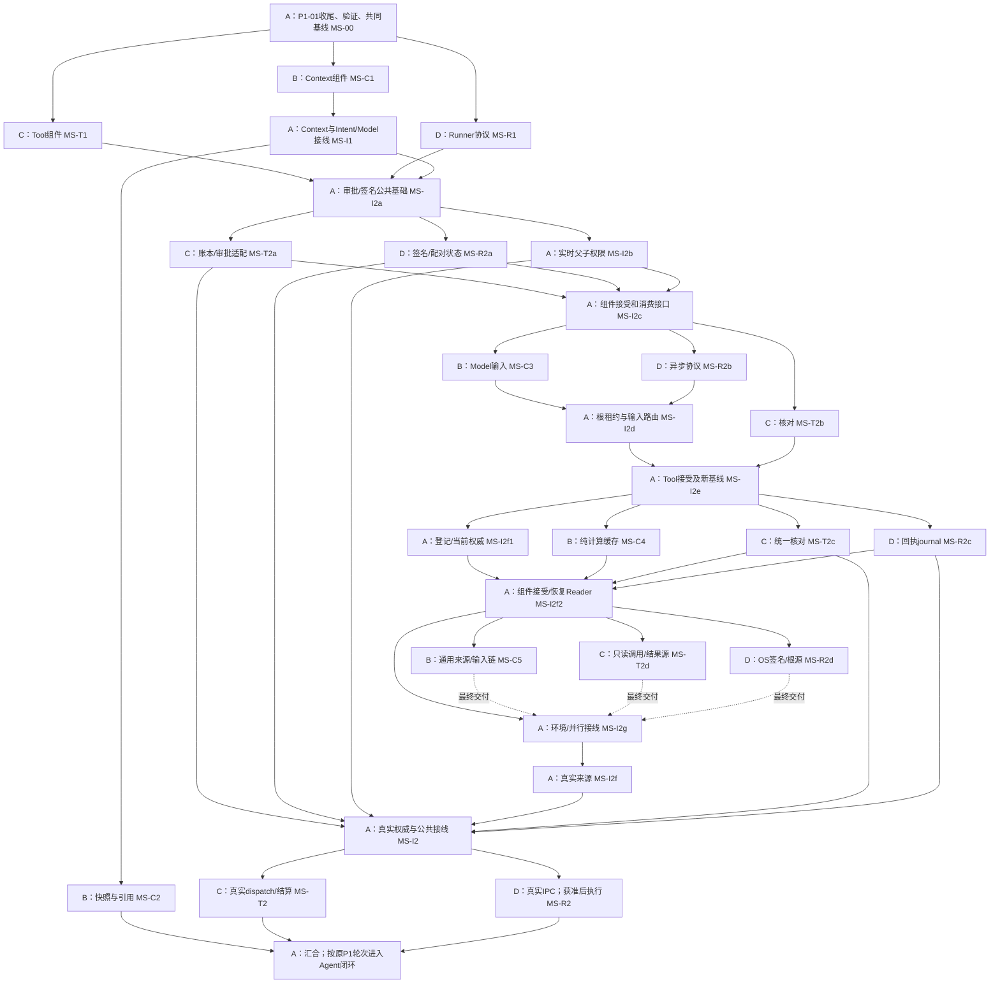

# UAW 多session开发计划

v0.16 · 2026-10-10 · 方案：**3个开发session＋1个集成session，共4个**。

先让不同session各做一个不重叠的组件包，再由集成session接起来。接口文档使组件能按同一规则开发；完整任务能运行，还需要具体文件归属、固定代码版本和组合验证。

## 1. 当前起点

- P0-01、P0-03、P0-04已验收；P0-02开发存储已验证，D01最终权威位置待定。
- P0-05模型网关与实际固定DeepSeek已验证：ms-i2j-a2有6次调用含失败、2个最终有界样例；生产提供方治理仍待验。
- P1-01原文/逐字来源、理解版本、修订、取消和幂等已有协议验证，真实小样例已跑；完整语义质量与P1阶段仍待后续门槛。
- 上次完整开发集成ms-i2i覆盖1691个不同通过节点；原失败和定向修复保留，实际批次以DISPATCH为准。当前阶段验证另列，不把历史全量当作新源码全量。
- `E:/UAW`已建立`integration`分支，`origin`关联`https://github.com/Guozai3633/UAW.git`。
- 当前各session进度由下表列出；根Agent组件开发验证、完整集成及真实产品任务是独立验收范围。固定worker标签、待接受交付和安排见[统一派发表](../coordination/DISPATCH.md)。

沿用原三个worktree，开发session自行在包边界同步固定标签；A不改写worker分支。具体见[开工、合并与交接流程](PARALLEL_WORKFLOW.md)。

## 2. Session归属与历史首包

| Session | 做什么 | 首个包 | 实际分工 |
| --- | --- | --- | --- |
| [A：集成与任务理解](sessions/A.md) | 负责现有P1-01收尾、公共契约、组装根、迁移、依赖锁和合并。 | MS-00 | 推荐4个方案 |
| [B：前端工作区（原Context负责人）](sessions/B.md) | 本轮MS-U1独占apps/web做真实页面，暂停新Context优化；原Context归属保留。 | MS-C1 | 推荐4个方案 |
| [C：工具组件](sessions/C.md) | 先做小工具目录、schema规范化、角色/权限/flag过滤和动作身份。 | MS-T1 | 推荐4个方案 |
| [D：Runner协议与授权组件](sessions/D.md) | 先落实可信命令信封、期限/主体/签名校验port、授权根和撤销状态。 | MS-R1 | 推荐4个方案 |
| [E：可选样本与评测](sessions/E.md) | 第5个session可选，负责办公/开发/学术样本、验收表和来源/权限反例。 | MS-Q1 | 第5个可选 |

### 当前包状态

| Session | 包 | 实际状态 |
| --- | --- | --- |
| A | MS-I2j | MS-I2j已开工：旧MS-I2i全量1691最终覆盖通过；当前M1浏览器会话/API准备与文件桥接，默认权限不扩大。 |
| B | MS-U1 | MS-U1已发布待开工：本轮临时负责apps/web真实前端；MS-C7已接受，暂停新Context优化。 |
| C | MS-T2g | MS-T2g已发布待开工：file.read工具与真实结果恢复；MS-T2f组件接受，不重做原包。 |
| D | MS-R2g | MS-R2g已发布待开工：Windows本机确认/目录选择/只读授权；MS-R2f组件接受。 |
| E | MS-Q1 | 可选工作区未创建、任务未派发。 |

A负责评估/完成控制与公共接线；B/C/D实现并验证各自组件。阶段接口与源码到即审阅，组件业务错误由原worker修复。

## 3. 本轮为何可以并行

[当前完整包：输入输出、策略、四里程碑与目录](../coordination/requests/A/MS-I2j-parallel-packages.md)

各worker从同一固定基线和已接受组件开工，不读其他开发分支；可选A适配到达后接线，独立兼容路径与模块验证继续。A纯数据交付不等待本机通道，最终组件逐包接受后再做一次集成里程碑全量。

### 历史首包依赖（保留）

| 子包 | 首包真正依赖 | 此时暂不接入的部分 |
| --- | --- | --- |
| MS-C1 上下文规则/来源/预算 | 已固定InstructionSet、ContextSnapshot、Scope、Ref和模型窗口契约 | 通用Context到Intent/Model的组装、Runner读文件 |
| MS-T1 工具注册/过滤/schema | 已固定ToolSpec、ToolCall、CapabilityPolicy、flag和错误契约 | 审批、真实Runner派发及全链路结算 |
| MS-R1 Runner协议/授权范围 | 已固定RunnerCommand/Receipt、RootSelection及可信上下文 | 实际账号配对、真实签名、安装/写入/exec授权 |

这里的“无依赖”指首批组件包互不依赖另一个开发session的未完成代码。它们共同依赖MS-00发布的稳定基线。P1-02/03/04整轮本来有依赖，不能直接宣称三整轮都无依赖。

**原50轮主计划和阶段验收门槛继续有效。** 子包可提前开发；整轮接受、能力启用和真实场景验收仍要满足原轮依赖，P0-05待配置的门槛不会因并行安排消失。

## 4. 第一波与第二波

每次合入发布新集成SHA。开发session在包边界同步后进入下一包；未完成的分支不会直接作为另一个session的依赖。MS-I3仅是汇合入口，P1-06变更、P1-10真实界面等原工作包仍须另行完成。

## 5. 开3个或5个怎样调整

| 总session数 | 分配 | 调整 |
| --- | --- | --- |
| 3 | A集成＋B上下文＋C工具 | Runner协议放下一波，由已完成首包的开发session接手；先更新负责人及路径归属，不能默认多出第4个 |
| **4，推荐** | A集成＋B上下文＋C工具＋D Runner | 符合3个session分别开发、另1个负责合并的想法 |
| 5 | 上面4个＋E样本/评测 | E写独立样本与审阅标准，不再让第5个一起改共享基础文件 |

首次尝试先跑完一波小包，再按实际冲突、等待与集成耗时决定是否增加session；不预估线性提速。

## 6. 每个包的交付与正式状态

| 包 | 负责 | 标题 | 组件开发前置 | 原轮 |
| --- | --- | --- | --- | --- |
| MS-00 | A | 收尾并建立共同基线 | 现有进度收尾 | [P0-05](rounds/P0-05.md)、[P1-01](rounds/P1-01.md) |
| MS-C1 | B | 规则、来源与窗口分配 | MS-00 | [P1-02](rounds/P1-02.md) |
| MS-T1 | C | 工具注册、过滤与参数校验 | MS-00 | [P1-03](rounds/P1-03.md) |
| MS-R1 | D | Runner协议与授权范围校验 | MS-00 | [P1-04](rounds/P1-04.md) |
| MS-Q1 | E | 三类样本及语义审阅标准 | MS-00 | [P0-01](rounds/P0-01.md)、[P1-01](rounds/P1-01.md)、[P1-11](rounds/P1-11.md)、[P2-07](rounds/P2-07.md) |
| MS-I1 | A | 合入Context并接Intent/Model | MS-00、MS-C1 | [P1-01](rounds/P1-01.md)、[P1-02](rounds/P1-02.md) |
| MS-C2 | B | 固定快照和引用查询 | MS-I1 | [P1-02](rounds/P1-02.md) |
| MS-I2a | A | 持久人工审批和签名公共基础 | MS-I1、MS-T1、MS-R1 | [P1-03](rounds/P1-03.md)、[P1-04](rounds/P1-04.md) |
| MS-T2a | C | 持久调用账本和审批适配 | MS-I2a | [P1-03](rounds/P1-03.md)、[P1-09](rounds/P1-09.md) |
| MS-R2a | D | 真实签名适配和配对一次使用状态 | MS-I2a | [P1-04](rounds/P1-04.md) |
| MS-I2b | A | 实时父子权限链公共接线 | MS-I2a | [P1-02](rounds/P1-02.md)、[P1-03](rounds/P1-03.md)、[P1-04](rounds/P1-04.md) |
| MS-I2c | A | 接受基础组件并发布恢复/异步消费接口 | MS-I2b、MS-T2a、MS-R2a | [P1-02](rounds/P1-02.md)、[P1-03](rounds/P1-03.md)、[P1-04](rounds/P1-04.md) |
| MS-C3 | B | 通用快照到Model输入转换 | MS-I2c | [P1-02](rounds/P1-02.md)、[P1-07](rounds/P1-07.md) |
| MS-T2b | C | 预算接口收敛和可信结果核对 | MS-I2c | [P1-03](rounds/P1-03.md)、[P1-09](rounds/P1-09.md) |
| MS-R2b | D | 异步Runner协议消费入口 | MS-I2c | [P1-04](rounds/P1-04.md) |
| MS-I2d | A | B/D组件接受、根执行租约与输入路由 | MS-I2c、MS-C3、MS-R2b | [P1-02](rounds/P1-02.md)、[P1-04](rounds/P1-04.md)、[P1-09](rounds/P1-09.md) |
| MS-I2e | A | 接受Tool核对组件并发布下一轮范围 | MS-I2d、MS-T2b | [P1-03](rounds/P1-03.md)、[P1-09](rounds/P1-09.md) |
| MS-C4 | B | 上下文纯计算有界缓存 | MS-I2e | [P1-02](rounds/P1-02.md)、[P4-04](rounds/P4-04.md) |
| MS-T2c | C | 统一核对入口与效果结论读取 | MS-I2e | [P1-03](rounds/P1-03.md)、[P1-09](rounds/P1-09.md) |
| MS-R2c | D | 签名终态回执持久journal | MS-I2e | [P1-04](rounds/P1-04.md) |
| MS-I2f1 | A | 设备/命令登记及当前权威组件 | MS-I2e | [P1-03](rounds/P1-03.md)、[P1-04](rounds/P1-04.md)、[P1-09](rounds/P1-09.md) |
| MS-I2f2 | A | 缓存/工具恢复/journal接受与登记Reader接线 | MS-I2f1、MS-C4、MS-T2c、MS-R2c | [P1-02](rounds/P1-02.md)、[P1-03](rounds/P1-03.md)、[P1-04](rounds/P1-04.md)、[P1-09](rounds/P1-09.md)、[P4-04](rounds/P4-04.md) |
| MS-C5 | B | 通用上下文登记/当前权威/完整输入链 | MS-I2f2 | [P1-02](rounds/P1-02.md)、[P1-07](rounds/P1-07.md) |
| MS-T2d | C | 只读工具调用编排/实际adapter/持久结果源 | MS-I2f2 | [P1-03](rounds/P1-03.md)、[P1-09](rounds/P1-09.md) |
| MS-R2d | D | OS控制签名/授权根来源/适配器装配 | MS-I2f2 | [P1-04](rounds/P1-04.md) |
| MS-I2g | A | 独立验证环境/阶段接口接线/并行集成 | MS-I2f2 | [P0-02](rounds/P0-02.md)、[P1-02](rounds/P1-02.md)、[P1-03](rounds/P1-03.md)、[P1-04](rounds/P1-04.md)、[P1-07](rounds/P1-07.md) |
| MS-C6 | B | 多规则语义评估/版本复查/读取测量 | MS-C5、MS-I2f2 | [P1-02](rounds/P1-02.md)、[P1-07](rounds/P1-07.md) |
| MS-T2e | C | 权限先行混合检索/向量索引缓存 | MS-T2d、MS-I2f2 | [P1-03](rounds/P1-03.md) |
| MS-R2e | D | 获准根内实际file.read/来源复核/journal | MS-R2d、MS-I2f2 | [P1-04](rounds/P1-04.md)、[P1-05](rounds/P1-05.md) |
| MS-I2h | A | 根实例/有限步单Agent/阶段版集成 | MS-C5、MS-T2d、MS-R2d | [P1-07](rounds/P1-07.md)、[P1-08](rounds/P1-08.md)、[P1-09](rounds/P1-09.md) |
| MS-C7 | B | Context读取提速/有界批读/来源等价 | MS-C6 | [P1-02](rounds/P1-02.md)、[P4-04](rounds/P4-04.md) |
| MS-T2f | C | 办公计算/JSON检查/多适配器持久恢复 | MS-T2e | [P1-03](rounds/P1-03.md) |
| MS-R2f | D | Windows可信IPC/活连接来源/只读双进程链 | MS-R2e | [P1-04](rounds/P1-04.md) |
| MS-I2i | A | 固定模型评估/成果核验/完成提交与逐包集成 | MS-C6、MS-T2e、MS-R2e | [P1-02](rounds/P1-02.md)、[P1-07](rounds/P1-07.md)、[P1-08](rounds/P1-08.md)、[P1-09](rounds/P1-09.md) |
| MS-U1 | B | 真实Web工作区/协议客户端/事件恢复 | MS-C7、MS-T2f、MS-R2f | [P1-10](rounds/P1-10.md) |
| MS-T2g | C | 真实file.read工具/签名语义核验/原结果恢复 | MS-T2f、MS-R2f | [P1-03](rounds/P1-03.md)、[P1-04](rounds/P1-04.md)、[P1-08](rounds/P1-08.md) |
| MS-R2g | D | Windows本机确认/目录选择/只读授权生命周期 | MS-R2f | [P1-04](rounds/P1-04.md) |
| MS-I2j | A | 真实网页API/用户控制/文件桥接与逐包集成 | MS-C7、MS-T2f、MS-R2f | [P1-04](rounds/P1-04.md)、[P1-07](rounds/P1-07.md)、[P1-08](rounds/P1-08.md)、[P1-09](rounds/P1-09.md)、[P1-10](rounds/P1-10.md) |
| MS-I2f | A | 实际设备归属、登记命令与当前权威 | MS-I2f2 | [P1-03](rounds/P1-03.md)、[P1-04](rounds/P1-04.md)、[P1-09](rounds/P1-09.md) |
| MS-I2 | A | 合入Tool与Runner并完成真实权威接线 | MS-I2f、MS-T2c、MS-R2c | [P1-03](rounds/P1-03.md)、[P1-04](rounds/P1-04.md) |
| MS-T2 | C | 工具真实dispatch及结算接线 | MS-I2、MS-T2a | [P1-03](rounds/P1-03.md)、[P1-09](rounds/P1-09.md) |
| MS-R2 | D | 真实IPC配对和获准执行接线 | MS-I2、MS-R2a | [P1-04](rounds/P1-04.md)、[P1-05](rounds/P1-05.md) |
| MS-I3 | A | 汇合后进入Agent闭环 | MS-C2、MS-T2、MS-R2 | [P1-07](rounds/P1-07.md)、[P1-08](rounds/P1-08.md)、[P1-09](rounds/P1-09.md)、[P1-11](rounds/P1-11.md) |

开发交付只写各自handoff；A在[统一派发表](../coordination/DISPATCH.md)记录基线、派发与接受。两者是不同文件，减少状态记录冲突。组件交接通过不自动将整轮改为accepted。

## 7. 具体入口

- [文件归属、worktree、公共变更与合并流程](PARALLEL_WORKFLOW.md)。
- [提交交接模板](../coordination/HANDOFF_TEMPLATE.md)与[公共接口变更模板](../coordination/REQUEST_TEMPLATE.md)。
- 各session页末尾有可复制到新聊天的开工说明。
- [机器分工/依赖/归属表](../../planning/parallel-plan.json)与[计划检查结果](parallel-check.json)。
- [并行计划维护源](../../planning/parallel_catalog.py)；运行 `python planning/build_parallel.py`，总计划生成器也会重建本计划。
